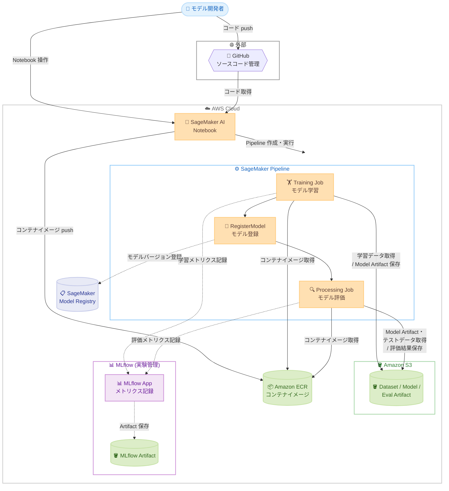
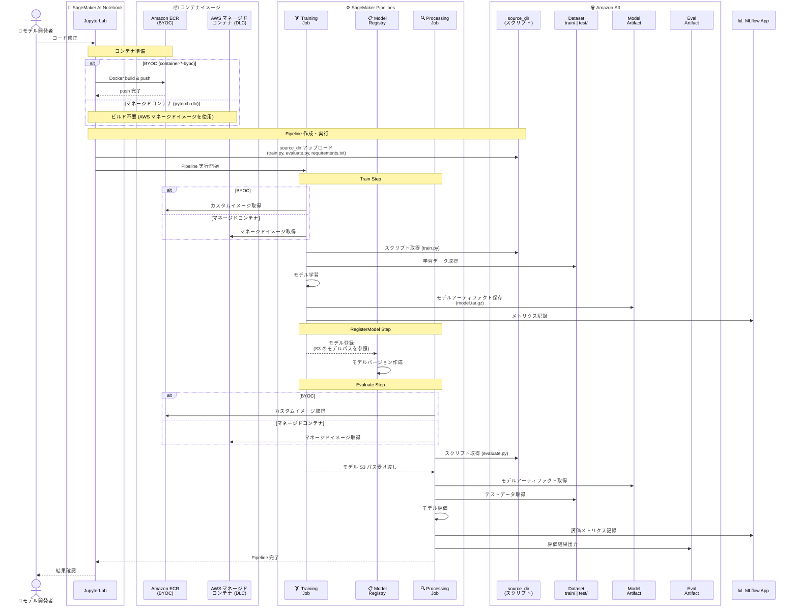
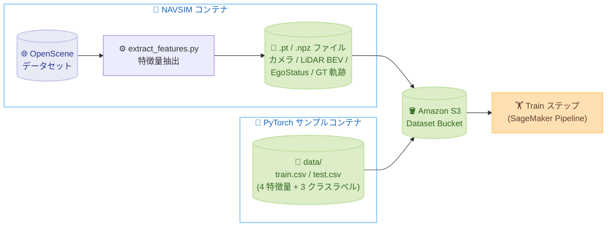
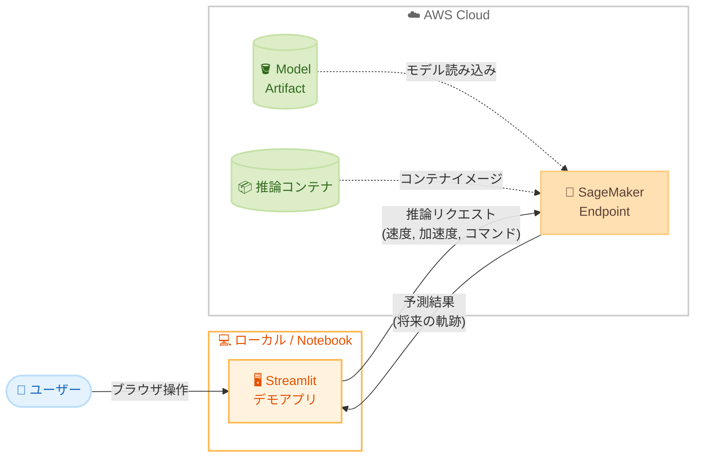
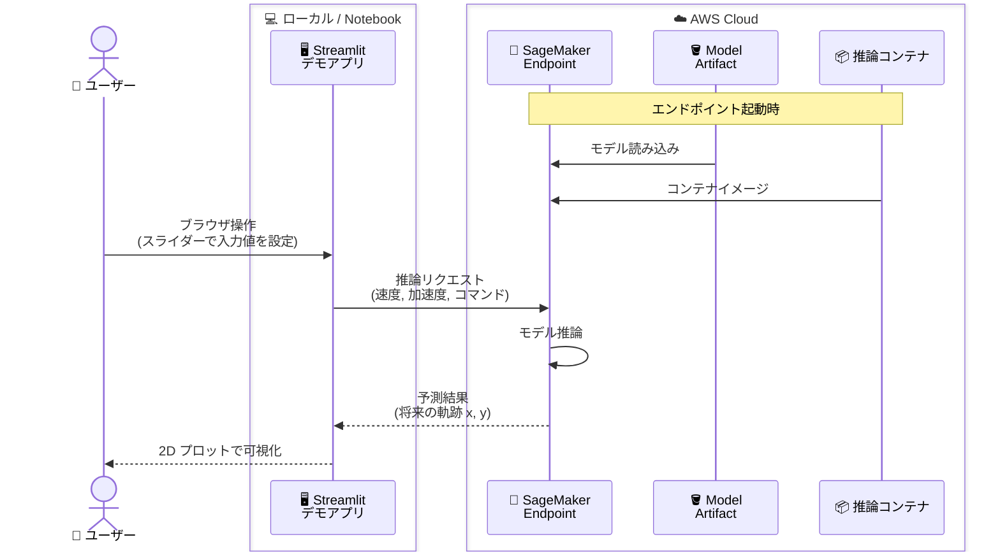
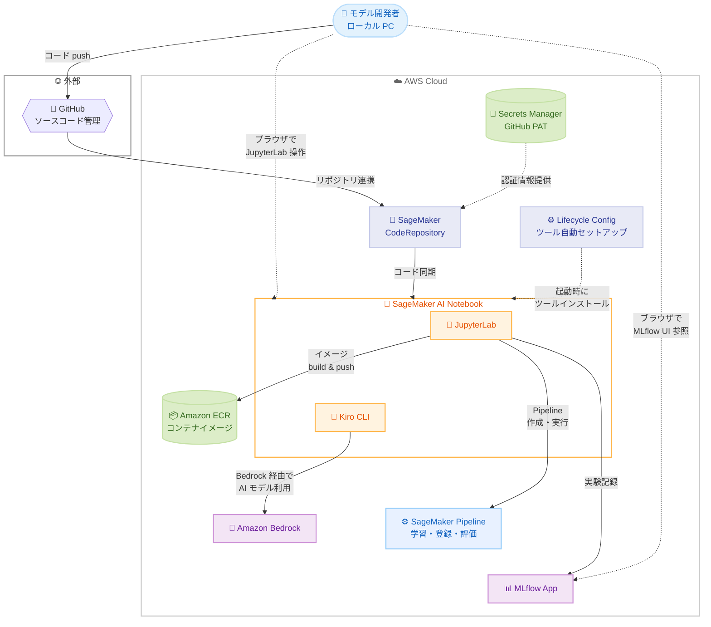

# SageMaker AI Pipeline for NAVSIM Autonomous Driving <!-- omit in toc -->

🌐 **Language**: 🇺🇸 [English](README.md) | 🇯🇵 [日本語](README.ja.md)

このリポジトリは、Amazon SageMaker AI をはじめとする AWS サービスを自動運転のモデル開発に適用する方法を示すサンプルプロジェクトです。ML 学習パイプラインの構築から実験管理、モデルデプロイ、SageMaker Unified Studio との連携まで、AWS 上での実践的な実装パターンを紹介することに主眼を置いています。

具体的なユースケースとして [NAVSIM](https://github.com/autonomousvision/navsim) を採用し、学習・登録・評価の 3 ステップで構成される ML ワークフローを、インフラのプロビジョニングからパイプラインの実行まですぐに試せる形で提供します。NAVSIM は End-to-End 自動運転モデルの評価フレームワークです。本プロジェクトでは NAVSIM の 2 つのベースラインエージェント — EgoStatusMLP と Transfuser — を SageMaker 学習パイプラインとして実装し、推論エンドポイントとデモアプリも提供しています。CARLA シミュレーションデモも含まれており、学習した TransFuser モデルを [CARLA](https://carla.org/) 自動運転シミュレーター上でカメラと LiDAR 入力を使って実行できます。

- [概要](#概要)
- [アーキテクチャ](#アーキテクチャ)
  - [ML Pipeline アーキテクチャ](#ml-pipeline-アーキテクチャ)
  - [学習データセット](#学習データセット)
  - [推論アーキテクチャ](#推論アーキテクチャ)
  - [開発環境アーキテクチャ](#開発環境アーキテクチャ)
- [ディレクトリ構成](#ディレクトリ構成)
- [前提条件](#前提条件)
- [クイックスタート](#クイックスタート)
- [セットアップとデモアプリ](#セットアップとデモアプリ)
- [クリーンアップ](#クリーンアップ)
- [ドキュメント](#ドキュメント)
- [サードパーティライセンス](#サードパーティライセンス)
- [サードパーティデータに関する注意事項](#サードパーティデータに関する注意事項)
- [セキュリティ](#セキュリティ)
- [ライセンス](#ライセンス)


## 概要

本プロジェクトは、End-to-End (E2E) 自動運転モデルの学習パイプラインを Amazon SageMaker AI 上で構築するサンプルです。モデルの学習 (Train)、モデルレジストリへの登録 (Register)、テストデータによる評価 (Evaluate) の 3 ステップで構成される ML ワークフローを提供します。インフラは CloudFormation でワンコマンドでプロビジョニングし、Pipeline の定義・実行は SageMaker Python SDK で行います。MLflow App によるメトリクスの記録・実験管理も組み込まれています。

自動運転向けの E2E モデルとして [NAVSIM](https://github.com/autonomousvision/navsim) の EgoStatusMLP と Transfuser を実装しています。汎用的な PyTorch テンプレート (SimpleClassifier) も含まれており、`train.py` と `evaluate.py` を差し替えるだけで任意のモデルに対応できます。

オプションで [SageMaker Unified Studio](https://docs.aws.amazon.com/sagemaker-unified-studio/latest/userguide/what-is-sagemaker-unified-studio.html) との連携もサポートしています。Model Registry、MLflow App、Pipeline などの SageMaker リソースを Unified Studio から参照・操作できます。

## アーキテクチャ

システム全体の構成と、Pipeline 実行時のサービス間のやり取りを示します。

### ML Pipeline アーキテクチャ

本環境の全体構成です。モデル開発者が SageMaker AI Notebook 上でコードを修正し、カスタムコンテナを ECR にプッシュした後、SageMaker Pipeline を通じて学習 (Train) → モデル登録 (RegisterModel) → 評価 (Evaluate) の 3 ステップのワークフローを実行します。学習済みモデルは Model Registry でバージョン管理され、MLflow App が各ステップのメトリクスを記録します。



Pipeline 実行時のサービス間のやり取りを時系列で示しています。本プロジェクトでは複数のコンテナパターン (PyTorch DLC、BYOC、NAVSIM) を提供していますが、いずれも同じ 3 ステップ構成 (Train → RegisterModel → Evaluate) で動作します。NAVSIM コンテナ (`container-navsim-ego-mlp` / `container-navsim-transfuser`) は BYOC パターンで、ECR にプッシュしたカスタムイメージを使用します。マネージドコンテナ (PyTorch DLC) の場合は AWS が提供するイメージを使用するため、ECR へのプッシュは不要です。



### 学習データセット

Pipeline の学習データはコンテナパターンによって異なります。



#### NAVSIM Transfuser (container-navsim-transfuser)

[OpenScene](https://github.com/OpenDriveLab/OpenScene) データセットから抽出した特徴量を使用します。OpenScene は [nuPlan](https://www.nuscenes.org/nuplan) をベースとした大規模自動運転データセットで、実車走行で収集されたカメラ画像、LiDAR 点群、車両状態 (速度・加速度)、走行軌跡などを含みます。

`extract_features.py` で以下の特徴量を `.pt` (PyTorch tensor) ファイルとして抽出し、S3 にアップロードします。Pipeline の Train ステップはこの S3 上のデータを読み込んで学習します。

| 特徴量 | Shape | 説明 |
|--------|-------|------|
| カメラ画像 | `[3, 256, 1024]` | 左 60°・正面・右 60° の 3 台をスティッチしてリサイズした RGB 画像 |
| LiDAR BEV | `[1, 256, 256]` | 点群を Bird's Eye View ヒストグラムに変換 (50m 範囲) |
| EgoStatus | `[8]` | 速度 (vx, vy)、加速度 (ax, ay)、走行コマンド (one-hot 4 次元) |
| GT 軌跡 | `[8, 3]` | 将来 4 秒間の正解軌跡 (x, y, heading) × 8 ポーズ |
| 補助タスクのターゲット | — | 共同学習用の `agent_states`、`agent_labels`、`bev_semantic_map` |

#### NAVSIM EgoStatusMLP (container-navsim-ego-mlp)

OpenScene データセットから自車状態のみを使用します (カメラ・LiDAR は使いません)。抽出した特徴量は `.npz` ファイル (train / test それぞれ 1 ファイル) として S3 にアップロードされます。

| 特徴量 | Shape | 説明 |
|--------|-------|------|
| EgoStatus | `[8]` | 速度 (vx, vy)、加速度 (ax, ay)、走行コマンド (one-hot 4 次元) |
| GT 軌跡 | `[8, 3]` | 将来 4 秒間の正解軌跡 (x, y, heading) × 8 ポーズ |

#### PyTorch サンプルコンテナ (container-pytorch-dlc / container-pytorch-dlc-byoc)

パイプラインの動作確認用に、リポジトリ内にサンプルデータを同梱しています。4 つの数値特徴量 (`f1`〜`f4`) と 3 クラスの分類ラベル (`target`) からなる CSV ファイルで、SimpleClassifier (3 層 MLP) の学習・評価に使用します。

| ファイル | サンプル数 | 説明 |
|---------|-----------|------|
| `train.csv` | 800 | 学習データ (特徴量 4 列 + ラベル 1 列) |
| `test.csv` | 200 | 評価データ (特徴量 4 列 + ラベル 1 列) |

これらは各コンテナの `data/` ディレクトリに配置されており、Pipeline 実行時に自動で S3 にアップロードされます。

データ準備の具体的な手順は [Getting Started Guide](docs/setup-guide.ja.md#step-2-データセットのアップロード) を参照してください。

### 推論アーキテクチャ

Pipeline で学習したモデルを SageMaker リアルタイム推論エンドポイントとしてデプロイし、デモアプリから推論リクエストを送信する構成です。デプロイスクリプトが S3 上のモデルアーティファクトを自動検索し、推論スクリプト (`inference.py`) を含む形で再パッケージした後、CloudFormation でエンドポイントを作成します。



デモアプリは NAVSIM EgoStatusMLP に対応しており、予測された将来の軌跡を 2D プロットで可視化します。



### 開発環境アーキテクチャ

モデル開発者のローカル PC から SageMaker AI Notebook 上の JupyterLab にアクセスし、AI コーディングツール (Kiro CLI) を活用してコードを開発する環境の構成です。GitHub リポジトリとの連携、Amazon Bedrock を通じた AI モデルへのアクセス、MLflow による実験管理が統合されています。



## ディレクトリ構成

リポジトリの主要なファイルとディレクトリです。

```
.
├── README.md                                    # プロジェクト概要・セットアップ手順
├── .env.example                                 # 環境設定テンプレート (.env にコピーして使用)
├── .env.example.ja                              # 環境設定テンプレート (日本語コメント版)
├── demo-app/                                    # 推論デモアプリ
│   ├── main.py                                  # アプリ本体
│   └── requirements.txt                         # 依存パッケージ
├── demo-carla/                                  # CARLA シミュレーションデモ
│   └── transfuser/                              # TransFuser CARLA デモ
│       ├── run_demo.py                          # 一括実行スクリプト (インストール → CARLA → シミュレーション → 動画)
│       ├── run.py                               # シミュレーション本体 (3 カメラ + LiDAR)
│       ├── agent.py                             # TransFuser エージェント (カメラ + LiDAR + ego status)
│       ├── pid_controller.py                    # 軌跡 → ステアリング/スロットル変換
│       ├── recorder.py                          # カメラフレーム取得 & mp4 出力
│       └── config.py                            # CARLA 接続先、センサー、PID パラメータ
├── notebooks/                                   # Jupyter Notebook
│   ├── README.md                                # Notebook の説明・実行環境
│   ├── pytorch-pipeline.ipynb                   # PyTorch DLC: 学習・評価・Pipeline
│   ├── pytorch-byoc-pipeline.ipynb              # PyTorch BYOC: 学習・評価・Pipeline
│   ├── navsim-ego-mlp-pipeline.ipynb            # NAVSIM EgoStatusMLP の学習・評価
│   ├── navsim-transfuser-pipeline.ipynb         # NAVSIM Transfuser / LTF の学習・評価 (GPU)
│   └── carla-transfuser-demo.ipynb              # CARLA シミュレーションデモ (TransFuser)
├── infra/                                       # インフラストラクチャ
│   ├── _common.sh                               # 共通定義 (カラー、デフォルトパラメータ)
│   ├── sagemaker-ai-ml-pipeline/                # ML パイプライン環境
│   │   ├── cfn/
│   │   │   └── sagemaker-ai-ml-pipeline.yaml    # インフラ定義 (S3, ECR, Notebook, MLflow 等)
│   │   └── scripts/
│   │       ├── deploy.sh                        # インフラデプロイ
│   │       ├── destroy.sh                       # インフラ削除
│   │       ├── open-jupyterlab.sh               # JupyterLab をブラウザで開く
│   │       └── open-mlflow.sh                   # MLflow UI をブラウザで開く
│   ├── sagemaker-ai-inference/                  # SageMaker 推論エンドポイント
│   │   ├── cfn/
│   │   │   └── sagemaker-ai-inference.yaml      # CloudFormation テンプレート
│   │   └── scripts/
│   │       ├── deploy.sh                        # 推論エンドポイントデプロイ
│   │       └── destroy.sh                       # 推論エンドポイント削除
│   └── unified-studio/                          # SageMaker Unified Studio (オプション)
│       ├── cfn/
│       │   ├── foundation.yaml                  # Domain + IAM Role
│       │   ├── project.yaml                     # BlueprintConfig + ProjectProfile + Project
│       │   └── integration.yaml                 # RAM share + DataSource 連携
│       └── scripts/
│           ├── deploy-foundation.sh             # Domain デプロイ
│           ├── deploy-project.sh                # ProjectProfile + Project デプロイ
│           ├── setup-integration.sh             # SageMaker リソース連携
│           └── tag-resources.py                 # タグ付けスクリプト
├── pipelines/                                   # 学習・評価の実行スクリプトとコンテナ (GitHub → JupyterLab に連携)
│   ├── README.md                                # Pipeline 実行手順
│   ├── container-pytorch-dlc/                   # PyTorch DLC (マネージドコンテナ、GPU 対応)
│   ├── container-pytorch-dlc-byoc/              # PyTorch DLC ベース BYOC (Train も BYOC)
│   ├── container-navsim-ego-mlp/                # NAVSIM EgoStatusMLP ベースライン
│   ├── container-navsim-transfuser/             # NAVSIM Transfuser (GPU)
│   └── scripts/                                 # Pipeline 実行スクリプト
│       ├── run-pipeline.sh                      # Step 1〜4 一括実行
│       ├── 01-upload-dataset.sh                 # サンプルデータを S3 にアップロード
│       ├── 02-build-and-push-container.sh       # コンテナビルド & ECR プッシュ
│       ├── 03-create-and-run-pipeline.py        # Pipeline 作成 & 実行
│       └── 04-check-pipeline-status.sh          # Pipeline 実行状況の確認
└── docs/                                        # プロジェクトドキュメント
    ├── setup-guide.ja.md                           # セットアップと実行ガイド
    ├── model-development-guide.ja.md               # ML/AI モデル開発ガイド
    ├── sagemaker-python-sdk-guide.ja.md            # SageMaker Python SDK ガイド
    ├── mlflow-guide.ja.md                          # MLflow 実験管理ガイド
    ├── navsim-guide.ja.md                          # NAVSIM 自動運転シミュレーション ガイド
    ├── unified-studio-integration-guide.ja.md      # SageMaker Unified Studio 連携ガイド
    ├── unified-studio-setup-guide.ja.md            # SageMaker Unified Studio セットアップガイド
    ├── vpc-configuration-guide.ja.md               # VPC 構成ガイド
    ├── vpc-implementation.ja.md                    # VPC 実装詳細と知見
    └── troubleshooting-guide.ja.md                 # トラブルシューティングガイド
```

## 前提条件

インフラのデプロイにはローカルマシンに以下が必要です。

- OS: macOS, Linux, または Windows (WSL2)
- AWS CLI v2
- Python 3.10 以上
- SageMaker Python SDK (`pip install sagemaker`)
- GitHub CLI (`gh`) - GitHub リポジトリの自動作成に使用 ([インストール](https://cli.github.com/))

> **Note**: Docker や ML 関連の依存パッケージは SageMaker AI Notebook インスタンスにプリインストールされています。Pipeline の実行はローカルではなく Notebook 上で行います。

**デフォルトリージョン**: `us-east-1` (バージニア北部)。変更する場合は `.env` ファイルの `AWS_DEFAULT_REGION` を設定してください。

**Notebook インスタンスタイプ**: デフォルトは `ml.g4dn.2xlarge` (NVIDIA T4 GPU, 32 GB RAM) です。CARLA シミュレーションデモや GPU を活用した開発が可能です。アイドル状態が 60 分続くと自動停止するため、コストを最小限に抑えられます (実行中 $1.473/時間)。

**ネットワーク構成**: デフォルトは VPC なしの構成です。`.env` で `ENABLE_VPC=true` を設定すると、VPC 内にすべてのコンポーネントを配置する閉域構成でデプロイできます。既存の VPC を指定することも可能です。詳細は [VPC 構成ガイド](docs/vpc-configuration-guide.ja.md) を参照してください。

**Service Quotas**: SageMaker AI の GPU インスタンス (例: `ml.g6.4xlarge`) はデフォルトのクォータが 0 に設定されていることがあります。`deploy.sh` が必要なクォータの引き上げを自動でリクエストしますが、承認には数分〜数時間かかる場合があります。


## クイックスタート

インフラの構築から Pipeline 実行まで、4 つのコマンドで開始できます。

```bash
# 1. 環境設定
cp .env.example.ja .env
# .env を編集して必要な設定を行う (リージョン、GitHub 連携等)

# 2. インフラのデプロイ (S3, ECR, Notebook, MLflow 等)
./infra/sagemaker-ai-ml-pipeline/scripts/deploy.sh

# 3. JupyterLab を開く
./infra/sagemaker-ai-ml-pipeline/scripts/open-jupyterlab.sh

# 4. Pipeline を実行 (JupyterLab のターミナルから)
./pipelines/scripts/run-pipeline.sh -c container-navsim-transfuser
```

## セットアップとデモアプリ

[セットアップと実行ガイド](docs/setup-guide.ja.md) に、インフラ構築から Pipeline 実行、推論エンドポイントのデプロイまでの詳細な手順をまとめています。CloudFormation による一括デプロイ、SageMaker Python SDK による Pipeline 定義・実行、MLflow による実験管理を組み合わせた ML ワークフローを、ステップバイステップで実行できます。

- **インフラデプロイ**: `deploy.sh` で S3、ECR、SageMaker AI Notebook、MLflow App を一括構築します。
- **Pipeline 実行**: `run-pipeline.sh` でデータアップロード、コンテナビルド、学習・評価 Pipeline を実行します。
- **推論エンドポイント**: 学習済みモデルを SageMaker リアルタイム推論エンドポイントとしてデプロイします。
- **Unified Studio 連携**: SageMaker Unified Studio から Model Registry、MLflow、Pipeline を統合管理できます。

学習したモデルの動作を確認するための 2 つのデモも提供しています。CARLA シミュレーションデモではモデルが実際のセンサー入力からどのような軌跡を予測するかを確認でき、推論デモアプリではブラウザから手軽に推論結果を可視化できます。

- 🚗 **[CARLA シミュレーションデモ](demo-carla/transfuser/README.ja.md)** — 学習した TransFuser モデルを CARLA シミュレーター上で実行します。3 台のカメラと LiDAR からリアルタイムでセンサーデータを取得し、モデルが予測した軌跡に基づいて車両を自律走行させ、走行動画を録画します。GPU インスタンス (ml.g4dn.2xlarge 以上) が必要です。
- 🖥️ **[推論デモアプリ](demo-app/README.md)** — SageMaker Endpoint にデプロイしたモデルに対して、Streamlit UI から推論リクエストを送信します。速度・加速度・走行コマンドを入力し、予測された将来軌跡を 2D プロットで可視化します。GPU や CARLA は不要です。

## クリーンアップ

```bash
./infra/sagemaker-ai-ml-pipeline/scripts/destroy.sh
```

## ドキュメント

本リポジトリ内の関連ドキュメントです。

- [セットアップと実行ガイド](docs/setup-guide.ja.md) - インフラデプロイ、Pipeline 実行、推論エンドポイント、デモアプリ、Unified Studio 連携
- [ML/AI モデル開発ガイド](docs/model-development-guide.ja.md) - フレームワーク選択基準、コンテナ提供方法の比較
- [SageMaker Python SDK ガイド](docs/sagemaker-python-sdk-guide.ja.md) - SageMaker Python SDK の主要クラスと使い方
- [MLflow 実験管理ガイド](docs/mlflow-guide.ja.md) - メトリクス記録・モデル登録の使い方
- [NAVSIM 自動運転シミュレーション ガイド](docs/navsim-guide.ja.md) - ベースラインエージェント比較、SageMaker 実装パターン
- [推論デモアプリ](demo-app/README.md) - 推論エンドポイントのデプロイとデモアプリ
- [CARLA シミュレーションデモ](demo-carla/transfuser/README.md) - CARLA シミュレーターで TransFuser を実行 (カメラ + LiDAR)
- [Unified Studio 連携ガイド](docs/unified-studio-integration-guide.ja.md) - SageMaker リソースの Unified Studio 連携
- [Unified Studio セットアップガイド](docs/unified-studio-setup-guide.ja.md) - ドメインとプロジェクトのセットアップ
- [VPC 構成ガイド](docs/vpc-configuration-guide.ja.md) - VPC の設計と構成ガイド
- [VPC 実装](docs/vpc-implementation.ja.md) - VPC 構成の実装詳細と知見
- [トラブルシューティングガイド](docs/troubleshooting-guide.ja.md) - デプロイ・Pipeline 実行・Notebook 環境のエラー調査と解決方法

## サードパーティライセンス

NAVSIM (Apache 2.0)、TransFuser (MIT)、データセットライセンスの詳細は [NOTICE](NOTICE) ファイルを参照してください。

## サードパーティデータに関する注意事項

本リポジトリの NAVSIM コンテナは [OpenScene](https://github.com/OpenDriveLab/OpenScene) および [nuPlan](https://www.nuscenes.org/nuplan) データセットと連携するよう設計されています。**本リポジトリにはサードパーティのデータは含まれていません。** `data/` ディレクトリのサンプルデータは独自に生成したダミーデータです。

OpenScene または nuPlan データを使用する場合は、以下の点に注意してください。

- **OpenScene データ**: [CC BY-NC-SA 4.0](https://creativecommons.org/licenses/by-nc-sa/4.0/) および [nuPlan Dataset License Agreement for Non-Commercial Use](https://www.nuscenes.org/terms-of-use) の下で配布されています。商用利用は許可されていません。
- **nuPlan データ**: 独自の[利用規約](https://www.nuscenes.org/terms-of-use)が適用されます。データのダウンロード・使用前に利用規約に同意する必要があります。

データセットライセンスの遵守はユーザーの責任です。

## セキュリティ

詳細は [CONTRIBUTING](CONTRIBUTING.md#security-issue-notifications) を参照してください。

## ライセンス

このプロジェクトは MIT-0 ライセンスの下で公開されています。詳細は [LICENSE](LICENSE) を参照してください。
