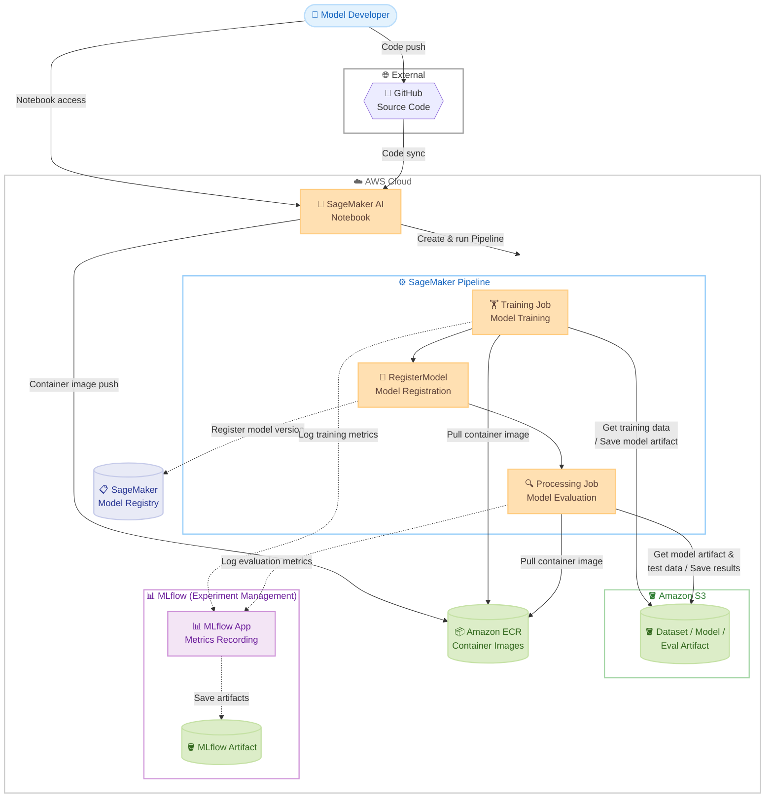
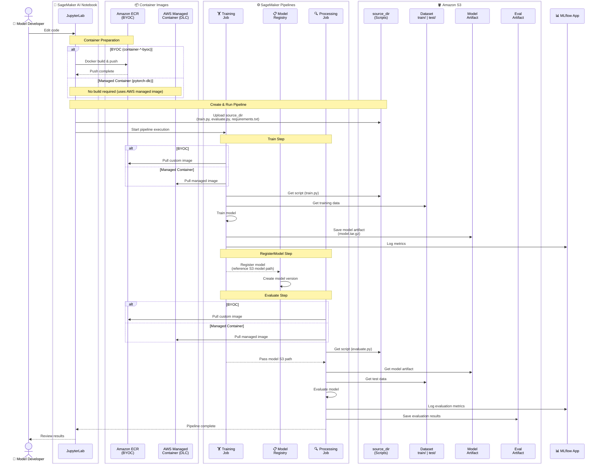
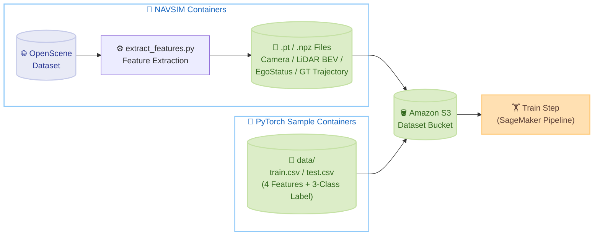
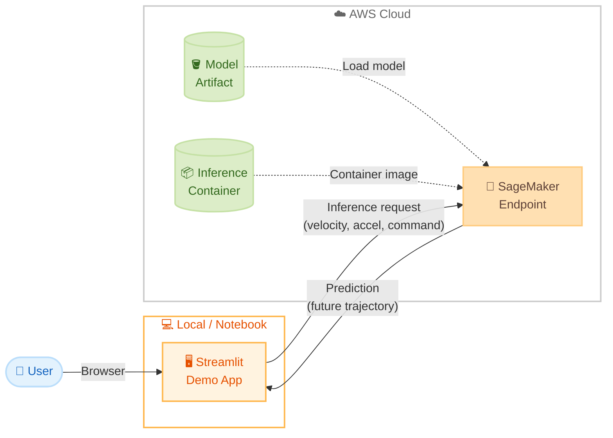
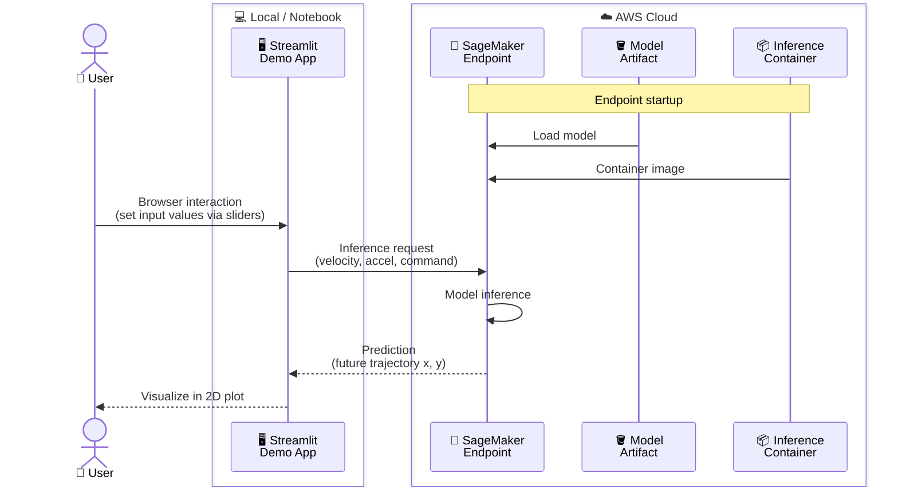
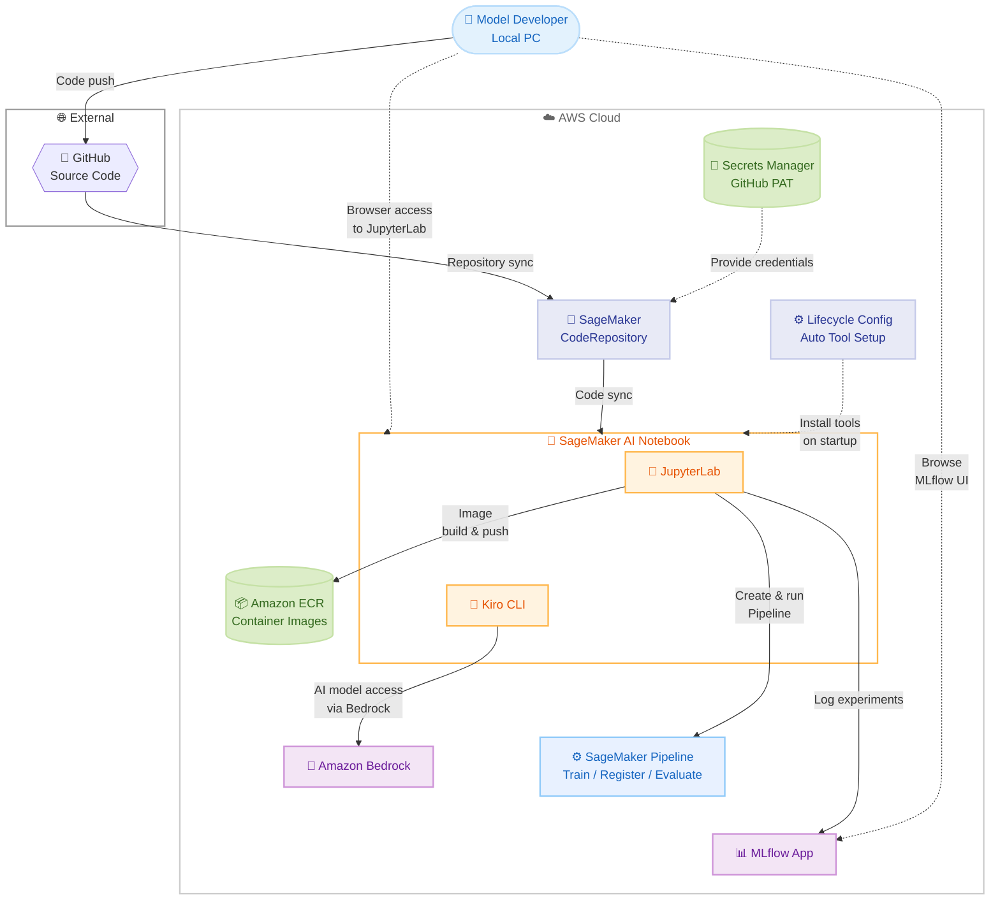

# SageMaker AI Pipeline for NAVSIM Autonomous Driving <!-- omit in toc -->

🌐 **Language**: 🇺🇸 [English](README.md) | 🇯🇵 [日本語](README.ja.md)

This repository is a sample project demonstrating how to apply AWS services such as Amazon SageMaker AI to model development for autonomous driving. The primary focus is on practical implementation patterns — from building ML training pipelines and managing experiments to deploying models and integrating with SageMaker Unified Studio.

Using [NAVSIM](https://github.com/autonomousvision/navsim) as a concrete use case, this project provides an end-to-end ML workflow consisting of three steps — training, model registration, and evaluation — ready to use from infrastructure provisioning to pipeline execution. NAVSIM is a framework for evaluating End-to-End driving models. Two NAVSIM baseline agents — EgoStatusMLP and Transfuser — are implemented as SageMaker training pipelines, along with inference endpoints and a demo app. A CARLA simulation demo is also included, allowing you to run the trained TransFuser model in the [CARLA](https://carla.org/) autonomous driving simulator with camera and LiDAR inputs.

- [Overview](#overview)
- [Architecture](#architecture)
  - [ML Pipeline Architecture](#ml-pipeline-architecture)
  - [Training Dataset](#training-dataset)
  - [Inference Architecture](#inference-architecture)
  - [Development Environment Architecture](#development-environment-architecture)
- [Directory Structure](#directory-structure)
- [Prerequisites](#prerequisites)
- [Quick Start](#quick-start)
- [Setup and Demos](#setup-and-demos)
- [Cleanup](#cleanup)
- [Documentation](#documentation)
- [Third-Party Licenses](#third-party-licenses)
- [Third-Party Data Notice](#third-party-data-notice)
- [Security](#security)
- [License](#license)

## Overview

This project provides a sample for building end-to-end (E2E) autonomous driving model training pipelines on Amazon SageMaker AI. It consists of three steps: model training (Train), registration to Model Registry (Register), and evaluation with test data (Evaluate). Infrastructure is provisioned with a single CloudFormation command, and pipeline definition and execution are handled via the SageMaker Python SDK. MLflow App integration for metrics recording and experiment management is built in.

For autonomous driving, implementations of [NAVSIM](https://github.com/autonomousvision/navsim) EgoStatusMLP and Transfuser are included as E2E driving models. A generic PyTorch template (SimpleClassifier) is also provided — you can adapt to any model by replacing `train.py` and `evaluate.py`.

Optional integration with [SageMaker Unified Studio](https://docs.aws.amazon.com/sagemaker-unified-studio/latest/userguide/what-is-sagemaker-unified-studio.html) is also supported, allowing you to view and manage SageMaker resources (Model Registry, MLflow App, Pipeline) from Unified Studio.

## Architecture

### ML Pipeline Architecture

The ML Pipeline consists of three steps: Train, Register, and Evaluate. Infrastructure (S3, ECR, SageMaker AI Notebook, MLflow App) is provisioned via CloudFormation, and the pipeline is defined and executed using the SageMaker Python SDK.



Service interactions during pipeline execution. This project provides multiple container patterns (PyTorch DLC, BYOC, NAVSIM), all sharing the same 3-step structure (Train → RegisterModel → Evaluate). NAVSIM containers (`container-navsim-ego-mlp` / `container-navsim-transfuser`) use the BYOC pattern with custom images pushed to ECR. Managed containers (PyTorch DLC) use AWS-provided images, so no ECR push is required.



### Training Dataset

Training data differs by container pattern.



#### NAVSIM Transfuser (container-navsim-transfuser)

Uses features extracted from the [OpenScene](https://github.com/OpenDriveLab/OpenScene) dataset. OpenScene is a large-scale autonomous driving dataset based on [nuPlan](https://www.nuscenes.org/nuplan), containing camera images, LiDAR point clouds, vehicle states (velocity, acceleration), and driving trajectories collected from real-world driving.

`extract_features.py` extracts the following features into `.pt` (PyTorch tensor) files and uploads them to S3. The Pipeline's Train step reads this data from S3 for training.

| Feature | Shape | Description |
|---------|-------|-------------|
| Camera images | `[3, 256, 1024]` | Left 60°, front, right 60° cameras stitched and resized (RGB) |
| LiDAR BEV | `[1, 256, 256]` | Point cloud converted to Bird's Eye View histogram (50m range) |
| EgoStatus | `[8]` | Velocity (vx, vy), acceleration (ax, ay), driving command (one-hot 4D) |
| GT trajectory | `[8, 3]` | Ground-truth future trajectory (x, y, heading) × 8 poses over 4 seconds |
| Auxiliary targets | — | `agent_states`, `agent_labels`, `bev_semantic_map` for joint training |

#### NAVSIM EgoStatusMLP (container-navsim-ego-mlp)

Uses only the ego vehicle state from the OpenScene dataset (no camera or LiDAR input). Features are extracted into `.npz` files (one file each for train / test) and uploaded to S3.

| Feature | Shape | Description |
|---------|-------|-------------|
| EgoStatus | `[8]` | Velocity (vx, vy), acceleration (ax, ay), driving command (one-hot 4D) |
| GT trajectory | `[8, 3]` | Ground-truth future trajectory (x, y, heading) × 8 poses over 4 seconds |

#### PyTorch Sample Containers (container-pytorch-dlc / container-pytorch-dlc-byoc)

PyTorch sample containers include sample data in the repository for verifying pipeline operation. The data consists of CSV files with 4 numeric features (`f1`–`f4`) and a 3-class classification label (`target`), used to train and evaluate a SimpleClassifier (3-layer MLP).

| File | Samples | Description |
|------|---------|-------------|
| `train.csv` | 800 | Training data (4 feature columns + 1 label column) |
| `test.csv` | 200 | Evaluation data (4 feature columns + 1 label column) |

These files are located in each container's `data/` directory and are automatically uploaded to S3 during pipeline execution.

For detailed data preparation steps, see the [Getting Started Guide](docs/setup-guide.md#step-2-upload-dataset).

### Inference Architecture

Deploy trained models as SageMaker real-time inference endpoints and send inference requests from a demo app. The deploy script automatically finds the latest model artifact on S3, repackages it with an inference script (`inference.py`), and creates the endpoint via CloudFormation.



The demo app supports NAVSIM EgoStatusMLP, visualizing predicted future trajectories in a 2D plot.



### Development Environment Architecture

Development environment where model developers access JupyterLab on a SageMaker AI Notebook instance from their local PC, with AI coding tools (Kiro CLI) for development. Includes GitHub repository integration, Amazon Bedrock AI model access, and MLflow experiment management.



## Directory Structure

The main files and directories in this repository.

```
.
├── README.md                                    # Project overview and setup instructions
├── .env.example                                 # Environment configuration template (copy to .env)
├── .env.example.ja                              # Environment configuration template (Japanese comments)
├── demo-app/                                    # Inference demo app
│   ├── main.py                                  # App entry point
│   └── requirements.txt                         # Dependencies
├── demo-carla/                                  # CARLA simulation demo
│   └── transfuser/                              # TransFuser CARLA demo
│       ├── run_demo.py                          # One-click demo (install → CARLA → simulate → video)
│       ├── run.py                               # Simulation main loop (3 cameras + LiDAR)
│       ├── agent.py                             # TransFuser agent (camera + LiDAR + ego status)
│       ├── pid_controller.py                    # Trajectory → steering/throttle conversion
│       ├── recorder.py                          # Camera frame capture & mp4 output
│       └── config.py                            # CARLA connection, sensor, PID parameters
├── notebooks/                                   # Jupyter Notebooks
│   ├── README.md                                # Notebook descriptions and runtime environment
│   ├── pytorch-pipeline.ipynb                   # PyTorch DLC: training, evaluation, Pipeline
│   ├── pytorch-byoc-pipeline.ipynb              # PyTorch BYOC: training, evaluation, Pipeline
│   ├── navsim-ego-mlp-pipeline.ipynb            # NAVSIM EgoStatusMLP training and evaluation
│   ├── navsim-transfuser-pipeline.ipynb         # NAVSIM Transfuser / LTF training and evaluation (GPU)
│   └── carla-transfuser-demo.ipynb              # CARLA simulation demo with TransFuser
├── infra/                                       # Infrastructure (CloudFormation)
│   ├── _common.sh                               # Common variables and functions
│   ├── sagemaker-ai-ml-pipeline/                # ML Pipeline environment
│   │   ├── cfn/
│   │   │   └── sagemaker-ai-ml-pipeline.yaml    # Infrastructure definition (S3, ECR, Notebook, MLflow, etc.)
│   │   └── scripts/
│   │       ├── deploy.sh                        # Deploy infrastructure
│   │       ├── destroy.sh                       # Cleanup infrastructure
│   │       ├── open-jupyterlab.sh               # Open JupyterLab in browser
│   │       └── open-mlflow.sh                   # Open MLflow UI in browser
│   ├── sagemaker-ai-inference/                  # SageMaker inference endpoint
│   │   ├── cfn/
│   │   │   └── sagemaker-ai-inference.yaml      # CloudFormation template
│   │   └── scripts/
│   │       ├── deploy.sh                        # Deploy inference endpoint
│   │       └── destroy.sh                       # Cleanup inference endpoint
│   └── unified-studio/                          # SageMaker Unified Studio integration (optional)
│       ├── cfn/
│       │   ├── foundation.yaml                  # Domain + IAM Role
│       │   ├── project.yaml                     # BlueprintConfig + ProjectProfile + Project
│       │   └── integration.yaml                 # RAM share + DataSource integration
│       └── scripts/
│           ├── deploy-foundation.sh             # Deploy Domain
│           ├── deploy-project.sh                # Deploy ProjectProfile + Project
│           ├── setup-integration.sh             # SageMaker resource integration
│           └── tag-resources.py                 # Resource tagging script
├── pipelines/                                   # Training and evaluation scripts and containers
│   ├── README.md                                # Pipeline execution instructions
│   ├── container-pytorch-dlc/                   # PyTorch DLC (managed container, GPU)
│   ├── container-pytorch-dlc-byoc/              # PyTorch DLC-based BYOC
│   ├── container-navsim-ego-mlp/                # NAVSIM EgoStatusMLP baseline
│   ├── container-navsim-transfuser/             # NAVSIM Transfuser (GPU)
│   └── scripts/                                 # Pipeline execution scripts
│       ├── run-pipeline.sh                      # One-command pipeline execution (Steps 1-4)
│       ├── 01-upload-dataset.sh                 # Upload sample data to S3
│       ├── 02-build-and-push-container.sh       # Build container & push to ECR
│       ├── 03-create-and-run-pipeline.py        # Create & run Pipeline
│       └── 04-check-pipeline-status.sh          # Check pipeline execution status
└── docs/                                        # Project documentation
    ├── setup-guide.md                              # Getting Started Guide
    ├── model-development-guide.md                  # ML/AI Model Development Guide
    ├── sagemaker-python-sdk-guide.md               # SageMaker Python SDK Guide
    ├── mlflow-guide.md                             # MLflow Experiment Management Guide
    ├── navsim-guide.md                             # NAVSIM Autonomous Driving Simulation Guide
    ├── unified-studio-integration-guide.md         # SageMaker Unified Studio Integration Guide
    ├── unified-studio-setup-guide.md               # SageMaker Unified Studio Setup Guide
    ├── vpc-configuration-guide.md                  # VPC Configuration Guide
    ├── vpc-implementation.md                       # VPC Implementation Details
    └── troubleshooting-guide.md                    # Troubleshooting Guide
```

## Prerequisites

The following tools are required on your local machine for infrastructure deployment.

- AWS CLI v2
- Python 3.10+
- SageMaker Python SDK (`pip install sagemaker`)
- GitHub CLI (`gh`) — for automatic GitHub repository creation ([install](https://cli.github.com/))

> **Note**: Docker and other ML dependencies are pre-installed on the SageMaker AI Notebook instance. Pipeline execution is performed from the Notebook, not from your local machine.

**Default region**: `us-east-1` (N. Virginia). Change by setting `AWS_DEFAULT_REGION` in the `.env` file.

**Notebook instance type**: The default is `ml.g4dn.2xlarge` (NVIDIA T4 GPU, 32 GB RAM). This enables CARLA simulation demos with TransFuser and GPU-accelerated development. The instance auto-stops after 60 minutes of idle time to minimize costs ($1.473/hour when running).

**Network configuration**: The default deployment does not use a VPC. Set `ENABLE_VPC=true` in `.env` to deploy all components within a VPC for a private network configuration. You can also specify an existing VPC. See [VPC Configuration](docs/vpc-configuration-guide.md) for details.

**Service Quotas**: SageMaker AI GPU instances (e.g., `ml.g6.4xlarge`) may have a default quota of 0. `deploy.sh` automatically requests the necessary quota increases, but approval may take a few minutes to several hours.

## Quick Start

Get started with 4 commands — from infrastructure provisioning to pipeline execution.

```bash
# 1. Configure environment
cp .env.example .env
# Edit .env to set your configuration (region, GitHub integration, etc.)

# 2. Deploy infrastructure (S3, ECR, Notebook, MLflow, etc.)
./infra/sagemaker-ai-ml-pipeline/scripts/deploy.sh

# 3. Open JupyterLab
./infra/sagemaker-ai-ml-pipeline/scripts/open-jupyterlab.sh

# 4. Run pipeline (from JupyterLab terminal)
./pipelines/scripts/run-pipeline.sh -c container-navsim-transfuser
```

## Setup and Demos

The [Getting Started Guide](docs/setup-guide.md) provides detailed steps from infrastructure deployment through pipeline execution to inference endpoint deployment. It covers a complete ML workflow combining CloudFormation-based provisioning, pipeline definition and execution with the SageMaker Python SDK, and experiment management with MLflow.

- **Infrastructure deployment**: Run `deploy.sh` to provision S3, ECR, SageMaker AI Notebook, and MLflow App.
- **Pipeline execution**: Run `run-pipeline.sh` to upload data, build containers, and execute the training/evaluation pipeline.
- **Inference endpoint**: Deploy trained models as SageMaker real-time inference endpoints.
- **Unified Studio integration**: View and manage Model Registry, MLflow, and Pipelines from SageMaker Unified Studio.

Two demos are also provided to verify trained model behavior. The CARLA simulation demo lets you observe how the model predicts trajectories from real sensor inputs, while the inference demo app provides a lightweight way to visualize predictions from a browser.

- 🚗 **[CARLA Simulation Demo](demo-carla/transfuser/README.md)** — Run a trained TransFuser model in the CARLA simulator. Captures real-time sensor data from 3 cameras and LiDAR, drives the vehicle autonomously based on the model's predicted trajectory, and records a driving video. Requires a GPU instance (ml.g4dn.2xlarge or larger).
- 🖥️ **[Inference Demo App](demo-app/README.md)** — Send inference requests to a model deployed on a SageMaker Endpoint via Streamlit UI. Input velocity, acceleration, and driving command, and visualize the predicted future trajectory in a 2D plot. No GPU or CARLA required.

## Cleanup

```bash
./infra/sagemaker-ai-ml-pipeline/scripts/destroy.sh
```

## Documentation

Related documentation in this repository.

- [Getting Started Guide](docs/setup-guide.md) - Infrastructure deployment, pipeline execution, inference endpoint, demo app, Unified Studio integration
- [ML/AI Model Development Guide](docs/model-development-guide.md) - Framework selection, container patterns
- [SageMaker Python SDK Guide](docs/sagemaker-python-sdk-guide.md) - Key classes and usage of SageMaker Python SDK
- [MLflow Experiment Management Guide](docs/mlflow-guide.md) - Metrics recording and model registration
- [NAVSIM Autonomous Driving Simulation Guide](docs/navsim-guide.md) - Baseline agent comparison, SageMaker implementation patterns
- [Inference Demo App](demo-app/README.md) - Inference endpoint deployment and demo app
- [CARLA Simulation Demo](demo-carla/transfuser/README.md) - Run TransFuser in CARLA simulator with camera + LiDAR
- [Unified Studio Integration Guide](docs/unified-studio-integration-guide.md) - SageMaker resource integration with Unified Studio
- [Unified Studio Setup Guide](docs/unified-studio-setup-guide.md) - Domain and project setup
- [VPC Configuration](docs/vpc-configuration-guide.md) - VPC design and configuration guide
- [VPC Implementation](docs/vpc-implementation.md) - VPC implementation details and lessons learned
- [Troubleshooting Guide](docs/troubleshooting-guide.md) - Investigating and resolving deployment, pipeline execution, and Notebook environment errors


## Third-Party Licenses

See the [NOTICE](NOTICE) file for third-party attributions including NAVSIM (Apache 2.0), TransFuser (MIT), and dataset license notices.

## Third-Party Data Notice

The NAVSIM containers in this repository are designed to work with the [OpenScene](https://github.com/OpenDriveLab/OpenScene) and [nuPlan](https://www.nuscenes.org/nuplan) datasets. **This repository does not bundle or redistribute any third-party data.** The sample data in `data/` directories is independently generated dummy data.

If you choose to use OpenScene or nuPlan data, please note:

- **OpenScene data** is distributed under [CC BY-NC-SA 4.0](https://creativecommons.org/licenses/by-nc-sa/4.0/) and the [nuPlan Dataset License Agreement for Non-Commercial Use](https://www.nuscenes.org/terms-of-use). Commercial use is not permitted.
- **nuPlan data** is subject to its own [terms of use](https://www.nuscenes.org/terms-of-use). You must agree to these terms before downloading and using the data.

Users are responsible for complying with the applicable dataset licenses.

## Security

See [CONTRIBUTING](CONTRIBUTING.md#security-issue-notifications) for more information.

## License

This project is licensed under the MIT-0 License. See the [LICENSE](LICENSE) file.
