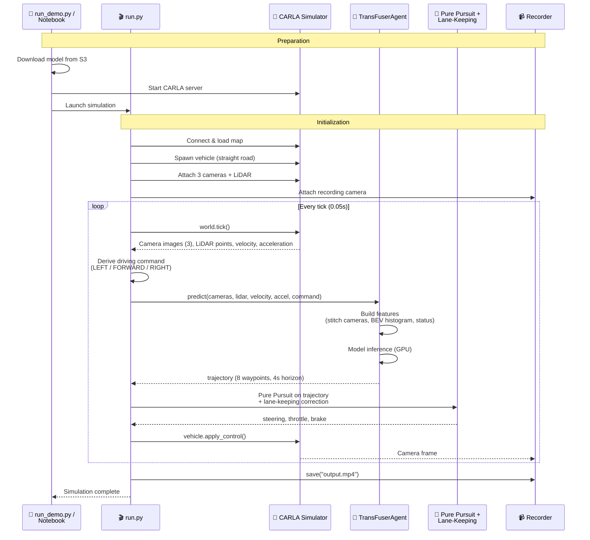

# CARLA シミュレーションデモ: TransFuser <!-- omit in toc -->

🌐 **Language**: 🇺🇸 [English](README.md) | 🇯🇵 [日本語](README.ja.md)

SageMaker AI Pipeline で学習した NAVSIM TransFuser モデルを [CARLA](https://carla.org/) 自動運転シミュレーター上で実行するデモです。3 台の RGB カメラと LiDAR からリアルタイムでセンサーデータを取得し、モデルが予測した将来軌跡に基づいて車両を自律走行させ、走行動画を録画します。

NAVSIM のオフラインデータセットで学習したモデルが、CARLA のリアルタイムシミュレーション環境でどのように振る舞うかを確認できます。

- [概要](#概要)
- [アーキテクチャ](#アーキテクチャ)
  - [センサー構成](#センサー構成)
  - [座標系変換](#座標系変換)
  - [制御の仕組み](#制御の仕組み)
- [実行方法](#実行方法)
  - [方法 1: run\_demo.py (推奨)](#方法-1-run_demopy-推奨)
  - [方法 2: Notebook](#方法-2-notebook)
  - [方法 3: run.py (手動)](#方法-3-runpy-手動)
- [設定](#設定)
- [ファイル構成](#ファイル構成)
- [関連情報](#関連情報)

## 概要

このデモは、SageMaker AI Pipeline で学習した TransFuser モデルを CARLA シミュレーター上の車両に接続し、モデルの軌跡予測に基づいて走行させるエンドツーエンドのワークフローです。モデル学習 → 推論 → シミュレーション走行 → 動画録画までを一気通貫で体験できます。

TransFuser は、前方カメラ画像と LiDAR の BEV (Bird's Eye View) ヒストグラムを CNN + Transformer で融合し、将来の軌跡を予測するマルチモーダルモデルです。CARLA 上では以下の 3 つの入力をリアルタイムで構築してモデルに渡します。

| 入力 | Shape | 説明 |
|------|-------|------|
| カメラ画像 | `[3, 256, 1024]` | 左 60°・正面・右 60° の 3 台をスティッチしてリサイズ |
| LiDAR BEV | `[1, 256, 256]` | 点群を BEV ヒストグラムに変換 (50m 範囲) |
| EgoStatus | `[8]` | 速度 (vx, vy)、加速度 (ax, ay)、走行コマンド (one-hot 4 次元) |

モデルは将来 4 秒間の軌跡 (8 ポーズ × [x, y, heading]) を出力し、Pure Pursuit + Lane-Keeping 制御で車両のステアリング・スロットル・ブレーキに変換します。

## アーキテクチャ

シミュレーションは、準備フェーズと走行ループの 2 段階で構成されます。

準備フェーズでは、`run_demo.py` または Notebook が CARLA サーバーの起動、学習済みモデルの S3 からのダウンロード、依存パッケージのインストールを行います。準備が完了すると `run.py` を呼び出してシミュレーション本体を開始します。

走行ループでは、毎 tick (0.05 秒間隔、20 FPS) ごとに以下の処理を繰り返します。

1. CARLA から 3 台のカメラ画像と LiDAR 点群を取得
2. 3 台のカメラ画像を横方向に連結して 1 枚のパノラマ画像 (形状 `[3, 256, 1024]`) を作成し、LiDAR 点群を真上から見下ろした俯瞰 (BEV) の点密度マップ (形状 `[1, 256, 256]`) に変換
3. 車両の速度・加速度とこのループで決めた進行方向 (LEFT / FORWARD / RIGHT) を 1 つのベクトル (形状 `[8]`) にまとめる
4. 上記 3 つを TransFuser モデルに入力し、将来 4 秒間の軌跡 (8 ポーズ) を予測
5. 予測軌跡上の目標点を追いかけるようハンドル角を計算し (Pure Pursuit)、レーン中心からのずれを補正する微調整を加える (Lane-Keeping)。同時に軌跡のカーブ具合から目標速度を決め、アクセル・ブレーキを調整する
6. 車両に制御コマンドを適用



### センサー構成

CARLA 上の車両には以下のセンサーをアタッチします。

| センサー | 位置 | 設定 | 用途 |
|---------|------|------|------|
| RGB カメラ (左) | 前方 x=1.5m, z=2.4m, yaw=-60° | 1600×900, FOV 70° | TransFuser 入力 |
| RGB カメラ (正面) | 前方 x=1.5m, z=2.4m | 1600×900, FOV 70° | TransFuser 入力 |
| RGB カメラ (右) | 前方 x=1.5m, z=2.4m, yaw=+60° | 1600×900, FOV 70° | TransFuser 入力 |
| LiDAR | 前方 x=1.5m, z=2.4m | 64ch, 50m 範囲, 600K pts/s | TransFuser 入力 |
| RGB カメラ (後方) | 後方 x=-5.5m, z=2.8m, pitch=-15° | 1280×720, FOV 110° | 動画録画用 |

### 座標系変換

CARLA と NAVSIM では座標系が異なるため、`agent.py` と `run.py` で変換を行っています。

| 軸 | CARLA (UE4) | NAVSIM (nuPlan) | 変換 |
|----|-------------|-----------------|------|
| x | 前方 | 前方 | そのまま |
| y | 右方向が正 | 左方向が正 | `y = -y` |
| yaw | 時計回りが正 | 反時計回りが正 | `yaw = -yaw` |

### 制御の仕組み

車両制御は、モデルの軌跡予測を主とし、レーン維持補正を安全ネットとして組み合わせています。

- **Pure Pursuit (主制御)**: モデルが予測した trajectory 上で、速度に応じた先読み距離 (4〜15m) の目標点を見つけ、ステアリング角を幾何学的に計算します。
- **Lane-Keeping (補正)**: CARLA の道路 waypoint からレーン中心までの横方向オフセットを計測し、オフセットに比例した補正ステアリングを加えます。
- **速度制御**: trajectory の曲率を推定し、カーブが急な場合は目標速度を下げます。PID 制御でスロットル/ブレーキを調整します。

## 実行方法

### 前提条件

以下が必要です。

- GPU Notebook インスタンス (ml.g4dn.2xlarge 以上、32 GB RAM)
- 学習済み TransFuser モデル (`navsim-transfuser-pipeline.ipynb` または `run-pipeline.sh` で学習)

### 方法 1: run_demo.py (推奨)

CARLA のインストール、サーバー起動、モデルの S3 からのダウンロード、シミュレーション実行、動画生成を一括で行うスクリプトです。

```bash
# 初回実行 (CARLA インストール含む)
python demo-carla/transfuser/run_demo.py

# 2 回目以降 (インストールスキップ)
python demo-carla/transfuser/run_demo.py --skip-install

# オプション指定
python demo-carla/transfuser/run_demo.py --town Town04 --duration 30
```

| 引数 | デフォルト | 説明 |
|----------|---------|-------------|
| `--model` | 自動検出 | model.pth のパス (未指定時は S3 から自動ダウンロード) |
| `--town` | `Town04` | CARLA マップ |
| `--duration` | `60` | シミュレーション時間 (秒) |
| `--output` | `outputs/transfuser_demo.mp4` | 出力動画ファイルパス |
| `--skip-install` | - | CARLA/依存パッケージのインストールをスキップ |

### 方法 2: Notebook

`notebooks/carla-transfuser-demo.ipynb` を JupyterLab で開いて、セルを順番に実行します。モデルのダウンロード、CARLA のインストール・起動、シミュレーション実行、動画再生までをセル単位で実行できます。

### 方法 3: run.py (手動)

CARLA サーバーが既に起動している場合に、シミュレーションのみを実行します。デバッグや設定の調整に便利です。

```bash
# CARLA サーバーを別ターミナルで起動
~/SageMaker/carla/CarlaUE4.sh -RenderOffScreen --world-port=2000 &
sleep 30

# シミュレーション実行
cd demo-carla/transfuser
python run.py --model model/model.pth --town Town04 --duration 60
```

## 設定

`config.py` で以下のパラメータを調整できます。

| カテゴリ | パラメータ | デフォルト | 説明 |
|---------|-----------|-----------|------|
| Simulation | `TOWN` | `Town04` | CARLA マップ |
| Simulation | `FIXED_DELTA` | `0.05` | シミュレーション刻み (20 FPS) |
| Simulation | `DURATION_SEC` | `60` | シミュレーション時間 (秒) |
| Perception | `PERCEPTION_CAM_FOV` | `70` | カメラ FOV |
| Perception | `PERCEPTION_CAM_YAW_LEFT` | `-60` | 左カメラ角度 |
| Perception | `PERCEPTION_CAM_YAW_RIGHT` | `60` | 右カメラ角度 |
| LiDAR | `LIDAR_RANGE` | `50.0` | LiDAR 検出範囲 (m) |
| LiDAR | `LIDAR_CHANNELS` | `64` | LiDAR チャネル数 |
| Control | `TARGET_SPEED_MS` | `6.0` | 目標速度 (m/s, 約 22 km/h) |
| Control | `MIN_LOOKAHEAD` | `4.0` | Pure Pursuit 最小先読み距離 (m) |
| Control | `MAX_LOOKAHEAD` | `15.0` | Pure Pursuit 最大先読み距離 (m) |

## ファイル構成

```
demo-carla/transfuser/
├── run_demo.py          # 一括実行スクリプト (CARLA インストール〜動画生成)
├── run.py               # シミュレーション本体 (3 カメラ + LiDAR)
├── agent.py             # TransFuser 推論 (カメラ + LiDAR + EgoStatus → 軌跡)
├── pid_controller.py    # Pure Pursuit + Lane-Keeping 制御
├── recorder.py          # カメラ録画・動画出力
├── config.py            # パラメータ設定
├── requirements.txt     # Python 依存パッケージ
├── model/               # 学習済みモデル配置先
│   └── .gitkeep
└── outputs/             # 動画出力先
    └── .gitkeep
```

## 関連情報

- [TransFuser / CARLA Garage](https://github.com/autonomousvision/carla_garage) - TransFuser の CARLA 向け実装 (autonomousvision)
- [CARLA Simulator](https://carla.org/) - オープンソース自動運転シミュレーター
- [TransFuser モデルアーキテクチャ](../../pipelines/container-navsim-transfuser/) - SageMaker 学習コンテナ (モデル定義・学習スクリプト)
- [TransFuser Pipeline Notebook](../../notebooks/navsim-transfuser-pipeline.ipynb) - モデル学習・評価の Notebook
- [CARLA Demo Notebook](../../notebooks/carla-transfuser-demo.ipynb) - CARLA シミュレーションデモの Notebook
