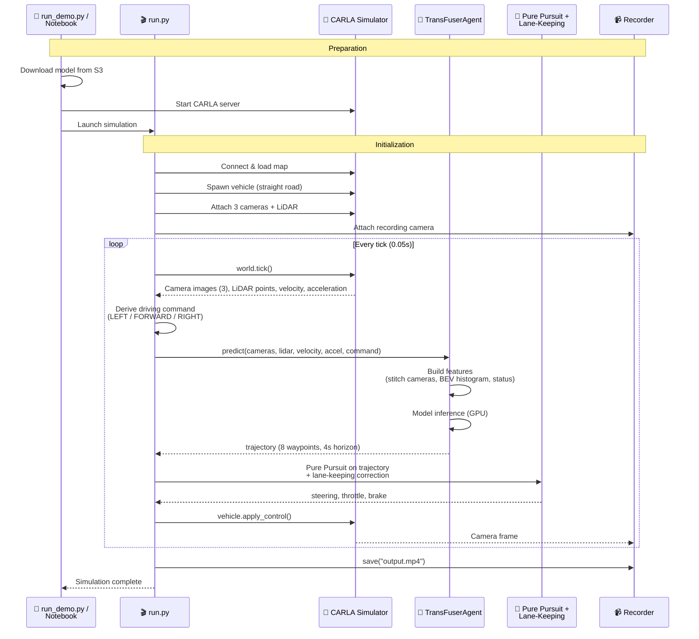

# CARLA Simulation Demo: TransFuser <!-- omit in toc -->

🌐 **Language**: 🇺🇸 [English](README.md) | 🇯🇵 [日本語](README.ja.md)

Run a NAVSIM TransFuser model trained with SageMaker AI Pipeline in the [CARLA](https://carla.org/) autonomous driving simulator. The demo captures real-time sensor data from 3 RGB cameras and LiDAR, feeds it into the model to predict future trajectories, and drives the vehicle autonomously while recording a video.

This allows you to observe how a model trained on NAVSIM's offline dataset behaves in CARLA's real-time simulation environment.

- [Overview](#overview)
- [Architecture](#architecture)
  - [Sensor Configuration](#sensor-configuration)
  - [Coordinate System Conversion](#coordinate-system-conversion)
  - [Control System](#control-system)
- [How to Run](#how-to-run)
  - [Option 1: run\_demo.py (Recommended)](#option-1-run_demopy-recommended)
  - [Option 2: Notebook](#option-2-notebook)
  - [Option 3: run.py (Manual)](#option-3-runpy-manual)
- [Configuration](#configuration)
- [File Structure](#file-structure)
- [Related Resources](#related-resources)

## Overview

This demo connects a TransFuser model trained with SageMaker AI Pipeline to a vehicle in the CARLA simulator, driving it based on the model's trajectory predictions. It provides an end-to-end experience from model training to inference, simulation driving, and video recording.

TransFuser is a multi-modal model that fuses front-view camera images and LiDAR BEV (Bird's Eye View) histograms using CNN + Transformer to predict future trajectories. In CARLA, the following three inputs are constructed in real-time and fed to the model:

| Input | Shape | Description |
|-------|-------|-------------|
| Camera images | `[3, 256, 1024]` | Left 60°, front, right 60° cameras stitched and resized |
| LiDAR BEV | `[1, 256, 256]` | Point cloud converted to BEV histogram (50m range) |
| EgoStatus | `[8]` | Velocity (vx, vy), acceleration (ax, ay), driving command (one-hot 4D) |

The model outputs a 4-second future trajectory (8 poses × [x, y, heading]), which is converted to steering, throttle, and brake commands using Pure Pursuit + Lane-Keeping control.

## Architecture

The simulation consists of two phases: preparation and the driving loop.

In the preparation phase, `run_demo.py` or the Notebook starts the CARLA server, downloads the trained model from S3, and installs dependencies. Once ready, it launches `run.py` to begin the simulation.

In the driving loop, the following steps are repeated every tick (0.05s interval, 20 FPS):

1. Retrieve 3 camera images and LiDAR point cloud from CARLA
2. Concatenate the 3 camera images horizontally into a single panorama (shape `[3, 256, 1024]`), and convert the LiDAR point cloud into a top-down (BEV) point-density map (shape `[1, 256, 256]`)
3. Pack the vehicle's velocity and acceleration together with the driving direction decided in this loop (LEFT / FORWARD / RIGHT) into a single vector (shape `[8]`)
4. Feed these three inputs into the TransFuser model to predict a 4-second future trajectory (8 poses)
5. Compute the steering angle by chasing a target point on the predicted trajectory (Pure Pursuit), with a correction based on the deviation from the lane center (Lane-Keeping). Also set a target speed from the trajectory's curvature and adjust throttle / brake accordingly
6. Apply control commands to the vehicle



### Sensor Configuration

The following sensors are attached to the vehicle in CARLA:

| Sensor | Position | Settings | Purpose |
|--------|----------|----------|---------|
| RGB Camera (left) | x=1.5m, z=2.4m, yaw=-60° | 1600×900, FOV 70° | TransFuser input |
| RGB Camera (front) | x=1.5m, z=2.4m | 1600×900, FOV 70° | TransFuser input |
| RGB Camera (right) | x=1.5m, z=2.4m, yaw=+60° | 1600×900, FOV 70° | TransFuser input |
| LiDAR | x=1.5m, z=2.4m | 64ch, 50m range, 600K pts/s | TransFuser input |
| RGB Camera (rear) | x=-5.5m, z=2.8m, pitch=-15° | 1280×720, FOV 110° | Video recording |

### Coordinate System Conversion

CARLA and NAVSIM use different coordinate systems. Conversion is handled in `agent.py` and `run.py`.

| Axis | CARLA (UE4) | NAVSIM (nuPlan) | Conversion |
|------|-------------|-----------------|------------|
| x | Forward | Forward | As-is |
| y | Right-positive | Left-positive | `y = -y` |
| yaw | Clockwise-positive | Counter-clockwise-positive | `yaw = -yaw` |

### Control System

Vehicle control combines the model's trajectory prediction as primary input with lane-keeping as a safety net.

- **Pure Pursuit (primary)**: Finds a goal point on the predicted trajectory at a speed-dependent lookahead distance (4–15m) and geometrically computes the steering angle.
- **Lane-Keeping (correction)**: Measures lateral offset from the lane center using CARLA road waypoints and adds proportional steering correction.
- **Speed control**: Estimates trajectory curvature and reduces target speed for sharp curves. PID control adjusts throttle/brake.

## How to Run

### Prerequisites

The following are required:

- GPU Notebook instance (ml.g4dn.2xlarge or larger, 32 GB RAM)
- Trained TransFuser model (train with `navsim-transfuser-pipeline.ipynb` or `run-pipeline.sh`)

### Option 1: run_demo.py (Recommended)

A single script that handles CARLA installation, server startup, model download from S3, simulation, and video generation.

```bash
# First run (includes CARLA installation)
python demo-carla/transfuser/run_demo.py

# Subsequent runs (skip installation)
python demo-carla/transfuser/run_demo.py --skip-install

# With options
python demo-carla/transfuser/run_demo.py --town Town04 --duration 30
```

| Argument | Default | Description |
|----------|---------|-------------|
| `--model` | Auto-detect | Path to model.pth (auto-downloads from S3 if omitted) |
| `--town` | `Town04` | CARLA map |
| `--duration` | `60` | Simulation duration (seconds) |
| `--output` | `outputs/transfuser_demo.mp4` | Output video file path |
| `--skip-install` | - | Skip CARLA/dependency installation |

### Option 2: Notebook

Open `notebooks/carla-transfuser-demo.ipynb` in JupyterLab and run the cells sequentially. Covers model download, CARLA installation and startup, simulation, and video playback in individual cells.

### Option 3: run.py (Manual)

Run the simulation directly when a CARLA server is already running. Useful for debugging and tuning parameters.

```bash
# Start CARLA server in another terminal
~/SageMaker/carla/CarlaUE4.sh -RenderOffScreen --world-port=2000 &
sleep 30

# Run simulation
cd demo-carla/transfuser
python run.py --model model/model.pth --town Town04 --duration 60
```

## Configuration

Adjust the following parameters in `config.py`:

| Category | Parameter | Default | Description |
|----------|-----------|---------|-------------|
| Simulation | `TOWN` | `Town04` | CARLA map |
| Simulation | `FIXED_DELTA` | `0.05` | Simulation tick (20 FPS) |
| Simulation | `DURATION_SEC` | `60` | Simulation duration (seconds) |
| Perception | `PERCEPTION_CAM_FOV` | `70` | Camera FOV |
| Perception | `PERCEPTION_CAM_YAW_LEFT` | `-60` | Left camera angle |
| Perception | `PERCEPTION_CAM_YAW_RIGHT` | `60` | Right camera angle |
| LiDAR | `LIDAR_RANGE` | `50.0` | LiDAR detection range (m) |
| LiDAR | `LIDAR_CHANNELS` | `64` | LiDAR channels |
| Control | `TARGET_SPEED_MS` | `6.0` | Target speed (m/s, ~22 km/h) |
| Control | `MIN_LOOKAHEAD` | `4.0` | Pure Pursuit min lookahead (m) |
| Control | `MAX_LOOKAHEAD` | `15.0` | Pure Pursuit max lookahead (m) |

## File Structure

```
demo-carla/transfuser/
├── run_demo.py          # One-click demo (install → CARLA → simulate → video)
├── run.py               # Simulation main loop (3 cameras + LiDAR)
├── agent.py             # TransFuser inference (camera + LiDAR + EgoStatus → trajectory)
├── pid_controller.py    # Pure Pursuit + Lane-Keeping control
├── recorder.py          # Camera recording & mp4 output
├── config.py            # Parameter settings
├── requirements.txt     # Python dependencies
├── model/               # Trained model directory
│   └── .gitkeep
└── outputs/             # Video output directory
    └── .gitkeep
```

## Related Resources

- [TransFuser / CARLA Garage](https://github.com/autonomousvision/carla_garage) - TransFuser implementation for CARLA (autonomousvision)
- [CARLA Simulator](https://carla.org/) - Open-source autonomous driving simulator
- [TransFuser Model Architecture](../../pipelines/container-navsim-transfuser/) - SageMaker training container (model definition & training scripts)
- [TransFuser Pipeline Notebook](../../notebooks/navsim-transfuser-pipeline.ipynb) - Model training & evaluation notebook
- [CARLA Demo Notebook](../../notebooks/carla-transfuser-demo.ipynb) - CARLA simulation demo notebook
