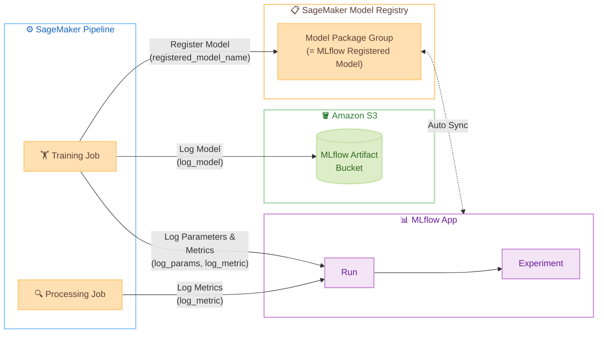

# MLflow 実験管理ガイド <!-- omit in toc -->

🌐 **Language**: 🇺🇸 [English](mlflow-guide.md) | 🇯🇵 [日本語](mlflow-guide.ja.md)

本プロジェクトでは、Amazon SageMaker AI の Managed MLflow App を使用して、ML 実験のメトリクス記録・モデル管理を行います。このドキュメントでは、MLflow の仕組みと使い方を解説します。

## 目次 <!-- omit in toc -->

- [概要](#概要)
- [アーキテクチャ](#アーキテクチャ)
- [MLflow UI へのアクセス](#mlflow-ui-へのアクセス)
- [MLflow SDK のセットアップ](#mlflow-sdk-のセットアップ)
  - [インストール](#インストール)
  - [MLflow App への接続](#mlflow-app-への接続)
- [メトリクス・パラメータの記録](#メトリクスパラメータの記録)
  - [基本的な使い方](#基本的な使い方)
  - [train.py での使用例](#trainpy-での使用例)
  - [PyTorch での epoch メトリクス記録](#pytorch-での-epoch-メトリクス記録)
  - [NAVSIM での epoch メトリクス記録](#navsim-での-epoch-メトリクス記録)
  - [evaluate.py での使用例](#evaluatepy-での使用例)
- [モデルの登録](#モデルの登録)
  - [Python SDK からの登録](#python-sdk-からの登録)
  - [MLflow UI からの登録](#mlflow-ui-からの登録)
  - [自動登録 (ModelRegistrationMode)](#自動登録-modelregistrationmode)
- [SageMaker Pipeline との統合](#sagemaker-pipeline-との統合)
- [参考リンク](#参考リンク)

## 概要

MLflow は ML 実験のライフサイクルを管理するオープンソースプラットフォームです。本プロジェクトでは、CloudFormation で作成される Managed MLflow App を使用しています。

MLflow は以下の階層構造で実験を管理します。

- **Experiment**: 同じ目的・モデルに取り組む Run をまとめる単位 (例: `navsim-transfuser` というプロジェクト全体)
- **Run**: 1 回の学習実行を表す単位 (例: `train.py` を 1 回走らせた記録)。固有 ID を持ち、以下の情報を紐づける
  - **パラメータ**: ハイパーパラメータや設定値 (`learning_rate=0.0003` など)
  - **メトリクス**: epoch ごとの loss、accuracy、ADE / FDE など (時系列記録)
  - **アーティファクト**: モデルファイル、グラフ、評価結果など
  - **タグ**: Git コミット、フレームワークバージョンなどのメタ情報

1 つの Experiment の下に複数の Run が並び、MLflow UI でハイパーパラメータとメトリクスを横並びで比較できます。さらに Run から登録したモデルは SageMaker Model Registry でバージョン管理されます。

## アーキテクチャ

SageMaker Pipeline の各ステップ (Training Job、Processing Job) から MLflow App にメトリクスやモデルを記録し、アーティファクトは S3 に保存されます。`mlflow.*.log_model()` 呼び出し時に `registered_model_name` を指定すると、SageMaker Model Registry に Model Package Group / Version が作成され、Managed MLflow App と自動的に同期されます。



図中の主な要素は以下の通りです。

- **Experiment / Run**: Experiment はモデル/プロジェクト単位のグループ、Run は 1 回の学習実行の記録です (詳細は [概要](#概要) を参照)
- **MLflow Artifact Bucket**: モデルファイル (`.pth`、`MLmodel`、`conda.yaml` 等) を保存する S3 バケット
- **Model Package Group**: SageMaker Model Registry 上のモデルのバージョン管理単位。MLflow の Registered Model と同一実体

## MLflow UI へのアクセス

MLflow UI には、ヘルパースクリプトで presigned URL を生成してブラウザからアクセスします。セッションは 4 時間有効です。

```bash
./infra/scripts/open-mlflow.sh [PROJECT_NAME]
```

presigned URL は 1 回のみ使用可能です。セッションが切れた場合はスクリプトを再実行してください。詳細は [署名付き URL を使用して MLflow UI を起動する](https://docs.aws.amazon.com/ja_jp/sagemaker/latest/dg/mlflow-launch-ui.html) を参照してください。

## MLflow SDK のセットアップ

### インストール

SageMaker AI Notebook (JupyterLab) 上で、MLflow と AWS MLflow プラグインをインストールします。

```bash
pip install sagemaker-mlflow
```

MLflow App のバージョンに合わせた MLflow バージョンを使用してください。

| MLflow App バージョン | MLflow バージョン |
|--------------------------|-----------------|
| 3.x | `mlflow>=3.0` |

### MLflow App への接続

MLflow App の ARN を使用して接続します。ARN はスタック出力の `MlflowAppArn` から取得できます。

```python
import mlflow

# MLflow App ARN で接続 (XXXXXXXXXXXX は実際のリソース ID に置き換えてください)
mlflow_app_arn = "arn:aws:sagemaker:us-east-1:123456789012:mlflow-app/app-XXXXXXXXXXXX"
mlflow.set_tracking_uri(mlflow_app_arn)
```

本プロジェクトでは、この接続処理を `train.py` (学習スクリプト) と `evaluate.py` (評価スクリプト) の中で行います。`03-create-and-run-pipeline.py` が MLflow App ARN を自動取得し、環境変数 `MLFLOW_APP_ARN` として各コンテナに渡すため、ARN のハードコードは不要です。詳細は [train.py での使用例](#trainpy-での使用例) と [SageMaker Pipeline との統合](#sagemaker-pipeline-との統合) を参照してください。

ARN は以下の CLI コマンドでも取得できます。

```bash
aws cloudformation describe-stacks \
  --stack-name sagemaker-ai-ml-pipeline-stack \
  --query 'Stacks[0].Outputs[?OutputKey==`MlflowAppArn`].OutputValue' \
  --output text
```

## メトリクス・パラメータの記録

### 基本的な使い方

MLflow SDK の主要な記録関数は以下の通りです。

```python
import mlflow

mlflow.set_tracking_uri(mlflow_app_arn)
mlflow.set_experiment("my-experiment")

with mlflow.start_run():
    # ハイパーパラメータを記録
    mlflow.log_params({"n_estimators": 100, "random_state": 42})

    # メトリクスを記録
    mlflow.log_metric("accuracy", 0.95)
    mlflow.log_metric("f1", 0.93)

    # epoch ごとのメトリクスを記録 (step パラメータで時系列チャートになる)
    for epoch in range(num_epochs):
        mlflow.log_metric("train_loss", train_loss, step=epoch)
        mlflow.log_metric("val_loss", val_loss, step=epoch)

    # タグを設定
    mlflow.set_tag("description", "ベースラインモデル")

    # モデルをアーティファクトとして記録
    mlflow.pytorch.log_model(model, name="model", signature=signature)
```

記録された情報は MLflow UI の Experiments ページで確認・比較できます。

### train.py での使用例

実際の `train.py` での MLflow 連携部分です。`MLFLOW_APP_ARN` と `MODEL_GROUP_NAME` は `03-create-and-run-pipeline.py` から環境変数として渡されます。

```python
# ハイパーパラメータ
params = {
    "epochs": 20,
    "batch_size": 32,
    "learning_rate": 0.001,
}

tracking_arn = os.environ.get("MLFLOW_APP_ARN", "")
model_group_name = os.environ.get(
    "MODEL_GROUP_NAME", "sagemaker-ai-ml-pipeline-pytorch"
)
if tracking_arn:
    import mlflow

    mlflow.set_tracking_uri(tracking_arn)
    mlflow.set_experiment("training")

    with mlflow.start_run():
        mlflow.log_params(params)

        # epoch 毎のメトリクスを記録
        for epoch in range(params["epochs"]):
            train_loss = train_one_epoch(model, train_loader, optimizer)
            mlflow.log_metric("train_loss", train_loss, step=epoch)

        # 最終メトリクスを記録
        mlflow.log_metric("train_accuracy", train_accuracy)
        mlflow.log_metric("train_f1", train_f1)

        # モデルをアーティファクトとして記録し、同時に Model Registry に登録する
        mlflow.pytorch.log_model(
            pytorch_model=model,
            name="pytorch-model",
            registered_model_name=model_group_name,
        )
```

### PyTorch での epoch メトリクス記録

PyTorch の `train.py` では、epoch ごとの train/validation メトリクスを `step` パラメータ付きで記録しています。MLflow UI でチャートとして学習曲線を可視化でき、過学習の検出に役立ちます。

```python
with mlflow.start_run():
    mlflow.log_params(params)

    # epoch ごとのメトリクスを記録 (学習曲線の可視化用)
    for step, m in enumerate(epoch_metrics):
        mlflow.log_metric("train_loss", m["train_loss"], step=step)
        mlflow.log_metric("train_acc", m["train_acc"], step=step)
        mlflow.log_metric("val_loss", m["val_loss"], step=step)
        mlflow.log_metric("val_acc", m["val_acc"], step=step)

    # 最終メトリクスを記録
    mlflow.log_metric("train_accuracy", train_accuracy)
    mlflow.log_metric("train_f1", train_f1)
```

### NAVSIM での epoch メトリクス記録

NAVSIM コンテナ (`container-navsim-ego-mlp`, `container-navsim-transfuser`) でも同様に epoch ごとの train_loss / val_loss を `step` 付きで記録しています。最終メトリクスとして ADE (Average Displacement Error) / FDE (Final Displacement Error) も記録されます。

### evaluate.py での使用例

評価スクリプトでも同様にメトリクスを記録できます。`training` experiment とは別に `evaluation` experiment に記録することで、学習時と評価時のメトリクスを分けて管理できます。

```python
# MLFLOW_APP_ARN が設定されている場合のみ実行する
tracking_arn = os.environ.get("MLFLOW_APP_ARN", "")
if tracking_arn:
    import mlflow

    mlflow.set_tracking_uri(tracking_arn)
    # training experiment とは別に evaluation experiment に記録する
    mlflow.set_experiment("evaluation")

    with mlflow.start_run():
        # テストセットのメトリクスをまとめて記録する
        mlflow.log_metrics(metrics)
        # どのデータセットで評価したかをタグで記録する
        mlflow.set_tag("dataset", "test")
```

## モデルアーティファクトの保存先

本プロジェクトでは、学習済みモデルが 2 つの場所に保存されます。

| 保存先 | 保存タイミング | 内容 | 用途 |
|--------|-------------|------|------|
| S3 Model Artifact バケット | Training Job 完了時 (SageMaker が自動保存) | `model.tar.gz` (model.pth or model.joblib を圧縮) | Pipeline の Evaluate Step、SageMaker Endpoint へのデプロイ |
| S3 MLflow Artifact バケット | `mlflow.*.log_model()` 実行時 | モデルの重み、MLmodel メタデータ、conda.yaml、requirements.txt | MLflow UI でのモデル閲覧、Model Registry 経由のバージョン管理 |

SageMaker Training Job は、`SM_MODEL_DIR` (`/opt/ml/model/`) に保存されたファイルを自動的に `model.tar.gz` に圧縮して S3 にアップロードします。これは SageMaker の標準的な動作で、`train.py` 内で明示的に S3 にアップロードする必要はありません。

一方、`mlflow.pytorch.log_model()` や `mlflow.sklearn.log_model()` を呼び出すと、MLflow App がモデルの重みファイルに加えて以下のメタデータも MLflow Artifact バケットに保存します。

- `MLmodel`: フレームワーク情報、入出力スキーマ (signature)
- `conda.yaml` / `requirements.txt`: モデルの再現に必要な依存関係
- `python_env.yaml`: Python バージョン情報

つまり、モデルバイナリは S3 上に 2 つのコピーが存在します。SageMaker 側 (`model.tar.gz`) は Pipeline の Evaluate Step やデプロイに使用し、MLflow 側はバージョン管理と再現性のために使用します。

## モデルの登録

MLflow で記録したモデルは、SageMaker Model Registry に自動登録できます。登録方法は 3 つあります。

### Python SDK からの登録

`mlflow.register_model()` を使用して、既存の Run からモデルを登録します。

```python
# Run 内でモデルを記録しつつ登録
with mlflow.start_run() as run:
    mlflow.pytorch.log_model(
        pytorch_model=model,
        name="model",
        registered_model_name="my-model",  # この名前で Model Registry に登録
    )

# または、既存の Run からモデルを登録
model_uri = f"runs:/{run.info.run_id}/model"
mlflow.register_model(model_uri, "my-model")
```

登録されたモデルは SageMaker Model Registry に Model Package Group として作成され、バージョン管理されます。

> ⚠️ モデル名にスペースを含めないでください。MLflow はスペースを許容しますが、SageMaker AI Model Package はサポートしていないため、自動登録が失敗します。

### MLflow UI からの登録

MLflow UI からもモデルを登録できます。

1. MLflow UI の Run ページを開く
2. Artifacts ペインでモデルを選択
3. 右上の「Register model」をクリック

UI で登録したモデルも SageMaker Model Registry に自動的に反映されます。

### 自動登録 (ModelRegistrationMode)

本プロジェクトの CloudFormation テンプレートでは、MLflow App に `ModelRegistrationMode: AUTOMATIC` を設定しています。この設定により、MLflow でモデルを登録すると、対応する SageMaker Model Package Group と Model Package Version が自動的に作成されます。

```yaml
# infra/cfn/sagemaker-ai-ml-pipeline.yaml より
MlflowApp:
  Type: AWS::CloudFormation::CustomResource  # MLflow App
  Properties:
    ModelRegistrationMode: AUTOMATIC  # MLflow → SageMaker Model Registry 自動連携
```

## SageMaker Pipeline との統合

SageMaker Pipeline の各ステップ (Training Job、Processing Job) 内で MLflow SDK を使用することで、Pipeline 実行ごとのメトリクスを自動的に記録できます。

MLflow App の ARN は、環境変数としてコンテナに渡すのが一般的です。`03-create-and-run-pipeline.py` の Estimator 定義で環境変数を設定します。

```python
estimator = Estimator(
    image_uri=ecr_image_uri,
    role=role_arn,
    instance_count=1,
    instance_type=train_instance_type,
    environment={
        "MLFLOW_APP_ARN": mlflow_app_arn,
    },
    sagemaker_session=pipeline_session,
)
```

Pipeline の各ステップ内で `os.environ.get("MLFLOW_APP_ARN")` を参照して MLflow App に接続します。

## 参考リンク

MLflow on SageMaker AI の公式ドキュメントです。

- [環境に MLflow を統合する](https://docs.aws.amazon.com/ja_jp/sagemaker/latest/dg/mlflow-track-experiments.html) - SDK のインストールと MLflow App への接続方法
- [メトリクス、パラメータ、モデルの記録](https://docs.aws.amazon.com/sagemaker/latest/dg/mlflow-track-experiments-log-metrics.html) - `log_metric`、`log_params`、`log_model` の使い方
- [モデルの自動登録](https://docs.aws.amazon.com/sagemaker/latest/dg/mlflow-track-experiments-model-registration.html) - MLflow → SageMaker Model Registry の連携
- [署名付き URL を使用して MLflow UI を起動する](https://docs.aws.amazon.com/ja_jp/sagemaker/latest/dg/mlflow-launch-ui.html) - presigned URL の生成方法
- [SageMaker Pipeline との統合](https://docs.aws.amazon.com/sagemaker/latest/dg/build-and-manage-steps-integration.html) - Pipeline ステップ内での MLflow 利用
- [AWS MLflow Plugin (PyPI)](https://pypi.org/project/sagemaker-mlflow/) - `sagemaker-mlflow` パッケージ
