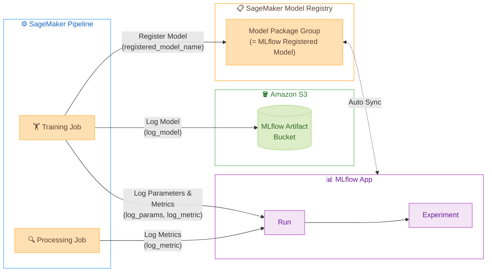

# MLflow Experiment Management Guide <!-- omit in toc -->

🌐 **Language**: 🇺🇸 [English](mlflow-guide.md) | 🇯🇵 [日本語](mlflow-guide.ja.md)

This project uses Amazon SageMaker AI Managed MLflow App to record ML experiment metrics and manage models. This document explains how MLflow works and how to use it.

## Table of Contents <!-- omit in toc -->

- [Overview](#overview)
- [Architecture](#architecture)
- [Accessing the MLflow UI](#accessing-the-mlflow-ui)
- [Setting Up the MLflow SDK](#setting-up-the-mlflow-sdk)
  - [Installation](#installation)
  - [Connecting to the MLflow App](#connecting-to-the-mlflow-app)
- [Recording Metrics and Parameters](#recording-metrics-and-parameters)
  - [Basic Usage](#basic-usage)
  - [Example Usage in train.py](#example-usage-in-trainpy)
  - [Recording Epoch Metrics in PyTorch](#recording-epoch-metrics-in-pytorch)
  - [Recording Epoch Metrics in NAVSIM](#recording-epoch-metrics-in-navsim)
  - [Example Usage in evaluate.py](#example-usage-in-evaluatepy)
- [Registering Models](#registering-models)
  - [Registration via Python SDK](#registration-via-python-sdk)
  - [Registration via MLflow UI](#registration-via-mlflow-ui)
  - [Automatic Registration (ModelRegistrationMode)](#automatic-registration-modelregistrationmode)
- [Integration with SageMaker Pipeline](#integration-with-sagemaker-pipeline)
- [References](#references)

## Overview

MLflow is an open-source platform for managing the ML experiment lifecycle. This project uses a Managed MLflow App created via CloudFormation.

MLflow manages experiments in the following hierarchy.

- **Experiment**: A container that groups Runs addressing the same goal or model (e.g., the whole `navsim-transfuser` project)
- **Run**: A single training execution (e.g., one invocation of `train.py`). Each Run has a unique ID and associates the following information:
  - **Parameters**: Hyperparameters and configuration values (e.g., `learning_rate=0.0003`)
  - **Metrics**: Per-epoch loss, accuracy, ADE / FDE, etc. (time-series records)
  - **Artifacts**: Model files, graphs, evaluation results
  - **Tags**: Metadata such as Git commit and framework version

Multiple Runs can sit under one Experiment, and the MLflow UI lets you compare hyperparameters and metrics side by side. Models registered from a Run are version-managed in the SageMaker Model Registry.

## Architecture

Each step of the SageMaker Pipeline (Training Job, Processing Job) records metrics and models to the MLflow App, while artifacts are stored in S3. When you specify `registered_model_name` in `mlflow.*.log_model()`, a Model Package Group / Version is created in the SageMaker Model Registry and kept in sync with the Managed MLflow App.



Key elements in the diagram:

- **Experiment / Run**: An Experiment groups related Runs at the model or project level; a Run represents a single training execution (see [Overview](#overview) for details)
- **MLflow Artifact Bucket**: The S3 bucket that stores model files (`.pth`, `MLmodel`, `conda.yaml`, etc.)
- **Model Package Group**: The unit of model version management in the SageMaker Model Registry. Same entity as the MLflow Registered Model

## Accessing the MLflow UI

To access the MLflow UI, use the helper script to generate a presigned URL and open it in your browser. The session is valid for 4 hours.

```bash
./infra/scripts/open-mlflow.sh [PROJECT_NAME]
```

The presigned URL can only be used once. If the session expires, re-run the script. For details, see [Launch the MLflow UI using a presigned URL](https://docs.aws.amazon.com/sagemaker/latest/dg/mlflow-launch-ui.html).

## Setting Up the MLflow SDK

### Installation

On the SageMaker AI Notebook (JupyterLab), install MLflow and the AWS MLflow plugin.

```bash
pip install sagemaker-mlflow
```

Use an MLflow version that matches your MLflow App version.

| MLflow App Version | MLflow Version |
|--------------------------|-----------------|
| 3.x | `mlflow>=3.0` |

### Connecting to the MLflow App

Connect using the MLflow App ARN. You can obtain the ARN from the stack output `MlflowAppArn`.

```python
import mlflow

# Connect via MLflow App ARN (replace XXXXXXXXXXXX with the actual resource ID)
mlflow_app_arn = "arn:aws:sagemaker:us-east-1:123456789012:mlflow-app/app-XXXXXXXXXXXX"
mlflow.set_tracking_uri(mlflow_app_arn)
```

In this project, this connection is established inside `train.py` (training script) and `evaluate.py` (evaluation script). `03-create-and-run-pipeline.py` automatically retrieves the MLflow App ARN and passes it to each container as the environment variable `MLFLOW_APP_ARN`, so there is no need to hardcode the ARN. For details, see [Example Usage in train.py](#example-usage-in-trainpy) and [Integration with SageMaker Pipeline](#integration-with-sagemaker-pipeline).

You can also retrieve the ARN with the following CLI command.

```bash
aws cloudformation describe-stacks \
  --stack-name sagemaker-ai-ml-pipeline-stack \
  --query 'Stacks[0].Outputs[?OutputKey==`MlflowAppArn`].OutputValue' \
  --output text
```

## Recording Metrics and Parameters

### Basic Usage

The main recording functions of the MLflow SDK are as follows.

```python
import mlflow

mlflow.set_tracking_uri(mlflow_app_arn)
mlflow.set_experiment("my-experiment")

with mlflow.start_run():
    # Log hyperparameters
    mlflow.log_params({"n_estimators": 100, "random_state": 42})

    # Log metrics
    mlflow.log_metric("accuracy", 0.95)
    mlflow.log_metric("f1", 0.93)

    # Log metrics per epoch (the step parameter creates a time-series chart)
    for epoch in range(num_epochs):
        mlflow.log_metric("train_loss", train_loss, step=epoch)
        mlflow.log_metric("val_loss", val_loss, step=epoch)

    # Set a tag
    mlflow.set_tag("description", "baseline model")

    # Log the model as an artifact
    mlflow.pytorch.log_model(model, name="model", signature=signature)
```

The recorded information can be viewed and compared on the Experiments page of the MLflow UI.

### Example Usage in train.py

This is the MLflow integration portion of the actual `train.py`. `MLFLOW_APP_ARN` and `MODEL_GROUP_NAME` are passed as environment variables from `03-create-and-run-pipeline.py`.

```python
# Hyperparameters
params = {
    "epochs": 20,
    "batch_size": 32,
    "learning_rate": 0.001,
}

tracking_arn = os.environ.get("MLFLOW_APP_ARN", "")
model_group_name = os.environ.get(
    "MODEL_GROUP_NAME", "sagemaker-ai-ml-pipeline-pytorch"
)
if tracking_arn:
    import mlflow

    mlflow.set_tracking_uri(tracking_arn)
    mlflow.set_experiment("training")

    with mlflow.start_run():
        mlflow.log_params(params)

        # Log metrics per epoch
        for epoch in range(params["epochs"]):
            train_loss = train_one_epoch(model, train_loader, optimizer)
            mlflow.log_metric("train_loss", train_loss, step=epoch)

        # Log final metrics
        mlflow.log_metric("train_accuracy", train_accuracy)
        mlflow.log_metric("train_f1", train_f1)

        # Log the model as an artifact and register it to Model Registry at the same time
        mlflow.pytorch.log_model(
            pytorch_model=model,
            name="pytorch-model",
            registered_model_name=model_group_name,
        )
```

### Recording Epoch Metrics in PyTorch

In the PyTorch `train.py`, train/validation metrics for each epoch are recorded with the `step` parameter. This allows learning curves to be visualized as charts in the MLflow UI, which is useful for detecting overfitting.

```python
with mlflow.start_run():
    mlflow.log_params(params)

    # Log metrics per epoch (for learning curve visualization)
    for step, m in enumerate(epoch_metrics):
        mlflow.log_metric("train_loss", m["train_loss"], step=step)
        mlflow.log_metric("train_acc", m["train_acc"], step=step)
        mlflow.log_metric("val_loss", m["val_loss"], step=step)
        mlflow.log_metric("val_acc", m["val_acc"], step=step)

    # Log final metrics
    mlflow.log_metric("train_accuracy", train_accuracy)
    mlflow.log_metric("train_f1", train_f1)
```

### Recording Epoch Metrics in NAVSIM

The NAVSIM containers (`container-navsim-ego-mlp`, `container-navsim-transfuser`) similarly record train_loss / val_loss per epoch with the `step` parameter. ADE (Average Displacement Error) / FDE (Final Displacement Error) are also recorded as final metrics.

### Example Usage in evaluate.py

Metrics can be recorded similarly in the evaluation script. By recording to an `evaluation` experiment separate from the `training` experiment, you can manage training-time and evaluation-time metrics independently.

```python
# Only run if MLFLOW_APP_ARN is set
tracking_arn = os.environ.get("MLFLOW_APP_ARN", "")
if tracking_arn:
    import mlflow

    mlflow.set_tracking_uri(tracking_arn)
    # Log to the evaluation experiment, separate from the training experiment
    mlflow.set_experiment("evaluation")

    with mlflow.start_run():
        # Log all metrics for the test set at once
        mlflow.log_metrics(metrics)
        # Record which dataset was used for evaluation as a tag
        mlflow.set_tag("dataset", "test")
```

## Where Model Artifacts Are Stored

In this project, trained models are saved to two locations.

| Location | When Saved | Contents | Purpose |
|--------|-------------|------|------|
| S3 Model Artifact bucket | When Training Job completes (automatically saved by SageMaker) | `model.tar.gz` (compressed model.pth or model.joblib) | Pipeline Evaluate Step, deployment to SageMaker Endpoint |
| S3 MLflow Artifact bucket | When `mlflow.*.log_model()` is executed | Model weights, MLmodel metadata, conda.yaml, requirements.txt | Viewing models in MLflow UI, version management via Model Registry |

SageMaker Training Jobs automatically compress files saved in `SM_MODEL_DIR` (`/opt/ml/model/`) into `model.tar.gz` and upload them to S3. This is standard SageMaker behavior, and you do not need to explicitly upload to S3 within `train.py`.

On the other hand, when you call `mlflow.pytorch.log_model()` or `mlflow.sklearn.log_model()`, the MLflow App saves the following metadata in addition to the model weight files to the MLflow Artifact bucket.

- `MLmodel`: Framework information, input/output schema (signature)
- `conda.yaml` / `requirements.txt`: Dependencies required to reproduce the model
- `python_env.yaml`: Python version information

In other words, two copies of the model binary exist on S3. The SageMaker side (`model.tar.gz`) is used for the Pipeline's Evaluate Step and deployment, while the MLflow side is used for version management and reproducibility.

## Registering Models

Models recorded with MLflow can be automatically registered to the SageMaker Model Registry. There are three registration methods.

### Registration via Python SDK

Use `mlflow.register_model()` to register a model from an existing Run.

```python
# Log and register the model within a Run
with mlflow.start_run() as run:
    mlflow.pytorch.log_model(
        pytorch_model=model,
        name="model",
        registered_model_name="my-model",  # Register to Model Registry with this name
    )

# Or, register the model from an existing Run
model_uri = f"runs:/{run.info.run_id}/model"
mlflow.register_model(model_uri, "my-model")
```

Registered models are created as a Model Package Group in the SageMaker Model Registry and are version-managed.

> ⚠️ Do not include spaces in the model name. MLflow allows spaces, but SageMaker AI Model Package does not support them, so automatic registration will fail.

### Registration via MLflow UI

You can also register models from the MLflow UI.

1. Open the Run page in the MLflow UI
2. Select the model in the Artifacts pane
3. Click "Register model" in the upper right

Models registered via the UI are also automatically reflected in the SageMaker Model Registry.

### Automatic Registration (ModelRegistrationMode)

This project's CloudFormation template sets `ModelRegistrationMode: AUTOMATIC` on the MLflow App. With this setting, when you register a model in MLflow, a corresponding SageMaker Model Package Group and Model Package Version are automatically created.

```yaml
# From infra/cfn/sagemaker-ai-ml-pipeline.yaml
MlflowApp:
  Type: AWS::CloudFormation::CustomResource  # MLflow App
  Properties:
    ModelRegistrationMode: AUTOMATIC  # Auto-integration MLflow -> SageMaker Model Registry
```

## Integration with SageMaker Pipeline

By using the MLflow SDK within each step of a SageMaker Pipeline (Training Job, Processing Job), you can automatically record metrics for each Pipeline execution.

The MLflow App ARN is typically passed to the container as an environment variable. Set the environment variable in the Estimator definition of `03-create-and-run-pipeline.py`.

```python
estimator = Estimator(
    image_uri=ecr_image_uri,
    role=role_arn,
    instance_count=1,
    instance_type=train_instance_type,
    environment={
        "MLFLOW_APP_ARN": mlflow_app_arn,
    },
    sagemaker_session=pipeline_session,
)
```

Within each Pipeline step, reference `os.environ.get("MLFLOW_APP_ARN")` to connect to the MLflow App.

## References

Official documentation for MLflow on SageMaker AI.

- [Integrate MLflow with your environment](https://docs.aws.amazon.com/sagemaker/latest/dg/mlflow-track-experiments.html) - How to install the SDK and connect to a MLflow App
- [Log metrics, parameters, and models](https://docs.aws.amazon.com/sagemaker/latest/dg/mlflow-track-experiments-log-metrics.html) - How to use `log_metric`, `log_params`, and `log_model`
- [Automatically register models](https://docs.aws.amazon.com/sagemaker/latest/dg/mlflow-track-experiments-model-registration.html) - MLflow → SageMaker Model Registry integration
- [Launch the MLflow UI using a presigned URL](https://docs.aws.amazon.com/sagemaker/latest/dg/mlflow-launch-ui.html) - How to generate a presigned URL
- [Integration with SageMaker Pipeline](https://docs.aws.amazon.com/sagemaker/latest/dg/build-and-manage-steps-integration.html) - Using MLflow within Pipeline steps
- [AWS MLflow Plugin (PyPI)](https://pypi.org/project/sagemaker-mlflow/) - `sagemaker-mlflow` package
