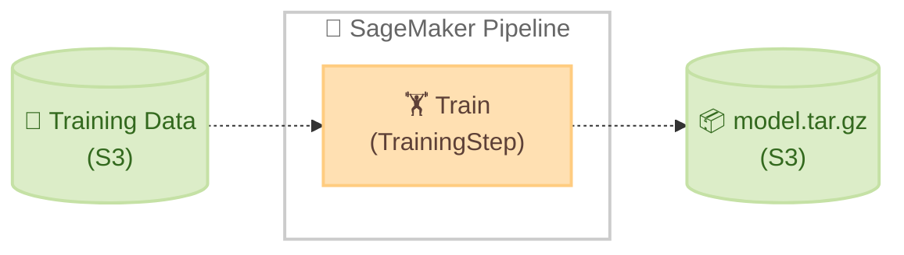
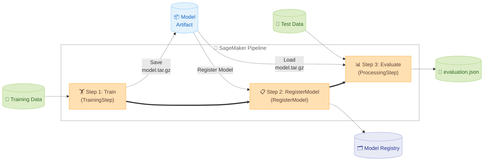

# SageMaker Python SDK ガイド

🌐 **Language**: 🇺🇸 [English](sagemaker-python-sdk-guide.md) | 🇯🇵 [日本語](sagemaker-python-sdk-guide.ja.md)

このドキュメントは、SageMaker Python SDK の概要と主要な使い方をまとめたものです。どのような用途でどのクラスを使うべきかを整理し、このプロジェクトのコードとの対応も示します。

## 目次

1. [SageMaker Python SDK とは](#1-sagemaker-python-sdk-とは)
2. [インストールとセットアップ](#2-インストールとセットアップ)
3. [トレーニング](#3-トレーニング)
4. [分散トレーニング](#4-分散トレーニング)
5. [ハイパーパラメータチューニング](#5-ハイパーパラメータチューニング)
6. [推論モデルのデプロイ](#6-推論モデルのデプロイ)
7. [パイプライン / ワークフロー](#7-パイプライン--ワークフロー)
8. [モデルレジストリ](#8-モデルレジストリ)
9. [参考リンク](#9-参考リンク)


## 1. SageMaker Python SDK とは

SageMaker Python SDK は、Amazon SageMaker AI の各機能 (トレーニング、推論、パイプラインなど) を Python から操作するための高レベル SDK です。AWS SDK (boto3) を直接使うよりも少ないコードで ML ワークフローを記述できます。

主な役割は以下の通りです。

- トレーニングジョブの定義・実行 (Estimator / ModelTrainer)
- 推論エンドポイントのデプロイ (Model / ModelBuilder)
- ML パイプラインの構築・実行 (SageMaker AI Pipelines)
- モデルレジストリへの登録・管理
- ハイパーパラメータチューニングジョブの実行 (HyperparameterTuner)

**重要な使い分け**: SageMaker Python SDK はジョブを「起動する側」のコードで使います。コンテナ内で動くトレーニングスクリプト (`train.py`) や評価スクリプト (`evaluate.py`) には SageMaker Python SDK を import しません。これらのスクリプトは標準ライブラリと ML フレームワーク (scikit-learn, PyTorch など) のみを使います。MLflow への記録も `mlflow` パッケージを直接使用します。

| 場所 | SageMaker SDK | ML フレームワーク | mlflow |
|------|:---:|:---:|:---:|
| notebook / Pipeline スクリプト (ジョブ起動側) | ✅ | - | - |
| `train.py` / `evaluate.py` (コンテナ内) | ❌ | ✅ | ✅ |

### V2 と V3 について

SageMaker Python SDK には V2 と V3 の 2 つのメジャーバージョンが存在します。このプロジェクトのコードは現在 **V2 API** を使用しています。

以下に両バージョンの情報をまとめます (出典: [PyPI sagemaker](https://pypi.org/project/sagemaker/)、[AWS Blog: ModelTrainer](https://aws.amazon.com/blogs/machine-learning/accelerate-your-ml-lifecycle-using-the-new-and-improved-amazon-sagemaker-python-sdk-part-1-modeltrainer/))。

| 項目 | V2 | V3 |
|------|----|----|
| リリース時期 | 2020 年〜 | 2025 年 11 月 20 日 (3.0) |
| 現在の最新版 (2026/02 時点) | 2.257.0 | 3.4.1 |
| 学習の主要クラス | `Estimator`, `SKLearn`, `PyTorch` など | `ModelTrainer` (統一クラス) |
| 推論の主要クラス | `Model`, `SKLearnModel` など | `ModelBuilder` (統一クラス) |
| V2 EOL | 公式アナウンスなし (現在も継続リリース中) | - |
| V3 への移行コスト | - | コードの書き直しが必要 |

**V3 の主な変更点**: `Estimator` やフレームワーク専用クラス (`SKLearn`, `PyTorch` など) が廃止され、`ModelTrainer` / `ModelBuilder` に統一されました。V3 は V2 との後方互換性がなく、`pip install --upgrade sagemaker` で V3 に上がると既存コードが動かなくなります。

**V2 を使い続けるには**: `pip install "sagemaker==2.*"` と固定してください。

**V3 への移行を検討するタイミング**: V3 のリリースは 2025 年 11 月と比較的新しく、V2 の EOL も未発表です。現時点では V2 を使い続けることに問題はありません。新規プロジェクトや、分散トレーニングの設定を簡略化したい場合は V3 の採用を検討する価値があります。移行する際は [V3 移行ガイド](https://sagemaker.readthedocs.io/en/stable/) を参照してください。


## 2. インストールとセットアップ

`pip` でインストールできます。V2 を明示的に指定することで、V3 への意図しないアップグレードを防げます。

```bash
# V2 の最新版をインストール (推奨: バージョンを固定)
pip install "sagemaker==2.*"

# または特定バージョンを指定
pip install "sagemaker==2.257.0"
```

Amazon SageMaker AI Notebook インスタンス、SageMaker Studio、SageMaker Unified Studio の JupyterLab 環境ではプリインストール済みです。ローカル環境から使う場合は、適切な IAM 権限を持つ AWS 認証情報が必要です。

```python
import boto3
import sagemaker

# SageMaker セッションの作成
# Session オブジェクトは、S3 バケットの管理やジョブの送信など
# SageMaker との通信全般を担います
# boto3.Session でリージョンを明示的に指定することを推奨します
sm_session = sagemaker.Session(
    boto_session=boto3.Session(region_name="us-east-1")
)

# 実行ロールの取得
# SageMaker がトレーニングジョブや推論エンドポイントを起動する際に
# 使用する IAM ロールです
# SageMaker AI Notebook / Studio 上ではアタッチされたロールが自動的に使用されます
# ローカル環境では IAM ロールの ARN を直接指定してください
# 例: role = "arn:aws:iam::123456789012:role/SageMakerExecutionRole"
role = sagemaker.get_execution_role()
```


## 3. トレーニング

### 3.1 Estimator とは

Estimator は、SageMaker トレーニングジョブを定義・実行するための中心的なクラスです。「どのコンテナで」「どのスクリプトを」「どのインスタンスで」「どのデータを使って」学習するかを一つのオブジェクトにまとめ、`.fit()` を呼ぶだけでジョブを起動できます。

Estimator が担う主な役割は以下の通りです。

- 学習スクリプト (`entry_point`) とその依存ファイル (`source_dir`) を S3 にアップロードする
- 指定したコンテナイメージ (DLC または BYOC) を使ってトレーニングジョブを SageMaker に投入する
- ハイパーパラメータを環境変数経由でコンテナに渡す
- 学習完了後、`/opt/ml/model/` の内容を `model.tar.gz` として S3 に保存する
- ジョブのログをストリーミング表示し、完了・失敗を検知する
- 学習済みモデルを推論エンドポイントとしてデプロイする (`.deploy()` メソッド、Section 6.1 参照)

コンテナ内の `train.py` から見ると、Estimator が渡したハイパーパラメータは `argparse` の引数として受け取れます。入力データは `/opt/ml/input/data/<チャンネル名>/` に配置され、モデルの保存先は `/opt/ml/model/` です。

### 3.2 Estimator の種類と使い分け

SageMaker Python SDK には、フレームワークごとに専用の Estimator クラスが用意されています。フレームワーク専用クラスを使うと、AWS マネージドの Deep Learning Container (DLC) が自動的に選択されるため、Docker イメージを自分でビルドする必要がありません。独自コンテナを使いたい場合は汎用の `Estimator` クラスを使います。

| クラス | 用途 | API ドキュメント |
|--------|------|----------------|
| `SKLearn` | scikit-learn モデルの学習 | [SKLearn API](https://sagemaker.readthedocs.io/en/v2.232.2/frameworks/sklearn/sagemaker.sklearn.html) |
| `PyTorch` | PyTorch モデルの学習 | [PyTorch API](https://sagemaker.readthedocs.io/en/v2.232.2/frameworks/pytorch/sagemaker.pytorch.html) |
| `TensorFlow` | TensorFlow モデルの学習 | [TensorFlow API](https://sagemaker.readthedocs.io/en/v2.232.2/frameworks/tensorflow/sagemaker.tensorflow.html) |
| `HuggingFace` | HuggingFace Transformers の学習 | [HuggingFace API](https://sagemaker.readthedocs.io/en/v2.232.2/frameworks/huggingface/sagemaker.huggingface.html) |
| `Estimator` | BYOC (独自コンテナ) | [Estimator API](https://sagemaker.readthedocs.io/en/v2.232.2/api/training/estimators.html) |

### 3.3 entry_point / source_dir によるスクリプト注入

Estimator の `entry_point` と `source_dir` を指定すると、SDK がローカルのスクリプトを tar.gz にまとめて S3 にアップロードし、コンテナ起動時に `/opt/ml/code/` に展開して実行します。この仕組みにより、train.py や evaluate.py を変更してもコンテナの再ビルドは不要です。

```
ローカル                          S3                          コンテナ
pipelines/container-pytorch-dlc/    →  s3://.../sourcedir.tar.gz  →  /opt/ml/code/
├── train.py                                                     ├── train.py
├── evaluate.py                                                  ├── evaluate.py
└── utils.py                                                     └── utils.py
```

この仕組みは `SKLearn` / `PyTorch` などのフレームワーク Estimator だけでなく、汎用 `Estimator` (BYOC) でも利用できます。BYOC で `entry_point` + `source_dir` を使う場合は、Dockerfile の `ENTRYPOINT` を削除し、`sagemaker-training` ライブラリにエントリポイントの実行を任せてください (Section 3.6 参照)。

コンテナの再ビルドが必要になるのは、依存ライブラリ (`pip install`) やベースイメージを変更した場合のみです。

| 変更内容 | コンテナ再ビルド | Pipeline 再実行 |
|---------|:---:|:---:|
| train.py / evaluate.py のロジック変更 | 不要 | 必要 |
| ハイパーパラメータの変更 (03-create-and-run-pipeline.py) | 不要 | 必要 |
| pip install するライブラリの追加・変更 | 必要 | 必要 |
| Dockerfile のベースイメージ変更 | 必要 | 必要 |

### 3.4 学習データの入力モード (S3 → コンテナ)

SageMaker Training Job が S3 から学習データをコンテナに渡す方法は 3 つあります。`TrainingInput` の `input_mode` パラメータで指定します。

#### File モード (デフォルト)

学習開始前に S3 からデータを丸ごとローカルの EBS ボリューム (`/opt/ml/input/data/{channel}`) にダウンロードしてから学習を開始します。

- メリット: 通常のファイル I/O でアクセスできるので、既存コードがそのまま動く。ランダムアクセスも可能
- デメリット: データ全量のダウンロードが完了するまで学習が始まらない。EBS に全データが収まるだけの容量が必要

#### FastFile モード

S3 のデータを POSIX 互換のファイルシステムインターフェースで公開し、実際にアクセスされたタイミングでオンデマンドにストリーミングします。

- メリット: ダウンロード待ちなしで学習開始できる。ファイルパスでアクセスできるので File モードと同じコードが使える
- デメリット: シーケンシャルリードに最適化されており、ランダムアクセスは非効率。Augmented Manifest ファイル非対応

#### Pipe モード (レガシー)

S3 のデータを名前付きパイプ (FIFO) 経由でストリーミングします。

- メリット: EBS 容量が最小限で済む
- デメリット: 通常のファイル I/O が使えず、パイプからの読み取り用にコードを書き直す必要がある。FastFile モードに置き換えられつつある

#### 選択の目安

| 条件 | 推奨モード |
|------|-----------|
| 小〜中規模データ | File |
| 大規模データ + シーケンシャルリード | FastFile |
| レガシー互換 | Pipe |

S3 Express One Zone ディレクトリバケットは上記いずれのモードとも組み合わせて使えます。`s3_data` にディレクトリバケットの URI を指定するだけで、低レイテンシーなデータアクセスが可能です。

> 💡 大規模データでランダムアクセスが必要な場合は、S3 の入力モードではなく Amazon FSx for Lustre (`FileSystemInput`) の利用を検討してください。VPC 構成が必須です。

#### 指定方法

```python
from sagemaker.inputs import TrainingInput

# FastFile モード (大規模データ向け)
inputs = {"train": TrainingInput(s3_data=train_data_uri, input_mode="FastFile")}

# File モード (デフォルト、小〜中規模データ向け)
# inputs = {"train": TrainingInput(s3_data=train_data_uri, input_mode="File")}

estimator.fit(inputs=inputs)
```

どのモードでも `train.py` 側のコードは同じです。`SM_CHANNEL_TRAIN` 環境変数で取得したパスからファイルとして読み込めます。

> ⚠️ **Processing Job (評価ステップ) は FastFile モードに対応していません。** `ProcessingInput` の `s3_input_mode` は `File` と `Pipe` のみです。本プロジェクトの評価ステップは File モードで動作します。

### 3.5 PyTorch Estimator の例

```python
from sagemaker.pytorch import PyTorch

pytorch_estimator = PyTorch(
    entry_point="train.py",
    source_dir="pipelines/container-pytorch-dlc",
    # AWS マネージドの PyTorch DLC バージョン
    # 利用可能なバージョン: https://github.com/aws/deep-learning-containers/blob/master/available_images.md
    framework_version="2.5",
    py_version="py311",
    role=role,
    # GPU インスタンスを指定することで高速な学習が可能です
    instance_type="ml.c7i.xlarge",
    instance_count=1,
    output_path="s3://my-model-bucket/sagemaker-jobs/pytorch",
    hyperparameters={
        "epochs": 20,
        "batch-size": 32,
        "learning-rate": 0.001,
    },
    sagemaker_session=sm_session,
)

# fit() のパラメータは PyTorch Estimator の例 (Section 3.5) と同様です
pytorch_estimator.fit(
    inputs={"train": "s3://my-dataset-bucket/train/"},
    wait=True,
)
```

### 3.6 BYOC (独自コンテナ) の例

AWS マネージドコンテナではなく、自分でビルドした Docker イメージを使う場合は汎用 `Estimator` を使います。`entry_point` と `source_dir` を指定することで、フレームワーク Estimator と同様にスクリプトの変更時にコンテナの再ビルドが不要になります (Section 3.3 参照)。

この方式を使うには、Dockerfile で `ENTRYPOINT` を指定せず、`sagemaker-training` ライブラリをインストールしておく必要があります。`sagemaker-training` がエントリポイントの実行を制御します。

```python
from sagemaker.estimator import Estimator

estimator = Estimator(
    image_uri="123456789012.dkr.ecr.us-east-1.amazonaws.com/my-container:latest",
    # entry_point + source_dir を指定すると、SDK がローカルのスクリプトを
    # S3 経由でコンテナに注入する (コンテナ再ビルド不要)
    entry_point="train.py",
    source_dir="pipelines/container-pytorch-dlc-byoc",
    role=role,
    instance_type="ml.c7i.xlarge",
    instance_count=1,
    output_path="s3://my-model-bucket/sagemaker-jobs/byoc",
    hyperparameters={
        "n-estimators": 100,
    },
    sagemaker_session=sm_session,
)

# fit() のパラメータは PyTorch Estimator の例 (Section 3.5) と同様です
estimator.fit(inputs={"train": "s3://my-dataset-bucket/train/"})
```


### 3.7 ジョブ名の命名規則

SageMaker の Training Job / Processing Job には自動的に名前が付与されます。命名の挙動は実行方法によって異なります。

**notebook から直接実行する場合 (`estimator.fit()` / `processor.run()`)**:

`base_job_name` を指定すると、`{base_job_name}-{timestamp}` の形式でジョブ名が生成されます。指定しない場合は、SDK がイメージ名やフレームワーク名からデフォルトの名前を生成します (例: `sagemaker-scikit-learn-2026-...`、`pytorch-training-2026-...`)。

```python
# base_job_name を指定する例
estimator = Estimator(
    image_uri=ecr_image_uri,
    base_job_name="my-project-train",  # → my-project-train-2026-02-28-...
    ...
)

eval_processor = ScriptProcessor(
    image_uri=ecr_image_uri,
    base_job_name="my-project-eval",  # → my-project-eval-2026-02-28-...
    ...
)
```

本プロジェクトでは `{project_name}-{framework_suffix}-train` / `{project_name}-{framework_suffix}-eval` の命名規則を採用しています。

**Pipeline 経由で実行する場合 (`TrainingStep` / `ProcessingStep`)**:

Pipeline は `base_job_name` を無視し、`pipelines-{execution_id}-{step_name}-{hash}` の形式でジョブ名を自動生成します。これは SageMaker Pipeline の仕様であり、SDK 側から制御することはできません。

Pipeline コンソールから実行 ID → ステップ → ジョブへの紐付けは追えるため、実用上の問題はありません。

| 実行方法 | ジョブ名の形式 | `base_job_name` |
|---------|-------------|----------------|
| notebook から直接 | `{base_job_name}-{timestamp}` | ✅ 有効 |
| Pipeline 経由 | `pipelines-{execution_id}-{step_name}-{hash}` | ❌ 無視される |


## 4. 分散トレーニング

大規模なデータセットや大きなモデルを扱う場合、単一の GPU では学習に時間がかかりすぎることがあります。SageMaker の分散トレーニング機能を使うと、複数の GPU やインスタンスを使って学習を並列化できます。

分散トレーニングの設定は Estimator の `distribution` パラメータで行います。詳細は [SageMaker 分散トレーニングドキュメント](https://docs.aws.amazon.com/ja_jp/sagemaker/latest/dg/distributed-training.html) を参照してください。

### 4.1 データ並列 (Data Parallelism)

データ並列は、同じモデルを複数の GPU にコピーし、データを分割して並列に学習する方法です。各 GPU が異なるミニバッチを処理し、勾配を集約してモデルを更新します。モデルが 1 台の GPU に収まるが、データ量が多くて学習が遅い場合に有効です。

`distribution` パラメータで SageMaker の分散データ並列ライブラリを有効化します。

```python
from sagemaker.pytorch import PyTorch

pytorch_estimator = PyTorch(
    entry_point="train.py",
    source_dir="pipelines/container-pytorch-dlc",
    framework_version="2.5",
    py_version="py311",
    role=role,
    # 複数インスタンスを指定します (instance_count >= 2 で分散学習が有効になります)
    instance_type="ml.p3.16xlarge",
    instance_count=2,
    # SageMaker 分散データ並列ライブラリ (SMDDP) を使用する設定
    # train.py 側でも smddp の初期化コードが必要です
    distribution={
        "smdistributed": {
            "dataparallel": {
                "enabled": True,
            }
        }
    },
    sagemaker_session=sm_session,
)
```

### 4.2 モデル並列 (Model Parallelism)

モデル並列は、モデル自体を複数の GPU に分割して学習する方法です。GPT や LLaMA のような大規模言語モデル (LLM) など、1 台の GPU のメモリに収まらないモデルを学習する際に使います。MPI と組み合わせて使います。

```python
from sagemaker.pytorch import PyTorch

# モデル並列の設定
smp_options = {
    "enabled": True,
    "parameters": {
        # モデルを分割するパーティション数 (GPU 数に合わせて設定)
        "pipeline_parallel_degree": 2,
        # パイプライン並列のマイクロバッチ数 (大きいほどスループットが上がる)
        "microbatches": 4,
        "placement_strategy": "spread",
        "pipeline": "interleaved",
        "optimize": "speed",
        # データ並列とのハイブリッド構成にする場合は True
        "ddp": True,
    }
}

# MPI の設定 (モデル並列ライブラリは内部的に MPI を使用します)
mpi_options = {
    "enabled": True,
    # インスタンスあたりの GPU 数と一致させてください
    "processes_per_host": 8,
}

smd_mp_estimator = PyTorch(
    entry_point="train.py",
    source_dir="your_script_dir",
    role=role,
    instance_count=1,
    instance_type="ml.p3.16xlarge",
    framework_version="1.13.1",
    py_version="py38",
    distribution={
        "smdistributed": {"modelparallel": smp_options},
        "mpi": mpi_options,
    },
    base_job_name="model-parallel-demo",
    sagemaker_session=sm_session,
)

smd_mp_estimator.fit("s3://my-bucket/training-data/")
```

EFA (Elastic Fabric Adapter) 対応インスタンス (`ml.p4d.24xlarge`, `ml.p4de.24xlarge`, `ml.p5.48xlarge`, `ml.p5e.48xlarge` 等) を使う場合は、`custom_mpi_options` に以下を追加するとインスタンス間の通信が高速化されます。

```python
mpi_options = {
    "enabled": True,
    "processes_per_host": 8,
    "custom_mpi_options": "-x FI_EFA_USE_DEVICE_RDMA=1 -x FI_PROVIDER=efa -x RDMAV_FORK_SAFE=1",
}
```

### 4.3 SageMaker HyperPod での分散トレーニング

Section 4.1・4.2 で紹介した方法は、SageMaker Training Job (Estimator の `distribution` パラメータ) を使った分散トレーニングです。ジョブ実行時にクラスターが自動的に起動・終了するため、手軽に利用できます。

一方、LLM のような大規模モデルの学習では、数百〜数千の GPU を使って数週間〜数ヶ月にわたる長期トレーニングが必要になることがあります。このようなケースでは、Amazon SageMaker HyperPod が適しています。HyperPod は永続的なクラスターを提供し、ハードウェア障害の自動検知・修復、チェックポイントレス学習、エラスティックトレーニングなどの耐障害性機能を備えています (出典: [Amazon SageMaker HyperPod](https://docs.aws.amazon.com/sagemaker/latest/dg/sagemaker-hyperpod.html))。

#### SageMaker Training Job と HyperPod の使い分け

以下の表は、両者の主な違いをまとめたものです。

| 項目 | SageMaker Training Job (Section 4.1・4.2) | SageMaker HyperPod |
|------|------------------------------------------|---------------------|
| クラスターのライフサイクル | ジョブ実行時に自動起動・終了 | 永続的 (ワークロード間で再利用) |
| SDK パッケージ | `sagemaker` (SageMaker Python SDK) | `sagemaker-hyperpod` (HyperPod CLI/SDK) |
| ジョブ起動方法 | `Estimator.fit()` | `HyperPodPytorchJob.create()` または `hyp` CLI |
| オーケストレーター | SageMaker マネージド | Slurm または Amazon EKS |
| 耐障害性 | ジョブ単位のリトライ | ノード自動修復、チェックポイントレス学習、エラスティックトレーニング |
| 主な用途 | 数時間〜数日の学習ジョブ | 数週間〜数ヶ月の大規模 FM 学習 |

#### HyperPod CLI/SDK のインストール

HyperPod は SageMaker Python SDK (`sagemaker`) とは別のパッケージ `sagemaker-hyperpod` を使用します (出典: [Train and deploy models with HyperPod CLI and SDK](https://docs.aws.amazon.com/sagemaker/latest/dg/getting-started-hyperpod-training-deploying-models.html))。

```bash
pip install sagemaker-hyperpod
```

#### HyperPod SDK でのトレーニングジョブ例

以下は、HyperPod SDK を使って PyTorch の分散トレーニングジョブを起動する例です (出典: [Train a PyTorch model](https://docs.aws.amazon.com/sagemaker/latest/dg/train-models-with-hyperpod.html))。

```python
from sagemaker.hyperpod import HyperPodPytorchJob
from sagemaker.hyperpod.job import (
    ReplicaSpec, Template, Spec, Container, Resources, RunPolicy, Metadata,
)

replica_specs = [
    ReplicaSpec(
        name="pod",
        template=Template(
            spec=Spec(
                containers=[
                    Container(
                        name="training",
                        image="123456789012.dkr.ecr.us-west-2.amazonaws.com/my-training:latest",
                        image_pull_policy="Always",
                        resources=Resources(
                            requests={"nvidia.com/gpu": "8"},
                            limits={"nvidia.com/gpu": "8"},
                        ),
                        command=["python", "train.py"],
                        args=["--epochs", "10", "--batch-size", "32"],
                    )
                ]
            )
        ),
    )
]

pytorch_job = HyperPodPytorchJob(
    metadata=Metadata(name="my-training-job"),
    nproc_per_node="8",
    replica_specs=replica_specs,
    run_policy=RunPolicy(clean_pod_policy="None"),
    # 学習済みモデルアーティファクトの保存先
    output_s3_uri="s3://my-bucket/model-artifacts",
)

# ジョブを起動
pytorch_job.create()

# ジョブの状態を確認
pytorch_job.refresh()
print(pytorch_job.status.model_dump())
```

Estimator の `distribution` パラメータで設定する方法 (Section 4.1・4.2) とは異なり、HyperPod では Kubernetes のジョブリソースとしてトレーニングを定義します。クラスターの事前構築 (Slurm または Amazon EKS) が前提となりますが、大規模な分散トレーニングにおける耐障害性とスケーラビリティが大幅に向上します。

HyperPod のクラスター構築・管理の詳細は [Amazon SageMaker HyperPod ドキュメント](https://docs.aws.amazon.com/sagemaker/latest/dg/sagemaker-hyperpod.html) を参照してください。


## 5. ハイパーパラメータチューニング

モデルの精度はハイパーパラメータ (学習率、木の深さ、バッチサイズなど) の選択に大きく依存しますが、最適な値を手動で探すのは時間がかかります。`HyperparameterTuner` を使うと、指定した範囲内でハイパーパラメータを自動探索し、最良のモデルを見つけられます。

内部的にはベイズ最適化などの手法を使って、過去の試行結果を参考にしながら効率的に探索します。API ドキュメントは [HyperparameterTuner API](https://sagemaker.readthedocs.io/en/v2.232.2/api/training/tuner.html) を参照してください。

### 5.1 基本的な使い方

```python
from sagemaker.tuner import (
    HyperparameterTuner,
    IntegerParameter,
)
from sagemaker.pytorch.estimator import PyTorch

# ベースとなる Estimator を定義 (hyperparameters は指定しない)
base_estimator = PyTorch(
    entry_point="train.py",
    source_dir="pipelines/container-pytorch-dlc",
    framework_version="2.5.1",
    py_version="py311",
    role=role,
    instance_type="ml.c7i.xlarge",
    instance_count=1,
    output_path="s3://my-model-bucket/hpo-jobs/pytorch",
    sagemaker_session=sm_session,
)

# チューニングするハイパーパラメータの範囲を定義
# パラメータ名と範囲はモデル・フレームワークによって異なります
hyperparameter_ranges = {
    # 整数パラメータ: 10〜100 の範囲で探索
    "epochs": IntegerParameter(10, 100),
    # 整数パラメータ: 16〜128 の範囲で探索
    "batch-size": IntegerParameter(16, 128),
}

# HyperparameterTuner を定義
tuner = HyperparameterTuner(
    estimator=base_estimator,
    # 最大化する目標メトリクス
    # train.py のログ出力から正規表現で抽出されます
    # metric_definitions を指定しない場合、SageMaker が自動検出を試みますが、
    # 明示的に指定する方が確実です (下記の補足を参照)
    objective_metric_name="validation:accuracy",
    hyperparameter_ranges=hyperparameter_ranges,
    # 探索戦略: Bayesian (推奨), Random, Grid, Hyperband
    strategy="Bayesian",
    # 実行するトレーニングジョブの最大数
    max_jobs=20,
    # 同時実行するジョブの最大数
    max_parallel_jobs=4,
    # 目標メトリクスを最大化するか最小化するか
    objective_type="Maximize",
)

# チューニングジョブを開始
# max_jobs 件のトレーニングジョブが順次実行され、最良のハイパーパラメータが探索されます
tuner.fit(inputs={"train": "s3://my-dataset-bucket/train/"})

# 最良のトレーニングジョブの情報を取得
best_job = tuner.best_training_job()
print(f"Best training job: {best_job}")
```

`objective_metric_name` で指定したメトリクスは、トレーニングジョブのログ (stdout) から正規表現で抽出されます。`train.py` 側で `print("validation:accuracy=0.95")` のように出力し、Estimator の `metric_definitions` で抽出パターンを定義してください。

```python
base_estimator = PyTorch(
    entry_point="train.py",
    source_dir="pipelines/container-pytorch-dlc",
    framework_version="2.5.1", py_version="py311",
    role=role, instance_type="ml.c7i.xlarge", instance_count=1,
    # train.py のログ出力からメトリクスを抽出する正規表現
    metric_definitions=[
        {"Name": "validation:accuracy", "Regex": r"validation:accuracy=(\S+)"},
    ],
    sagemaker_session=sm_session,
)
```

### 5.2 ウォームスタート

過去のチューニングジョブの結果を引き継いで、より効率的に探索できます。

```python
from sagemaker.tuner import WarmStartConfig, WarmStartTypes

warm_start_config = WarmStartConfig(
    # IdenticalDataAndAlgorithm: 同じデータ・アルゴリズムで継続探索
    # TransferLearning: 異なるデータ・アルゴリズムでも引き継ぎ可能
    warm_start_type=WarmStartTypes.IDENTICAL_DATA_AND_ALGORITHM,
    # 引き継ぐ親ジョブ (最大 5 件)
    parents={"previous-tuning-job-name"},
)

tuner = HyperparameterTuner(
    estimator=base_estimator,
    objective_metric_name="validation:accuracy",
    hyperparameter_ranges=hyperparameter_ranges,
    max_jobs=10,
    max_parallel_jobs=2,
    warm_start_config=warm_start_config,
)

# チューニングジョブを開始 (使い方は Section 5.1 と同様)
tuner.fit(inputs={"train": "s3://my-dataset-bucket/train/"})
```


## 6. 推論モデルのデプロイ

学習済みモデルを SageMaker エンドポイントとしてデプロイすると、REST API 経由でリアルタイム推論を実行できます。エンドポイントはインスタンスが常時起動しているため、使い終わったら必ず削除してください (課金が継続します)。

デプロイには主に 2 つのアプローチがあります。

| アプローチ | クラス | 用途 |
|-----------|--------|------|
| Estimator から直接デプロイ | `Estimator.deploy()` | SageMaker トレーニングジョブで学習した Estimator オブジェクトから 1 行でデプロイ。最もシンプルな方法 |
| ModelBuilder でデプロイ | `ModelBuilder` | Notebook 上で直接学習したモデルオブジェクトをデプロイ。コンテナ選択・シリアライザー設定の自動化、ローカルテスト、カスタム推論ロジックなど柔軟な機能を提供 |

シンプルに学習→デプロイしたいだけなら `Estimator.deploy()` で十分です。Notebook 上で直接学習したモデルのデプロイや、ローカルでの動作確認、前処理・後処理のカスタマイズが必要な場合は `ModelBuilder` が適しています。

### 6.1 Estimator からの直接デプロイ

`.fit()` で学習した Estimator から `.deploy()` を呼ぶだけでエンドポイントを作成できます。最もシンプルな方法です。

```python
# 学習済み Estimator からデプロイ
# 内部的に SageMaker モデルの作成とエンドポイントの起動が行われます
predictor = pytorch_estimator.deploy(
    initial_instance_count=1,
    instance_type="ml.c7i.xlarge",
)

# 推論の実行
import numpy as np
result = predictor.predict(np.array([[1.0, 2.0, 3.0]]))
print(result)

# エンドポイントの削除 (使い終わったら必ず削除してください)
predictor.delete_endpoint()
```

### 6.2 ModelBuilder を使ったデプロイ

`ModelBuilder` は、モデルのデプロイに必要な設定 (コンテナ選択、シリアライザー設定など) を自動化するクラスです。API ドキュメントは [ModelBuilder API](https://sagemaker.readthedocs.io/en/v2.232.2/api/inference/model_builder.html) を参照してください。

`Estimator.deploy()` (Section 6.1) が SageMaker トレーニングジョブで学習したモデルをデプロイするのに対し、`ModelBuilder` は Notebook 上で直接学習したモデルをデプロイする場合に便利です。例えば、Notebook のセル内で学習したモデルオブジェクトを、SageMaker トレーニングジョブを経由せずにそのままエンドポイントにデプロイできます。

また、ローカルテスト (`Mode.LOCAL_CONTAINER`)、カスタム前処理・後処理 (`InferenceSpec`)、サーバーレス・非同期推論など柔軟なデプロイ構成が必要な場合にも `ModelBuilder` が適しています。

```python
from sagemaker.serve.builder.model_builder import ModelBuilder
from sagemaker.serve.builder.schema_builder import SchemaBuilder
import numpy as np
import torch

# Notebook 上で直接学習したモデル (SageMaker トレーニングジョブではない)
model = MyModel()
model.load_state_dict(torch.load("model.pth"))
model.eval()

# サンプルの入出力データを定義します
# 実際の推論データではなく、データの型と shape を ModelBuilder に伝えるためのものです
sample_input = np.array([[1.0, 2.0, 3.0, 4.0]])
sample_output = np.array([0])

model_builder = ModelBuilder(
    # メモリ上のモデルオブジェクトを渡します
    model=model,
    schema_builder=SchemaBuilder(sample_input, sample_output),
    role_arn=role,
)

# デプロイ可能なモデルを構築
# ModelBuilder がコンテナの選択や依存関係のパッケージングを自動で行います
model = model_builder.build()

# エンドポイントにデプロイ
predictor = model.deploy(
    initial_instance_count=1,
    instance_type="ml.c6i.xlarge",
)

# 推論の実行
result = predictor.predict(sample_input)
print(result)

# エンドポイントの削除 (使い終わったら必ず削除してください)
predictor.delete_endpoint()
```

### 6.3 ローカルモードでのテスト

本番デプロイ前にローカルで動作確認できます。

```python
from sagemaker.serve.builder.model_builder import ModelBuilder
from sagemaker.serve.builder.schema_builder import SchemaBuilder
from sagemaker.serve import Mode

model_builder_local = ModelBuilder(
    model=trained_model,
    schema_builder=SchemaBuilder(sample_input, sample_output),
    role_arn=role,
    # ローカルの Docker コンテナで動作確認します
    mode=Mode.LOCAL_CONTAINER,
)

local_model = model_builder_local.build()
local_predictor = local_model.deploy()

# ローカルで推論テスト
result = local_predictor.predict(sample_input)

# ローカルモードではエンドポイント課金は発生しませんが、
# Docker コンテナを停止するために delete_endpoint() を呼んでおくと安全です
local_predictor.delete_endpoint()
```

### 6.4 カスタム推論ロジック (InferenceSpec)

`InferenceSpec` を使うと、モデルのロード方法と推論処理を自由に定義できます。これにより、S3 や HuggingFace Hub などの外部にあるモデルを読み込んでエンドポイントにデプロイしたり、推論の前処理・後処理をカスタマイズしたりできます。API ドキュメントは [InferenceSpec API](https://sagemaker.readthedocs.io/en/v2.232.2/api/inference/model_builder.html#sagemaker.serve.spec.inference_spec.InferenceSpec) を参照してください。

以下は、HuggingFace Hub から翻訳モデルを読み込んでデプロイする例です (出典: [AWS 公式ドキュメント: ModelBuilder](https://docs.aws.amazon.com/sagemaker/latest/dg/how-it-works-modelbuilder-creation.html))。

```python
from sagemaker.serve.spec.inference_spec import InferenceSpec
from sagemaker.serve.builder.model_builder import ModelBuilder
from sagemaker.serve.builder.schema_builder import SchemaBuilder

class TranslationInferenceSpec(InferenceSpec):
    def load(self, model_dir: str):
        # HuggingFace Hub からモデルをダウンロードしてロード
        from transformers import pipeline
        return pipeline("translation_en_to_fr", model="t5-small")

    def invoke(self, input_data, model):
        # 推論処理 (前処理・後処理もここに記述できます)
        return model(input_data)

model_builder = ModelBuilder(
    inference_spec=TranslationInferenceSpec(),
    schema_builder=SchemaBuilder(
        sample_input="How is the demo going?",
        sample_output="Comment la démo va-t-elle?",
    ),
    role_arn=role,
)

model = model_builder.build()

predictor = model.deploy(
    initial_instance_count=1,
    instance_type="ml.c6i.xlarge",
)

result = predictor.predict("Hello, how are you?")
print(result)

# エンドポイントの削除 (使い終わったら必ず削除してください)
predictor.delete_endpoint()
```

S3 上のモデルアーティファクトを読み込む場合は、`model_path` にディレクトリパスを指定し、`load` メソッド内でそのディレクトリからモデルファイルを読み込みます。デプロイの流れは上記の例と同じです。

```python
class SKLearnInferenceSpec(InferenceSpec):
    def load(self, model_dir: str):
        # model_dir にはモデルアーティファクトが展開されたディレクトリが渡されます
        import joblib
        import os
        return joblib.load(os.path.join(model_dir, "model.joblib"))

    def invoke(self, input_data, model):
        return model.predict(input_data)

model_builder = ModelBuilder(
    inference_spec=SKLearnInferenceSpec(),
    schema_builder=SchemaBuilder(sample_input, sample_output),
    role_arn=role,
    # モデルアーティファクトのディレクトリパス
    model_path="/path/to/model/",
)
```


## 7. パイプライン / ワークフロー

SageMaker AI Pipelines を使うと、データ処理 → 学習 → 評価 → 登録 の一連のステップを DAG (有向非巡回グラフ) として定義し、再現性のある ML ワークフローを構築できます。

パイプラインを使う主なメリットは以下の通りです。

- 各ステップが独立したジョブとして実行されるため、失敗したステップだけ再実行できる
- パイプラインパラメータを使って、実行時にデータパスやハイパーパラメータを変更できる
- SageMaker Studio の UI でパイプラインの実行状況を可視化できる
- CI/CD と組み合わせて、モデルの再学習・デプロイを自動化できる

SDK のドキュメントは [SageMaker Model Building Pipeline](https://sagemaker.readthedocs.io/en/v2.232.2/amazon_sagemaker_model_building_pipeline.html) を参照してください。

### 7.1 主要なステップクラス

以下のステップクラスを組み合わせてパイプラインを構築します。

| クラス | 用途 | API ドキュメント |
|--------|------|----------------|
| `TrainingStep` | Estimator を使ったトレーニングジョブ | [TrainingStep](https://sagemaker.readthedocs.io/en/v2.232.2/workflows/pipelines/sagemaker.workflow.steps.html#sagemaker.workflow.steps.TrainingStep) |
| `ProcessingStep` | データ前処理・評価スクリプトの実行 | [ProcessingStep](https://sagemaker.readthedocs.io/en/v2.232.2/workflows/pipelines/sagemaker.workflow.steps.html#sagemaker.workflow.steps.ProcessingStep) |
| `CreateModelStep` | SageMaker モデルの作成 | [CreateModelStep](https://sagemaker.readthedocs.io/en/v2.232.2/workflows/pipelines/sagemaker.workflow.model_step.html) |
| `RegisterModel` | モデルレジストリへの登録 | [ModelStep](https://sagemaker.readthedocs.io/en/v2.232.2/workflows/pipelines/sagemaker.workflow.model_step.html) |
| `ConditionStep` | 条件分岐 (メトリクスに基づく承認など) | [ConditionStep](https://sagemaker.readthedocs.io/en/v2.232.2/workflows/pipelines/sagemaker.workflow.condition_step.html) |
| `TransformStep` | バッチ変換ジョブ | [TransformStep](https://sagemaker.readthedocs.io/en/v2.232.2/workflows/pipelines/sagemaker.workflow.steps.html#sagemaker.workflow.steps.TransformStep) |

### 7.2 パイプラインの定義例

#### シンプルなパイプライン (TrainingStep のみ)

TrainingStep 1 つだけのシンプルなパイプラインの例です。パイプラインの基本構造を理解するのに役立ちます。



```python
from sagemaker.workflow.pipeline import Pipeline
from sagemaker.workflow.steps import TrainingStep
from sagemaker.pytorch.estimator import PyTorch
from sagemaker.inputs import TrainingInput
from sagemaker.workflow.pipeline_context import PipelineSession

# PipelineSession を使うと fit() が実際にジョブを起動せず、
# Pipeline の DAG 定義として記録される
pipeline_session = PipelineSession()

estimator = PyTorch(
    entry_point="train.py",
    source_dir="pipelines/container-pytorch-dlc",
    framework_version="2.5.1", py_version="py311",
    role=role, instance_type="ml.c7i.xlarge", instance_count=1,
    hyperparameters={"epochs": 20, "batch-size": 32, "learning-rate": 0.001},
    sagemaker_session=pipeline_session,
)

train_step = TrainingStep(
    name="Train", estimator=estimator,
    inputs={"train": TrainingInput(s3_data="s3://my-bucket/train/", input_mode="FastFile")},
)

pipeline = Pipeline(
    name="my-simple-pipeline",
    steps=[train_step],
    sagemaker_session=pipeline_session,
)
pipeline.upsert(role_arn=role)
pipeline.start()
```

#### このプロジェクトのパイプライン (Train → RegisterModel → Evaluate)

`pipelines/scripts/03-create-and-run-pipeline.py` では、以下の 3 ステップからなるパイプラインを定義しています。



以下はその定義コードの要点です (完全版は `03-create-and-run-pipeline.py` を参照してください)。

```python
from sagemaker.workflow.pipeline import Pipeline
from sagemaker.workflow.steps import TrainingStep, ProcessingStep
from sagemaker.workflow.step_collections import RegisterModel
from sagemaker.pytorch.estimator import PyTorch
from sagemaker.pytorch.processing import PyTorchProcessor
from sagemaker.inputs import TrainingInput
from sagemaker.workflow.pipeline_context import PipelineSession

# PipelineSession を使うと fit() / run() が実際にジョブを起動せず、
# Pipeline の DAG 定義として記録される
pipeline_session = PipelineSession()

# --- Step 1: Train ---
estimator = PyTorch(
    entry_point="train.py",
    source_dir="pipelines/container-pytorch-dlc",
    framework_version="2.5.1", py_version="py311",
    role=role, instance_type="ml.c7i.xlarge", instance_count=1,
    hyperparameters={"epochs": 20, "batch-size": 32, "learning-rate": 0.001},
    sagemaker_session=pipeline_session,
)
train_step = TrainingStep(
    name="Train", estimator=estimator,
    inputs={"train": TrainingInput(s3_data=train_data_uri, input_mode="FastFile")},
)

# --- Step 2: RegisterModel ---
# train_step.properties... は Pipeline 実行時に動的に解決される参照 (PipelineVariable)
register_step = RegisterModel(
    name="RegisterModel", estimator=estimator,
    model_data=train_step.properties.ModelArtifacts.S3ModelArtifacts,
    content_types=["application/json"], response_types=["application/json"],
    inference_instances=["ml.c7i.xlarge"], transform_instances=["ml.c7i.xlarge"],
    model_package_group_name=model_group_name,
)

# --- Step 3: Evaluate ---
# コンテナ種別に応じて Processor を選択する。
# container-pytorch-dlc: AWS マネージドコンテナ (PyTorchProcessor)
# container-pytorch-dlc-byoc: BYOC (ScriptProcessor)
# 詳細は 03-create-and-run-pipeline.py を参照。
eval_processor = PyTorchProcessor(
    framework_version="2.5.1", py_version="py311",
    role=role,
    instance_count=1, instance_type="ml.c7i.xlarge",
    sagemaker_session=pipeline_session,
)
# ProcessingStep は source_dir を直接受け付けないため、
# processor.run() で step_args を生成して渡す。
eval_args = eval_processor.run(
    inputs=[...],   # model.tar.gz とテストデータをコンテナにマウント
    outputs=[...],  # evaluation.json を S3 に出力
    code="evaluate.py",
    source_dir="pipelines/container-pytorch-dlc",  # requirements.txt も含まれる
)
eval_step = ProcessingStep(
    name="Evaluate",
    step_args=eval_args,
)
eval_step.add_depends_on([register_step])

# --- Pipeline 組み立て ---
pipeline = Pipeline(
    name="my-ml-pipeline",
    steps=[train_step, register_step, eval_step],
    sagemaker_session=pipeline_session,
)
pipeline.upsert(role_arn=role)
execution = pipeline.start()
```

### 7.3 Processing Job での評価の仕組み

Evaluate ステップ (`ProcessingStep`) は推論 Endpoint を使わずにモデルの評価を行います。Processing Job は SageMaker が専用のインスタンスを起動してスクリプトを実行する仕組みで、Notebook インスタンス上ではなく別のインスタンスで処理が行われます。

具体的な流れは以下の通りです。

1. Training Job が学習済みモデルを `model.tar.gz` として S3 に保存する
2. Processing Job が起動すると、`model.tar.gz` とテストデータがコンテナ内にマウントされる (`/opt/ml/processing/{input_name}/`)
3. 評価スクリプト (`evaluate.py`) が `model.tar.gz` を展開し、モデルオブジェクトを Python のメモリに直接ロードする (例: `joblib.load()`, `torch.load()`)
4. ロードしたモデルの `predict()` メソッドでテストデータに対する推論を実行し、メトリクスを算出する
5. 評価結果を `/opt/ml/processing/{output_name}/` に出力する

推論 Endpoint はモデルを HTTP API として常時公開する仕組みですが、オフライン評価ではその必要がありません。モデルファイルを直接ロードして `predict()` を呼ぶだけで推論は実行できます。Processing Job はジョブ完了後にインスタンスが自動停止するため、Endpoint のような常時課金も発生しません。

大きなモデルを評価する場合は、Processing Job の `instance_type` をより大きなインスタンスに変更することで対応できます (例: メモリが必要な場合は `ml.m7i.4xlarge`、GPU が必要な場合は `ml.g6.xlarge`)。ただし、数十〜数百 GB クラスの LLM など、分散推論が必要なモデルの場合は Processing Job 単体では対応が難しく、バッチ変換 (`TransformStep`) や Endpoint 経由での評価を検討してください。


## 8. モデルレジストリ

学習済みモデルのバージョン管理・承認フローを管理するために、モデルレジストリを使用します。このプロジェクトでは以下の 2 つのレジストリを使用しています。

| 項目 | SageMaker AI Model Registry | MLflow Model Registry |
|------|---------------------------|---------------------|
| 主な用途 | 本番デプロイのモデル管理・承認フロー | 実験の追跡・比較・モデルの記録 |
| 登録方法 | Pipeline の `RegisterModel` ステップで自動登録 | `train.py` 内で `mlflow.*.log_model()` |
| UI | SageMaker コンソール | MLflow App UI |
| メトリクス比較 | 限定的 | 複数 Run の比較、チャート表示が充実 |
| SDK | SageMaker Python SDK | `mlflow` パッケージ (SageMaker SDK は不使用) |

SageMaker Managed MLflow の ModelRegistrationMode (AUTOMATIC) を有効にすると、MLflow Model Registry への登録が SageMaker AI Model Registry にも自動反映されます。これにより、実験管理は MLflow UI で行いつつ、本番デプロイの管理は SageMaker コンソールで行うという使い分けが可能です。

### 8.1 SageMaker AI Model Registry

SageMaker AI Model Registry を使うと、複数のモデルバージョンを一元管理し、「どのバージョンが本番環境にデプロイされているか」「どのバージョンが承認待ちか」を追跡できます。詳細は [Model Registry ドキュメント](https://docs.aws.amazon.com/ja_jp/sagemaker/latest/dg/model-registry.html) を参照してください。

典型的なフローは以下の通りです。

1. 学習完了後にモデルをレジストリに登録 (`PendingManualApproval` 状態)
2. 評価メトリクスを確認して手動承認 (`Approved` 状態に変更)
3. 承認済みモデルをエンドポイントにデプロイ

このプロジェクトでは、パイプラインの `RegisterModel` ステップ (Section 7.2) で自動的に登録しています。以下は `pipelines/scripts/03-create-and-run-pipeline.py` で実際に使われているコードです。

```python
from sagemaker.workflow.step_collections import RegisterModel

# 学習ステップの出力 (model.tar.gz) を Model Registry に登録する。
# train_step.properties.ModelArtifacts.S3ModelArtifacts は
# Pipeline 実行時に動的に解決される参照 (PipelineVariable)。
register_step = RegisterModel(
    name="RegisterModel",
    estimator=estimator,
    model_data=train_step.properties.ModelArtifacts.S3ModelArtifacts,
    content_types=["application/json"],
    response_types=["application/json"],
    inference_instances=["ml.m7i.xlarge"],
    transform_instances=["ml.m7i.xlarge"],
    # このグループ名で SageMaker Model Registry にモデルパッケージが作成される
    model_package_group_name=model_group_name,
)
```

パイプラインを使わずに手動で登録する場合は以下のようにします。

```python
from sagemaker.pytorch.model import PyTorchModel
from sagemaker.model_metrics import ModelMetrics, MetricsSource

# 評価メトリクスを定義 (S3 に保存した evaluation.json を参照)
model_metrics = ModelMetrics(
    model_statistics=MetricsSource(
        s3_uri="s3://my-model-bucket/evaluation/evaluation.json",
        content_type="application/json",
    )
)

# PyTorchModel を定義してレジストリに登録
pytorch_model = PyTorchModel(
    model_data=pytorch_estimator.model_data,
    role=role,
    entry_point="inference.py",
    framework_version="2.5.1",
    py_version="py311",
    sagemaker_session=sm_session,
)

model_package = pytorch_model.register(
    content_types=["application/json"],
    response_types=["application/json"],
    inference_instances=["ml.c7i.xlarge"],
    transform_instances=["ml.c7i.xlarge"],
    model_package_group_name="my-pytorch-models",
    model_metrics=model_metrics,
    # PendingManualApproval: 手動承認が必要
    # Approved: 自動承認
    approval_status="PendingManualApproval",
)

print(f"Model package ARN: {model_package.model_package_arn}")
```

承認済みモデルをデプロイするには、以下のようにします。

```python
from sagemaker import ModelPackage

# 登録済みモデルパッケージからデプロイ
model = ModelPackage(
    role=role,
    model_package_arn="arn:aws:sagemaker:us-east-1:123456789012:model-package/my-sklearn-models/1",
    sagemaker_session=sm_session,
)

predictor = model.deploy(
    initial_instance_count=1,
    instance_type="ml.m7i.large",
)

# エンドポイントの削除 (使い終わったら必ず削除してください)
predictor.delete_endpoint()
```

### 8.2 MLflow Model Registry

[MLflow Model Registry](https://mlflow.org/docs/latest/model-registry.html) は、MLflow が提供するモデルのバージョン管理機能です。学習済みモデルを名前付きで登録し、バージョンごとにメトリクス・パラメータ・アーティファクトを紐付けて管理できます。

このプロジェクトでは、`train.py` 内でハイパーパラメータ・メトリクス・モデルアーティファクトを MLflow に記録しています。MLflow への記録・登録には MLflow の Python ライブラリ (`mlflow` パッケージ) を使用しており、SageMaker Python SDK は使用しません。MLflow の詳細は [MLflow 実験管理ガイド](mlflow-guide.ja.md) を参照してください。

以下は `pipelines/container-pytorch-dlc/train.py` で実際に使われているコードです。

```python
import mlflow

# SageMaker Managed MLflow の場合、ARN を tracking URI として直接指定できる
tracking_arn = os.environ.get("MLFLOW_APP_ARN", "")
if tracking_arn:
    mlflow.set_tracking_uri(tracking_arn)
    mlflow.set_experiment("training")

    with mlflow.start_run():
        # ハイパーパラメータを記録 (MLflow UI で実験間の比較に使用)
        mlflow.log_params(params)

        # epoch 毎のメトリクスを記録 (step パラメータで epoch 番号を指定)
        for epoch in range(num_epochs):
            train_loss = train_one_epoch(model, train_loader, optimizer)
            mlflow.log_metric("train_loss", train_loss, step=epoch)

        # 最終メトリクスを記録
        mlflow.log_metric("train_accuracy", train_accuracy)
        mlflow.log_metric("train_f1", train_f1)

        # log_model + registered_model_name で記録と Model Registry 登録を同時に行う
        mlflow.pytorch.log_model(
            pytorch_model=model,
            name="pytorch-model",
            registered_model_name=model_group_name,
        )
```

`MLFLOW_APP_ARN` 環境変数は、パイプラインスクリプト (`03-create-and-run-pipeline.py`) が Estimator の `environment` パラメータで設定します。MLflow App が存在しない場合は空文字列になり、MLflow への記録はスキップされます。


## 9. 参考リンク

以下のドキュメントを参照してください。

**SageMaker Python SDK (V2) — このプロジェクトで使用中**

- [SageMaker Python SDK V2 ドキュメント (v2.232.2)](https://sagemaker.readthedocs.io/en/v2.232.2/)
- [Estimator API](https://sagemaker.readthedocs.io/en/v2.232.2/api/training/estimators.html)
- [SKLearn Estimator API](https://sagemaker.readthedocs.io/en/v2.232.2/frameworks/sklearn/sagemaker.sklearn.html)
- [PyTorch Estimator API](https://sagemaker.readthedocs.io/en/v2.232.2/frameworks/pytorch/sagemaker.pytorch.html)
- [HyperparameterTuner API](https://sagemaker.readthedocs.io/en/v2.232.2/api/training/tuner.html)
- [ModelBuilder API](https://sagemaker.readthedocs.io/en/v2.232.2/api/inference/model_builder.html)
- [SageMaker Model Building Pipeline (SDK ガイド)](https://sagemaker.readthedocs.io/en/v2.232.2/amazon_sagemaker_model_building_pipeline.html)

**SageMaker Python SDK (V3) — 2025 年 11 月リリース、移行検討時に参照**

- [SageMaker Python SDK V3 ドキュメント (最新)](https://sagemaker.readthedocs.io/en/stable/)
- [AWS Blog: ModelTrainer クラスの紹介 (V3)](https://aws.amazon.com/blogs/machine-learning/accelerate-your-ml-lifecycle-using-the-new-and-improved-amazon-sagemaker-python-sdk-part-1-modeltrainer/)
- [AWS Blog: ModelBuilder クラスの強化 (V3)](https://aws.amazon.com/blogs/machine-learning/accelerate-your-ml-lifecycle-using-the-new-and-improved-amazon-sagemaker-python-sdk-part-1-modeltrainer/)

**AWS 公式ドキュメント**

- [SageMaker Python SDK を使用してトレーニングジョブを起動する (分散モデル並列)](https://docs.aws.amazon.com/ja_jp/sagemaker/latest/dg/model-parallel-sm-sdk.html)
- [ModelBuilder を使用して Amazon SageMaker AI でモデルを作成する](https://docs.aws.amazon.com/ja_jp/sagemaker/latest/dg/how-it-works-modelbuilder-creation.html)
- [Amazon SageMaker AI Pipelines の概要](https://docs.aws.amazon.com/ja_jp/sagemaker/latest/dg/pipelines.html)
- [Amazon SageMaker AI 自動モデルチューニング (HPO)](https://docs.aws.amazon.com/ja_jp/sagemaker/latest/dg/automatic-model-tuning.html)
- [Amazon SageMaker AI Model Registry](https://docs.aws.amazon.com/ja_jp/sagemaker/latest/dg/model-registry.html)
- [Amazon SageMaker AI 分散トレーニング](https://docs.aws.amazon.com/ja_jp/sagemaker/latest/dg/distributed-training.html)
- [Amazon SageMaker HyperPod](https://docs.aws.amazon.com/sagemaker/latest/dg/sagemaker-hyperpod.html)
- [HyperPod CLI/SDK でモデルをトレーニング・デプロイする](https://docs.aws.amazon.com/sagemaker/latest/dg/getting-started-hyperpod-training-deploying-models.html)
- [AWS Blog: HyperPod CLI/SDK を使ったトレーニングとデプロイ](https://aws.amazon.com/blogs/machine-learning/train-and-deploy-models-on-amazon-sagemaker-hyperpod-using-the-new-hyperpod-cli-and-sdk/)
- [利用可能な Deep Learning Containers イメージ一覧](https://github.com/aws/deep-learning-containers/blob/master/available_images.md)
- [ModelBuilder サンプルノートブック](https://github.com/aws-samples/sagemaker-hosting/blob/main/SageMaker-Model-Builder)
