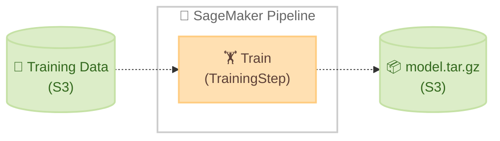
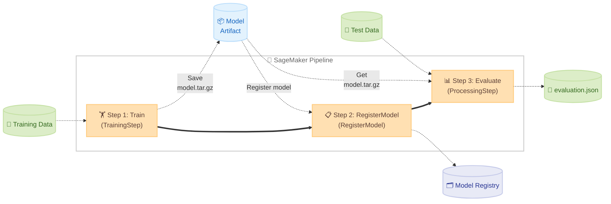

# SageMaker Python SDK Guide

🌐 **Language**: 🇺🇸 [English](sagemaker-python-sdk-guide.md) | 🇯🇵 [日本語](sagemaker-python-sdk-guide.ja.md)

This document summarizes the overview and main usage of the SageMaker Python SDK. It organizes which classes to use for which purposes and shows the correspondence with this project's code.

## Table of Contents

1. [What is the SageMaker Python SDK](#1-what-is-the-sagemaker-python-sdk)
2. [Installation and Setup](#2-installation-and-setup)
3. [Training](#3-training)
4. [Distributed Training](#4-distributed-training)
5. [Hyperparameter Tuning](#5-hyperparameter-tuning)
6. [Deploying Inference Models](#6-deploying-inference-models)
7. [Pipelines / Workflows](#7-pipelines--workflows)
8. [Model Registry](#8-model-registry)
9. [References](#9-references)


## 1. What is the SageMaker Python SDK

The SageMaker Python SDK is a high-level SDK for operating various features of Amazon SageMaker AI (training, inference, pipelines, etc.) from Python. It allows you to describe ML workflows with less code than using the AWS SDK (boto3) directly.

Its main roles are as follows.

- Defining and executing training jobs (Estimator / ModelTrainer)
- Deploying inference endpoints (Model / ModelBuilder)
- Building and executing ML pipelines (SageMaker AI Pipelines)
- Registering and managing models in the Model Registry
- Executing hyperparameter tuning jobs (HyperparameterTuner)

**Important distinction**: The SageMaker Python SDK is used in the code on the "job-launching side." You do not import the SageMaker Python SDK in training scripts (`train.py`) or evaluation scripts (`evaluate.py`) that run inside containers. These scripts only use standard libraries and ML frameworks (scikit-learn, PyTorch, etc.). MLflow logging also uses the `mlflow` package directly.

| Location | SageMaker SDK | ML Framework | mlflow |
|------|:---:|:---:|:---:|
| notebook / Pipeline script (job-launching side) | ✅ | - | - |
| `train.py` / `evaluate.py` (inside container) | ❌ | ✅ | ✅ |

### About V2 and V3

The SageMaker Python SDK has two major versions, V2 and V3. This project's code currently uses the **V2 API**.

The table below summarizes information about both versions (sources: [PyPI sagemaker](https://pypi.org/project/sagemaker/), [AWS Blog: ModelTrainer](https://aws.amazon.com/blogs/machine-learning/accelerate-your-ml-lifecycle-using-the-new-and-improved-amazon-sagemaker-python-sdk-part-1-modeltrainer/)).

| Item | V2 | V3 |
|------|----|----|
| Release date | 2020 onwards | November 20, 2025 (3.0) |
| Latest version (as of 2026/02) | 2.257.0 | 3.4.1 |
| Main training classes | `Estimator`, `SKLearn`, `PyTorch`, etc. | `ModelTrainer` (unified class) |
| Main inference classes | `Model`, `SKLearnModel`, etc. | `ModelBuilder` (unified class) |
| V2 EOL | No official announcement (still being released) | - |
| Migration cost to V3 | - | Code rewrite required |

**Main changes in V3**: `Estimator` and framework-specific classes (`SKLearn`, `PyTorch`, etc.) have been removed and unified into `ModelTrainer` / `ModelBuilder`. V3 is not backward compatible with V2, and existing code will stop working if you upgrade to V3 with `pip install --upgrade sagemaker`.

**To continue using V2**: Pin with `pip install "sagemaker==2.*"`.

**When to consider migrating to V3**: V3's release in November 2025 is relatively recent, and V2's EOL has not been announced. There is no problem continuing to use V2 at this point. For new projects or when you want to simplify distributed training configurations, it may be worth considering V3. When migrating, refer to the [V3 migration guide](https://sagemaker.readthedocs.io/en/stable/).


## 2. Installation and Setup

You can install it via `pip`. By explicitly specifying V2, you can prevent unintended upgrades to V3.

```bash
# Install the latest version of V2 (recommended: pin the version)
pip install "sagemaker==2.*"

# Or specify a specific version
pip install "sagemaker==2.257.0"
```

It comes pre-installed in Amazon SageMaker AI Notebook instances, SageMaker Studio, and SageMaker Unified Studio JupyterLab environments. When using it from a local environment, you need AWS credentials with appropriate IAM permissions.

```python
import boto3
import sagemaker

# Create SageMaker session
# The Session object handles overall communication with SageMaker,
# including S3 bucket management and job submission
# It is recommended to explicitly specify the region in boto3.Session
sm_session = sagemaker.Session(
    boto_session=boto3.Session(region_name="us-east-1")
)

# Get execution role
# This is the IAM role SageMaker uses when launching
# training jobs and inference endpoints
# On SageMaker AI Notebook / Studio, the attached role is used automatically
# In a local environment, specify the IAM role ARN directly
# Example: role = "arn:aws:iam::123456789012:role/SageMakerExecutionRole"
role = sagemaker.get_execution_role()
```


## 3. Training

### 3.1 What is an Estimator

The Estimator is the central class for defining and executing SageMaker training jobs. It bundles "which container," "which script," "which instance," and "which data to use" for training into a single object, and you can launch the job just by calling `.fit()`.

The main roles of the Estimator are as follows.

- Upload the training script (`entry_point`) and its dependent files (`source_dir`) to S3
- Submit a training job to SageMaker using the specified container image (DLC or BYOC)
- Pass hyperparameters to the container via environment variables
- After training completes, save the contents of `/opt/ml/model/` as `model.tar.gz` to S3
- Stream job logs and detect completion/failure
- Deploy the trained model as an inference endpoint (`.deploy()` method, see Section 6.1)

From the perspective of `train.py` inside the container, hyperparameters passed by the Estimator can be received as `argparse` arguments. Input data is placed at `/opt/ml/input/data/<channel_name>/`, and the model save location is `/opt/ml/model/`.

### 3.2 Types of Estimators and Their Use Cases

The SageMaker Python SDK provides dedicated Estimator classes for each framework. When you use a framework-specific class, an AWS-managed Deep Learning Container (DLC) is automatically selected, so you don't need to build your own Docker image. When you want to use your own container, use the generic `Estimator` class.

| Class | Purpose | API Documentation |
|--------|------|----------------|
| `SKLearn` | Training scikit-learn models | [SKLearn API](https://sagemaker.readthedocs.io/en/v2.232.2/frameworks/sklearn/sagemaker.sklearn.html) |
| `PyTorch` | Training PyTorch models | [PyTorch API](https://sagemaker.readthedocs.io/en/v2.232.2/frameworks/pytorch/sagemaker.pytorch.html) |
| `TensorFlow` | Training TensorFlow models | [TensorFlow API](https://sagemaker.readthedocs.io/en/v2.232.2/frameworks/tensorflow/sagemaker.tensorflow.html) |
| `HuggingFace` | Training HuggingFace Transformers | [HuggingFace API](https://sagemaker.readthedocs.io/en/v2.232.2/frameworks/huggingface/sagemaker.huggingface.html) |
| `Estimator` | BYOC (your own container) | [Estimator API](https://sagemaker.readthedocs.io/en/v2.232.2/api/training/estimators.html) |

### 3.3 Script Injection via entry_point / source_dir

When you specify `entry_point` and `source_dir` for an Estimator, the SDK bundles the local scripts into a tar.gz file, uploads it to S3, and extracts it to `/opt/ml/code/` for execution when the container starts. Thanks to this mechanism, you don't need to rebuild the container when you modify train.py or evaluate.py.

```
Local                             S3                          Container
pipelines/container-pytorch-dlc/    →  s3://.../sourcedir.tar.gz  →  /opt/ml/code/
├── train.py                                                     ├── train.py
├── evaluate.py                                                  ├── evaluate.py
└── utils.py                                                     └── utils.py
```

This mechanism is available not only for framework Estimators like `SKLearn` / `PyTorch` but also for the generic `Estimator` (BYOC). When using `entry_point` + `source_dir` with BYOC, remove the `ENTRYPOINT` from the Dockerfile and let the `sagemaker-training` library handle entry point execution (see Section 3.6).

Container rebuilds are only necessary when you change dependent libraries (`pip install`) or the base image.

| Change | Container Rebuild | Pipeline Re-execution |
|---------|:---:|:---:|
| Logic changes in train.py / evaluate.py | Not needed | Needed |
| Hyperparameter changes (03-create-and-run-pipeline.py) | Not needed | Needed |
| Adding/changing libraries installed via pip | Needed | Needed |
| Changing the Dockerfile base image | Needed | Needed |

### 3.4 Training Data Input Modes (S3 → Container)

There are three ways for SageMaker Training Jobs to pass training data from S3 to containers. Specify them with the `input_mode` parameter of `TrainingInput`.

#### File Mode (Default)

Before training begins, it downloads the entire data from S3 to the local EBS volume (`/opt/ml/input/data/{channel}`) and then starts training.

- Pros: Accessible with normal file I/O, so existing code works as-is. Random access is also possible.
- Cons: Training doesn't start until the entire dataset is downloaded. Requires enough EBS capacity to hold all the data.

#### FastFile Mode

Exposes S3 data through a POSIX-compliant filesystem interface and streams it on-demand when actually accessed.

- Pros: Training can start without waiting for downloads. Since files can be accessed by path, the same code as File mode can be used.
- Cons: Optimized for sequential reads; random access is inefficient. Does not support Augmented Manifest files.

#### Pipe Mode (Legacy)

Streams S3 data through named pipes (FIFOs).

- Pros: Minimizes EBS capacity requirements.
- Cons: Normal file I/O cannot be used; code needs to be rewritten to read from pipes. Being replaced by FastFile mode.

#### Selection Guide

| Condition | Recommended Mode |
|------|-----------|
| Small to medium-sized data | File |
| Large-scale data + sequential reads | FastFile |
| Legacy compatibility | Pipe |

S3 Express One Zone directory buckets can be combined with any of the above modes. Just specify the directory bucket URI in `s3_data` to enable low-latency data access.

> 💡 If you need random access for large-scale data, consider using Amazon FSx for Lustre (`FileSystemInput`) instead of S3 input modes. A VPC configuration is required.

#### How to Specify

```python
from sagemaker.inputs import TrainingInput

# FastFile mode (for large-scale data)
inputs = {"train": TrainingInput(s3_data=train_data_uri, input_mode="FastFile")}

# File mode (default, for small to medium-sized data)
# inputs = {"train": TrainingInput(s3_data=train_data_uri, input_mode="File")}

estimator.fit(inputs=inputs)
```

The `train.py` code is the same regardless of which mode you use. You can read files from the path obtained via the `SM_CHANNEL_TRAIN` environment variable.

> ⚠️ **Processing Jobs (evaluation steps) do not support FastFile mode.** `ProcessingInput`'s `s3_input_mode` supports only `File` and `Pipe`. The evaluation step in this project works in File mode.

### 3.5 Example of PyTorch Estimator

```python
from sagemaker.pytorch import PyTorch

pytorch_estimator = PyTorch(
    entry_point="train.py",
    source_dir="pipelines/container-pytorch-dlc",
    # AWS-managed PyTorch DLC version
    # Available versions: https://github.com/aws/deep-learning-containers/blob/master/available_images.md
    framework_version="2.5",
    py_version="py311",
    role=role,
    # Specifying a GPU instance enables faster training
    instance_type="ml.c7i.xlarge",
    instance_count=1,
    output_path="s3://my-model-bucket/sagemaker-jobs/pytorch",
    hyperparameters={
        "epochs": 20,
        "batch-size": 32,
        "learning-rate": 0.001,
    },
    sagemaker_session=sm_session,
)

# The parameters for fit() are the same as in the PyTorch Estimator example (Section 3.5)
pytorch_estimator.fit(
    inputs={"train": "s3://my-dataset-bucket/train/"},
    wait=True,
)
```

### 3.6 Example of BYOC (Your Own Container)

When you want to use a Docker image you built yourself instead of an AWS-managed container, use the generic `Estimator`. By specifying `entry_point` and `source_dir`, you avoid container rebuilds when scripts change, just like with framework Estimators (see Section 3.3).

To use this approach, do not specify `ENTRYPOINT` in the Dockerfile and install the `sagemaker-training` library. `sagemaker-training` controls entry point execution.

```python
from sagemaker.estimator import Estimator

estimator = Estimator(
    image_uri="123456789012.dkr.ecr.us-east-1.amazonaws.com/my-container:latest",
    # Specifying entry_point + source_dir makes the SDK inject local scripts
    # into the container via S3 (no container rebuild required)
    entry_point="train.py",
    source_dir="pipelines/container-pytorch-dlc-byoc",
    role=role,
    instance_type="ml.c7i.xlarge",
    instance_count=1,
    output_path="s3://my-model-bucket/sagemaker-jobs/byoc",
    hyperparameters={
        "n-estimators": 100,
    },
    sagemaker_session=sm_session,
)

# The parameters for fit() are the same as in the PyTorch Estimator example (Section 3.5)
estimator.fit(inputs={"train": "s3://my-dataset-bucket/train/"})
```


### 3.7 Job Naming Conventions

SageMaker Training Jobs / Processing Jobs are automatically assigned names. The naming behavior differs depending on how you run them.

**When running directly from a notebook (`estimator.fit()` / `processor.run()`)**:

If you specify `base_job_name`, the job name is generated in the format `{base_job_name}-{timestamp}`. If not specified, the SDK generates a default name from the image name or framework name (e.g., `sagemaker-scikit-learn-2026-...`, `pytorch-training-2026-...`).

```python
# Example of specifying base_job_name
estimator = Estimator(
    image_uri=ecr_image_uri,
    base_job_name="my-project-train",  # → my-project-train-2026-02-28-...
    ...
)

eval_processor = ScriptProcessor(
    image_uri=ecr_image_uri,
    base_job_name="my-project-eval",  # → my-project-eval-2026-02-28-...
    ...
)
```

This project adopts the naming convention `{project_name}-{framework_suffix}-train` / `{project_name}-{framework_suffix}-eval`.

**When running via Pipelines (`TrainingStep` / `ProcessingStep`)**:

Pipelines ignore `base_job_name` and automatically generate job names in the format `pipelines-{execution_id}-{step_name}-{hash}`. This is a SageMaker Pipeline specification and cannot be controlled from the SDK side.

Since you can trace execution ID → step → job linkage from the Pipeline console, this isn't a practical issue.

| Execution Method | Job Name Format | `base_job_name` |
|---------|-------------|----------------|
| Directly from notebook | `{base_job_name}-{timestamp}` | ✅ Effective |
| Via Pipeline | `pipelines-{execution_id}-{step_name}-{hash}` | ❌ Ignored |


## 4. Distributed Training

When dealing with large datasets or large models, training on a single GPU can take too long. With SageMaker's distributed training features, you can parallelize training using multiple GPUs or instances.

Distributed training is configured via the Estimator's `distribution` parameter. For details, see the [SageMaker distributed training documentation](https://docs.aws.amazon.com/sagemaker/latest/dg/distributed-training.html).

### 4.1 Data Parallelism

Data parallelism is a method where the same model is copied to multiple GPUs and data is split for parallel training. Each GPU processes different mini-batches, gradients are aggregated, and the model is updated. It's effective when the model fits on a single GPU but training is slow due to large data volume.

Enable the SageMaker distributed data parallel library via the `distribution` parameter.

```python
from sagemaker.pytorch import PyTorch

pytorch_estimator = PyTorch(
    entry_point="train.py",
    source_dir="pipelines/container-pytorch-dlc",
    framework_version="2.5",
    py_version="py311",
    role=role,
    # Specify multiple instances (distributed training is enabled when instance_count >= 2)
    instance_type="ml.p3.16xlarge",
    instance_count=2,
    # Configuration to use the SageMaker distributed data parallel library (SMDDP)
    # Initialization code for smddp is also required on the train.py side
    distribution={
        "smdistributed": {
            "dataparallel": {
                "enabled": True,
            }
        }
    },
    sagemaker_session=sm_session,
)
```

### 4.2 Model Parallelism

Model parallelism is a method that splits the model itself across multiple GPUs for training. It is used when training large models that don't fit in a single GPU's memory, such as large language models (LLMs) like GPT or LLaMA. It is used in combination with MPI.

```python
from sagemaker.pytorch import PyTorch

# Model parallelism configuration
smp_options = {
    "enabled": True,
    "parameters": {
        # Number of partitions to split the model into (match to the number of GPUs)
        "pipeline_parallel_degree": 2,
        # Number of microbatches for pipeline parallelism (larger values improve throughput)
        "microbatches": 4,
        "placement_strategy": "spread",
        "pipeline": "interleaved",
        "optimize": "speed",
        # Set to True for a hybrid configuration with data parallelism
        "ddp": True,
    }
}

# MPI configuration (the model parallelism library internally uses MPI)
mpi_options = {
    "enabled": True,
    # Match this to the number of GPUs per instance
    "processes_per_host": 8,
}

smd_mp_estimator = PyTorch(
    entry_point="train.py",
    source_dir="your_script_dir",
    role=role,
    instance_count=1,
    instance_type="ml.p3.16xlarge",
    framework_version="1.13.1",
    py_version="py38",
    distribution={
        "smdistributed": {"modelparallel": smp_options},
        "mpi": mpi_options,
    },
    base_job_name="model-parallel-demo",
    sagemaker_session=sm_session,
)

smd_mp_estimator.fit("s3://my-bucket/training-data/")
```

When using EFA (Elastic Fabric Adapter)-capable instances (`ml.p4d.24xlarge`, `ml.p4de.24xlarge`, `ml.p5.48xlarge`, `ml.p5e.48xlarge`, etc.), adding the following to `custom_mpi_options` will speed up inter-instance communication.

```python
mpi_options = {
    "enabled": True,
    "processes_per_host": 8,
    "custom_mpi_options": "-x FI_EFA_USE_DEVICE_RDMA=1 -x FI_PROVIDER=efa -x RDMAV_FORK_SAFE=1",
}
```

### 4.3 Distributed Training on SageMaker HyperPod

The methods introduced in Sections 4.1 and 4.2 are distributed training using SageMaker Training Jobs (Estimator's `distribution` parameter). Since clusters start and terminate automatically at job execution time, it's easy to use.

On the other hand, training large models like LLMs may require long-term training spanning weeks to months using hundreds to thousands of GPUs. For such cases, Amazon SageMaker HyperPod is suitable. HyperPod provides persistent clusters and offers fault tolerance features such as automatic hardware failure detection and repair, checkpointless training, and elastic training (source: [Amazon SageMaker HyperPod](https://docs.aws.amazon.com/sagemaker/latest/dg/sagemaker-hyperpod.html)).

#### When to Use SageMaker Training Jobs vs. HyperPod

The following table summarizes the main differences between the two.

| Item | SageMaker Training Job (Sections 4.1 and 4.2) | SageMaker HyperPod |
|------|------------------------------------------|---------------------|
| Cluster lifecycle | Automatically starts and terminates at job execution | Persistent (reused across workloads) |
| SDK package | `sagemaker` (SageMaker Python SDK) | `sagemaker-hyperpod` (HyperPod CLI/SDK) |
| Job launch method | `Estimator.fit()` | `HyperPodPytorchJob.create()` or `hyp` CLI |
| Orchestrator | SageMaker managed | Slurm or Amazon EKS |
| Fault tolerance | Per-job retries | Automatic node repair, checkpointless training, elastic training |
| Main use cases | Hours to days of training jobs | Weeks to months of large-scale FM training |

#### Installing HyperPod CLI/SDK

HyperPod uses a different package `sagemaker-hyperpod` from the SageMaker Python SDK (`sagemaker`) (source: [Train and deploy models with HyperPod CLI and SDK](https://docs.aws.amazon.com/sagemaker/latest/dg/getting-started-hyperpod-training-deploying-models.html)).

```bash
pip install sagemaker-hyperpod
```

#### Example Training Job with HyperPod SDK

The following is an example of launching a PyTorch distributed training job using the HyperPod SDK (source: [Train a PyTorch model](https://docs.aws.amazon.com/sagemaker/latest/dg/train-models-with-hyperpod.html)).

```python
from sagemaker.hyperpod import HyperPodPytorchJob
from sagemaker.hyperpod.job import (
    ReplicaSpec, Template, Spec, Container, Resources, RunPolicy, Metadata,
)

replica_specs = [
    ReplicaSpec(
        name="pod",
        template=Template(
            spec=Spec(
                containers=[
                    Container(
                        name="training",
                        image="123456789012.dkr.ecr.us-west-2.amazonaws.com/my-training:latest",
                        image_pull_policy="Always",
                        resources=Resources(
                            requests={"nvidia.com/gpu": "8"},
                            limits={"nvidia.com/gpu": "8"},
                        ),
                        command=["python", "train.py"],
                        args=["--epochs", "10", "--batch-size", "32"],
                    )
                ]
            )
        ),
    )
]

pytorch_job = HyperPodPytorchJob(
    metadata=Metadata(name="my-training-job"),
    nproc_per_node="8",
    replica_specs=replica_specs,
    run_policy=RunPolicy(clean_pod_policy="None"),
    # Destination for trained model artifacts
    output_s3_uri="s3://my-bucket/model-artifacts",
)

# Launch the job
pytorch_job.create()

# Check job status
pytorch_job.refresh()
print(pytorch_job.status.model_dump())
```

Unlike the method of configuring via the Estimator's `distribution` parameter (Sections 4.1 and 4.2), HyperPod defines training as a Kubernetes job resource. Prior cluster setup (Slurm or Amazon EKS) is a prerequisite, but fault tolerance and scalability in large-scale distributed training are significantly improved.

For details on HyperPod cluster construction and management, refer to the [Amazon SageMaker HyperPod documentation](https://docs.aws.amazon.com/sagemaker/latest/dg/sagemaker-hyperpod.html).


## 5. Hyperparameter Tuning

Model accuracy heavily depends on the choice of hyperparameters (learning rate, tree depth, batch size, etc.), but manually searching for optimal values takes time. With `HyperparameterTuner`, you can automatically search hyperparameters within specified ranges to find the best model.

Internally, it uses techniques like Bayesian optimization to efficiently search while referring to past trial results. For API documentation, see [HyperparameterTuner API](https://sagemaker.readthedocs.io/en/v2.232.2/api/training/tuner.html).

### 5.1 Basic Usage

```python
from sagemaker.tuner import (
    HyperparameterTuner,
    IntegerParameter,
)
from sagemaker.pytorch.estimator import PyTorch

# Define the base Estimator (do not specify hyperparameters)
base_estimator = PyTorch(
    entry_point="train.py",
    source_dir="pipelines/container-pytorch-dlc",
    framework_version="2.5.1",
    py_version="py311",
    role=role,
    instance_type="ml.c7i.xlarge",
    instance_count=1,
    output_path="s3://my-model-bucket/hpo-jobs/pytorch",
    sagemaker_session=sm_session,
)

# Define the range of hyperparameters to tune
# Parameter names and ranges differ depending on the model and framework
hyperparameter_ranges = {
    # Integer parameter: search in the range 10-100
    "epochs": IntegerParameter(10, 100),
    # Integer parameter: search in the range 16-128
    "batch-size": IntegerParameter(16, 128),
}

# Define HyperparameterTuner
tuner = HyperparameterTuner(
    estimator=base_estimator,
    # Objective metric to maximize
    # Extracted from train.py's log output using a regular expression
    # If metric_definitions is not specified, SageMaker will try to auto-detect, but
    # explicit specification is more reliable (see the note below)
    objective_metric_name="validation:accuracy",
    hyperparameter_ranges=hyperparameter_ranges,
    # Search strategy: Bayesian (recommended), Random, Grid, Hyperband
    strategy="Bayesian",
    # Maximum number of training jobs to run
    max_jobs=20,
    # Maximum number of jobs to run concurrently
    max_parallel_jobs=4,
    # Whether to maximize or minimize the objective metric
    objective_type="Maximize",
)

# Start the tuning job
# max_jobs training jobs will be run sequentially to search for the best hyperparameters
tuner.fit(inputs={"train": "s3://my-dataset-bucket/train/"})

# Get information about the best training job
best_job = tuner.best_training_job()
print(f"Best training job: {best_job}")
```

The metric specified by `objective_metric_name` is extracted from the training job's logs (stdout) using regular expressions. On the `train.py` side, output something like `print("validation:accuracy=0.95")` and define the extraction pattern in the Estimator's `metric_definitions`.

```python
base_estimator = PyTorch(
    entry_point="train.py",
    source_dir="pipelines/container-pytorch-dlc",
    framework_version="2.5.1", py_version="py311",
    role=role, instance_type="ml.c7i.xlarge", instance_count=1,
    # Regular expression to extract metrics from train.py's log output
    metric_definitions=[
        {"Name": "validation:accuracy", "Regex": r"validation:accuracy=(\S+)"},
    ],
    sagemaker_session=sm_session,
)
```

### 5.2 Warm Start

You can carry over results from past tuning jobs for more efficient exploration.

```python
from sagemaker.tuner import WarmStartConfig, WarmStartTypes

warm_start_config = WarmStartConfig(
    # IdenticalDataAndAlgorithm: continue exploration with the same data and algorithm
    # TransferLearning: can also carry over with different data and algorithms
    warm_start_type=WarmStartTypes.IDENTICAL_DATA_AND_ALGORITHM,
    # Parent jobs to carry over from (up to 5)
    parents={"previous-tuning-job-name"},
)

tuner = HyperparameterTuner(
    estimator=base_estimator,
    objective_metric_name="validation:accuracy",
    hyperparameter_ranges=hyperparameter_ranges,
    max_jobs=10,
    max_parallel_jobs=2,
    warm_start_config=warm_start_config,
)

# Start the tuning job (usage is the same as in Section 5.1)
tuner.fit(inputs={"train": "s3://my-dataset-bucket/train/"})
```


## 6. Deploying Inference Models

By deploying a trained model as a SageMaker endpoint, you can perform real-time inference via a REST API. Since endpoint instances run continuously, be sure to delete them when you're done (charges continue).

There are mainly two approaches to deployment.

| Approach | Class | Purpose |
|-----------|--------|------|
| Deploy directly from Estimator | `Estimator.deploy()` | Deploy in one line from an Estimator object trained with a SageMaker training job. The simplest method |
| Deploy with ModelBuilder | `ModelBuilder` | Deploy model objects trained directly in the notebook. Provides flexible features such as automated container selection/serializer configuration, local testing, and custom inference logic |

If you simply want to train and deploy, `Estimator.deploy()` is sufficient. `ModelBuilder` is suitable when you need to deploy a model trained directly in a notebook, verify behavior locally, or customize preprocessing and postprocessing.

### 6.1 Direct Deployment from Estimator

You can create an endpoint just by calling `.deploy()` on an Estimator that was trained with `.fit()`. This is the simplest method.

```python
# Deploy from a trained Estimator
# Internally, the SageMaker model is created and the endpoint is launched
predictor = pytorch_estimator.deploy(
    initial_instance_count=1,
    instance_type="ml.c7i.xlarge",
)

# Run inference
import numpy as np
result = predictor.predict(np.array([[1.0, 2.0, 3.0]]))
print(result)

# Delete the endpoint (always delete when finished)
predictor.delete_endpoint()
```

### 6.2 Deployment Using ModelBuilder

`ModelBuilder` is a class that automates configurations required for model deployment (container selection, serializer configuration, etc.). For API documentation, see [ModelBuilder API](https://sagemaker.readthedocs.io/en/v2.232.2/api/inference/model_builder.html).

While `Estimator.deploy()` (Section 6.1) deploys models trained with SageMaker training jobs, `ModelBuilder` is useful when deploying models trained directly in a notebook. For example, you can deploy model objects trained in notebook cells directly to an endpoint without going through SageMaker training jobs.

`ModelBuilder` is also suitable when you need flexible deployment configurations such as local testing (`Mode.LOCAL_CONTAINER`), custom preprocessing/postprocessing (`InferenceSpec`), or serverless/asynchronous inference.

```python
from sagemaker.serve.builder.model_builder import ModelBuilder
from sagemaker.serve.builder.schema_builder import SchemaBuilder
import numpy as np
import torch

# Model trained directly in a notebook (not via a SageMaker training job)
model = MyModel()
model.load_state_dict(torch.load("model.pth"))
model.eval()

# Define sample input/output data
# These are not actual inference data but are used to inform ModelBuilder
# about the data types and shapes
sample_input = np.array([[1.0, 2.0, 3.0, 4.0]])
sample_output = np.array([0])

model_builder = ModelBuilder(
    # Pass the in-memory model object
    model=model,
    schema_builder=SchemaBuilder(sample_input, sample_output),
    role_arn=role,
)

# Build a deployable model
# ModelBuilder automatically handles container selection and dependency packaging
model = model_builder.build()

# Deploy to an endpoint
predictor = model.deploy(
    initial_instance_count=1,
    instance_type="ml.c6i.xlarge",
)

# Run inference
result = predictor.predict(sample_input)
print(result)

# Delete the endpoint (always delete when finished)
predictor.delete_endpoint()
```

### 6.3 Testing in Local Mode

You can verify operation locally before production deployment.

```python
from sagemaker.serve.builder.model_builder import ModelBuilder
from sagemaker.serve.builder.schema_builder import SchemaBuilder
from sagemaker.serve import Mode

model_builder_local = ModelBuilder(
    model=trained_model,
    schema_builder=SchemaBuilder(sample_input, sample_output),
    role_arn=role,
    # Verify operation in a local Docker container
    mode=Mode.LOCAL_CONTAINER,
)

local_model = model_builder_local.build()
local_predictor = local_model.deploy()

# Test inference locally
result = local_predictor.predict(sample_input)

# In local mode, endpoint charges do not apply, but calling
# delete_endpoint() to stop the Docker container is safer
local_predictor.delete_endpoint()
```

### 6.4 Custom Inference Logic (InferenceSpec)

Using `InferenceSpec`, you can freely define how the model is loaded and how inference is performed. This allows you to load models from external sources such as S3 or HuggingFace Hub and deploy them to endpoints, or customize preprocessing and postprocessing for inference. For API documentation, see [InferenceSpec API](https://sagemaker.readthedocs.io/en/v2.232.2/api/inference/model_builder.html#sagemaker.serve.spec.inference_spec.InferenceSpec).

The following is an example of loading a translation model from HuggingFace Hub and deploying it (source: [AWS Official Documentation: ModelBuilder](https://docs.aws.amazon.com/sagemaker/latest/dg/how-it-works-modelbuilder-creation.html)).

```python
from sagemaker.serve.spec.inference_spec import InferenceSpec
from sagemaker.serve.builder.model_builder import ModelBuilder
from sagemaker.serve.builder.schema_builder import SchemaBuilder

class TranslationInferenceSpec(InferenceSpec):
    def load(self, model_dir: str):
        # Download and load the model from HuggingFace Hub
        from transformers import pipeline
        return pipeline("translation_en_to_fr", model="t5-small")

    def invoke(self, input_data, model):
        # Inference processing (preprocessing and postprocessing can also be written here)
        return model(input_data)

model_builder = ModelBuilder(
    inference_spec=TranslationInferenceSpec(),
    schema_builder=SchemaBuilder(
        sample_input="How is the demo going?",
        sample_output="Comment la démo va-t-elle?",
    ),
    role_arn=role,
)

model = model_builder.build()

predictor = model.deploy(
    initial_instance_count=1,
    instance_type="ml.c6i.xlarge",
)

result = predictor.predict("Hello, how are you?")
print(result)

# Delete the endpoint (always delete when finished)
predictor.delete_endpoint()
```

When loading model artifacts from S3, specify the directory path in `model_path` and load model files from that directory within the `load` method. The deployment flow is the same as the example above.

```python
class SKLearnInferenceSpec(InferenceSpec):
    def load(self, model_dir: str):
        # model_dir is passed the directory where the model artifact has been extracted
        import joblib
        import os
        return joblib.load(os.path.join(model_dir, "model.joblib"))

    def invoke(self, input_data, model):
        return model.predict(input_data)

model_builder = ModelBuilder(
    inference_spec=SKLearnInferenceSpec(),
    schema_builder=SchemaBuilder(sample_input, sample_output),
    role_arn=role,
    # Directory path of the model artifact
    model_path="/path/to/model/",
)
```


## 7. Pipelines / Workflows

With SageMaker AI Pipelines, you can define a series of steps — data processing → training → evaluation → registration — as a DAG (directed acyclic graph) and build reproducible ML workflows.

The main benefits of using pipelines are as follows.

- Each step runs as an independent job, so you can re-run only failed steps
- Pipeline parameters allow you to change data paths and hyperparameters at execution time
- Pipeline execution status can be visualized in the SageMaker Studio UI
- Combined with CI/CD, model retraining and deployment can be automated

For SDK documentation, see [SageMaker Model Building Pipeline](https://sagemaker.readthedocs.io/en/v2.232.2/amazon_sagemaker_model_building_pipeline.html).

### 7.1 Main Step Classes

You build pipelines by combining the following step classes.

| Class | Purpose | API Documentation |
|--------|------|----------------|
| `TrainingStep` | Training job using an Estimator | [TrainingStep](https://sagemaker.readthedocs.io/en/v2.232.2/workflows/pipelines/sagemaker.workflow.steps.html#sagemaker.workflow.steps.TrainingStep) |
| `ProcessingStep` | Execute data preprocessing / evaluation scripts | [ProcessingStep](https://sagemaker.readthedocs.io/en/v2.232.2/workflows/pipelines/sagemaker.workflow.steps.html#sagemaker.workflow.steps.ProcessingStep) |
| `CreateModelStep` | Create a SageMaker model | [CreateModelStep](https://sagemaker.readthedocs.io/en/v2.232.2/workflows/pipelines/sagemaker.workflow.model_step.html) |
| `RegisterModel` | Register to the Model Registry | [ModelStep](https://sagemaker.readthedocs.io/en/v2.232.2/workflows/pipelines/sagemaker.workflow.model_step.html) |
| `ConditionStep` | Conditional branching (approval based on metrics, etc.) | [ConditionStep](https://sagemaker.readthedocs.io/en/v2.232.2/workflows/pipelines/sagemaker.workflow.condition_step.html) |
| `TransformStep` | Batch transform job | [TransformStep](https://sagemaker.readthedocs.io/en/v2.232.2/workflows/pipelines/sagemaker.workflow.steps.html#sagemaker.workflow.steps.TransformStep) |

### 7.2 Pipeline Definition Examples

#### Simple Pipeline (TrainingStep Only)

This is an example of a simple pipeline with only one TrainingStep. It's useful for understanding the basic structure of a pipeline.



```python
from sagemaker.workflow.pipeline import Pipeline
from sagemaker.workflow.steps import TrainingStep
from sagemaker.pytorch.estimator import PyTorch
from sagemaker.inputs import TrainingInput
from sagemaker.workflow.pipeline_context import PipelineSession

# When using PipelineSession, fit() does not actually launch a job,
# but is recorded as part of the Pipeline DAG definition
pipeline_session = PipelineSession()

estimator = PyTorch(
    entry_point="train.py",
    source_dir="pipelines/container-pytorch-dlc",
    framework_version="2.5.1", py_version="py311",
    role=role, instance_type="ml.c7i.xlarge", instance_count=1,
    hyperparameters={"epochs": 20, "batch-size": 32, "learning-rate": 0.001},
    sagemaker_session=pipeline_session,
)

train_step = TrainingStep(
    name="Train", estimator=estimator,
    inputs={"train": TrainingInput(s3_data="s3://my-bucket/train/", input_mode="FastFile")},
)

pipeline = Pipeline(
    name="my-simple-pipeline",
    steps=[train_step],
    sagemaker_session=pipeline_session,
)
pipeline.upsert(role_arn=role)
pipeline.start()
```

#### This Project's Pipeline (Train → RegisterModel → Evaluate)

In `pipelines/scripts/03-create-and-run-pipeline.py`, a pipeline consisting of the following three steps is defined.



The following are the key points of its definition code (for the complete version, see `03-create-and-run-pipeline.py`).

```python
from sagemaker.workflow.pipeline import Pipeline
from sagemaker.workflow.steps import TrainingStep, ProcessingStep
from sagemaker.workflow.step_collections import RegisterModel
from sagemaker.pytorch.estimator import PyTorch
from sagemaker.pytorch.processing import PyTorchProcessor
from sagemaker.inputs import TrainingInput
from sagemaker.workflow.pipeline_context import PipelineSession

# When using PipelineSession, fit() / run() do not actually launch jobs,
# but are recorded as part of the Pipeline DAG definition
pipeline_session = PipelineSession()

# --- Step 1: Train ---
estimator = PyTorch(
    entry_point="train.py",
    source_dir="pipelines/container-pytorch-dlc",
    framework_version="2.5.1", py_version="py311",
    role=role, instance_type="ml.c7i.xlarge", instance_count=1,
    hyperparameters={"epochs": 20, "batch-size": 32, "learning-rate": 0.001},
    sagemaker_session=pipeline_session,
)
train_step = TrainingStep(
    name="Train", estimator=estimator,
    inputs={"train": TrainingInput(s3_data=train_data_uri, input_mode="FastFile")},
)

# --- Step 2: RegisterModel ---
# train_step.properties... is a reference (PipelineVariable) that is dynamically resolved at Pipeline execution time
register_step = RegisterModel(
    name="RegisterModel", estimator=estimator,
    model_data=train_step.properties.ModelArtifacts.S3ModelArtifacts,
    content_types=["application/json"], response_types=["application/json"],
    inference_instances=["ml.c7i.xlarge"], transform_instances=["ml.c7i.xlarge"],
    model_package_group_name=model_group_name,
)

# --- Step 3: Evaluate ---
# Select the Processor depending on the container type.
# container-pytorch-dlc: AWS managed container (PyTorchProcessor)
# container-pytorch-dlc-byoc: BYOC (ScriptProcessor)
# For details, see 03-create-and-run-pipeline.py.
eval_processor = PyTorchProcessor(
    framework_version="2.5.1", py_version="py311",
    role=role,
    instance_count=1, instance_type="ml.c7i.xlarge",
    sagemaker_session=pipeline_session,
)
# ProcessingStep does not directly accept source_dir,
# so generate step_args with processor.run() and pass them.
eval_args = eval_processor.run(
    inputs=[...],   # Mount model.tar.gz and test data into the container
    outputs=[...],  # Output evaluation.json to S3
    code="evaluate.py",
    source_dir="pipelines/container-pytorch-dlc",  # requirements.txt is also included
)
eval_step = ProcessingStep(
    name="Evaluate",
    step_args=eval_args,
)
eval_step.add_depends_on([register_step])

# --- Pipeline assembly ---
pipeline = Pipeline(
    name="my-ml-pipeline",
    steps=[train_step, register_step, eval_step],
    sagemaker_session=pipeline_session,
)
pipeline.upsert(role_arn=role)
execution = pipeline.start()
```

### 7.3 How Evaluation Works in Processing Jobs

The Evaluate step (`ProcessingStep`) evaluates the model without using an inference Endpoint. A Processing Job is a mechanism where SageMaker launches a dedicated instance to run scripts, so processing happens on a separate instance rather than on the Notebook instance.

The specific flow is as follows.

1. The Training Job saves the trained model as `model.tar.gz` to S3
2. When the Processing Job starts, `model.tar.gz` and test data are mounted into the container (`/opt/ml/processing/{input_name}/`)
3. The evaluation script (`evaluate.py`) extracts `model.tar.gz` and loads the model object directly into Python memory (e.g., `joblib.load()`, `torch.load()`)
4. The loaded model's `predict()` method is used to run inference on the test data, and metrics are calculated
5. Evaluation results are written to `/opt/ml/processing/{output_name}/`

An inference Endpoint is a mechanism to continuously expose the model as an HTTP API, but this is unnecessary for offline evaluation. Inference can be performed simply by loading the model file directly and calling `predict()`. Processing Jobs automatically stop instances after the job completes, so there are no continuous charges like with Endpoints.

When evaluating large models, you can accommodate by changing the Processing Job's `instance_type` to a larger instance (e.g., `ml.m7i.4xlarge` if memory is needed, `ml.g6.xlarge` if GPU is needed). However, for models that require distributed inference such as LLMs in the tens to hundreds of GB class, it's difficult to handle with Processing Jobs alone, so consider batch transform (`TransformStep`) or evaluation via Endpoints.


## 8. Model Registry

To manage version control and approval workflows for trained models, a model registry is used. This project uses the following two registries.

| Item | SageMaker AI Model Registry | MLflow Model Registry |
|------|---------------------------|---------------------|
| Main purpose | Production deployment model management / approval workflow | Experiment tracking / comparison / model recording |
| Registration method | Auto-register with Pipeline's `RegisterModel` step | `mlflow.*.log_model()` within `train.py` |
| UI | SageMaker console | MLflow App UI |
| Metrics comparison | Limited | Rich comparison and chart display across multiple Runs |
| SDK | SageMaker Python SDK | `mlflow` package (SageMaker SDK not used) |

When ModelRegistrationMode (AUTOMATIC) is enabled for SageMaker Managed MLflow, registrations to the MLflow Model Registry are also automatically reflected in the SageMaker AI Model Registry. This allows you to manage experiments through the MLflow UI while managing production deployments through the SageMaker console.

### 8.1 SageMaker AI Model Registry

With the SageMaker AI Model Registry, you can centrally manage multiple model versions and track "which version is deployed in production" and "which version is pending approval." For details, see the [Model Registry documentation](https://docs.aws.amazon.com/sagemaker/latest/dg/model-registry.html).

A typical flow is as follows.

1. After training, register the model to the registry (`PendingManualApproval` status)
2. Review evaluation metrics and manually approve (change to `Approved` status)
3. Deploy approved models to endpoints

In this project, the `RegisterModel` step in the pipeline (Section 7.2) handles registration automatically. The following is the code actually used in `pipelines/scripts/03-create-and-run-pipeline.py`.

```python
from sagemaker.workflow.step_collections import RegisterModel

# Register the training step's output (model.tar.gz) to the Model Registry.
# train_step.properties.ModelArtifacts.S3ModelArtifacts is
# a reference (PipelineVariable) that is dynamically resolved at Pipeline execution time.
register_step = RegisterModel(
    name="RegisterModel",
    estimator=estimator,
    model_data=train_step.properties.ModelArtifacts.S3ModelArtifacts,
    content_types=["application/json"],
    response_types=["application/json"],
    inference_instances=["ml.m7i.xlarge"],
    transform_instances=["ml.m7i.xlarge"],
    # A model package is created in the SageMaker Model Registry under this group name
    model_package_group_name=model_group_name,
)
```

To register manually without using a pipeline, do as follows.

```python
from sagemaker.pytorch.model import PyTorchModel
from sagemaker.model_metrics import ModelMetrics, MetricsSource

# Define evaluation metrics (reference evaluation.json saved to S3)
model_metrics = ModelMetrics(
    model_statistics=MetricsSource(
        s3_uri="s3://my-model-bucket/evaluation/evaluation.json",
        content_type="application/json",
    )
)

# Define PyTorchModel and register to the registry
pytorch_model = PyTorchModel(
    model_data=pytorch_estimator.model_data,
    role=role,
    entry_point="inference.py",
    framework_version="2.5.1",
    py_version="py311",
    sagemaker_session=sm_session,
)

model_package = pytorch_model.register(
    content_types=["application/json"],
    response_types=["application/json"],
    inference_instances=["ml.c7i.xlarge"],
    transform_instances=["ml.c7i.xlarge"],
    model_package_group_name="my-pytorch-models",
    model_metrics=model_metrics,
    # PendingManualApproval: requires manual approval
    # Approved: auto-approved
    approval_status="PendingManualApproval",
)

print(f"Model package ARN: {model_package.model_package_arn}")
```

To deploy an approved model, do as follows.

```python
from sagemaker import ModelPackage

# Deploy from a registered model package
model = ModelPackage(
    role=role,
    model_package_arn="arn:aws:sagemaker:us-east-1:123456789012:model-package/my-sklearn-models/1",
    sagemaker_session=sm_session,
)

predictor = model.deploy(
    initial_instance_count=1,
    instance_type="ml.m7i.large",
)

# Delete the endpoint (always delete when finished)
predictor.delete_endpoint()
```

### 8.2 MLflow Model Registry

The [MLflow Model Registry](https://mlflow.org/docs/latest/model-registry.html) is a model version management feature provided by MLflow. You can register trained models by name and manage metrics, parameters, and artifacts linked to each version.

In this project, `train.py` logs hyperparameters, metrics, and model artifacts to MLflow. MLflow logging and registration use MLflow's Python library (the `mlflow` package); the SageMaker Python SDK is not used. For details on MLflow, see the [MLflow Experiment Management Guide](mlflow-guide.md).

The following is the code actually used in `pipelines/container-pytorch-dlc/train.py`.

```python
import mlflow

# For SageMaker Managed MLflow, the ARN can be directly specified as the tracking URI
tracking_arn = os.environ.get("MLFLOW_APP_ARN", "")
if tracking_arn:
    mlflow.set_tracking_uri(tracking_arn)
    mlflow.set_experiment("training")

    with mlflow.start_run():
        # Log hyperparameters (used for comparing experiments in the MLflow UI)
        mlflow.log_params(params)

        # Log metrics per epoch (specify the epoch number with the step parameter)
        for epoch in range(num_epochs):
            train_loss = train_one_epoch(model, train_loader, optimizer)
            mlflow.log_metric("train_loss", train_loss, step=epoch)

        # Log final metrics
        mlflow.log_metric("train_accuracy", train_accuracy)
        mlflow.log_metric("train_f1", train_f1)

        # log_model + registered_model_name performs logging and Model Registry registration simultaneously
        mlflow.pytorch.log_model(
            pytorch_model=model,
            name="pytorch-model",
            registered_model_name=model_group_name,
        )
```

The `MLFLOW_APP_ARN` environment variable is set by the pipeline script (`03-create-and-run-pipeline.py`) via the Estimator's `environment` parameter. If the MLflow App does not exist, it becomes an empty string and MLflow logging is skipped.


## 9. References

Refer to the following documentation.

**SageMaker Python SDK (V2) — Used in this project**

- [SageMaker Python SDK V2 Documentation (v2.232.2)](https://sagemaker.readthedocs.io/en/v2.232.2/)
- [Estimator API](https://sagemaker.readthedocs.io/en/v2.232.2/api/training/estimators.html)
- [SKLearn Estimator API](https://sagemaker.readthedocs.io/en/v2.232.2/frameworks/sklearn/sagemaker.sklearn.html)
- [PyTorch Estimator API](https://sagemaker.readthedocs.io/en/v2.232.2/frameworks/pytorch/sagemaker.pytorch.html)
- [HyperparameterTuner API](https://sagemaker.readthedocs.io/en/v2.232.2/api/training/tuner.html)
- [ModelBuilder API](https://sagemaker.readthedocs.io/en/v2.232.2/api/inference/model_builder.html)
- [SageMaker Model Building Pipeline (SDK Guide)](https://sagemaker.readthedocs.io/en/v2.232.2/amazon_sagemaker_model_building_pipeline.html)

**SageMaker Python SDK (V3) — Released November 2025, refer to when considering migration**

- [SageMaker Python SDK V3 Documentation (latest)](https://sagemaker.readthedocs.io/en/stable/)
- [AWS Blog: Introducing the ModelTrainer class (V3)](https://aws.amazon.com/blogs/machine-learning/accelerate-your-ml-lifecycle-using-the-new-and-improved-amazon-sagemaker-python-sdk-part-1-modeltrainer/)
- [AWS Blog: Enhanced ModelBuilder class (V3)](https://aws.amazon.com/blogs/machine-learning/accelerate-your-ml-lifecycle-using-the-new-and-improved-amazon-sagemaker-python-sdk-part-1-modeltrainer/)

**AWS Official Documentation**

- [Launch a training job using the SageMaker Python SDK (distributed model parallelism)](https://docs.aws.amazon.com/sagemaker/latest/dg/model-parallel-sm-sdk.html)
- [Create a model in Amazon SageMaker AI with ModelBuilder](https://docs.aws.amazon.com/sagemaker/latest/dg/how-it-works-modelbuilder-creation.html)
- [Overview of Amazon SageMaker AI Pipelines](https://docs.aws.amazon.com/sagemaker/latest/dg/pipelines.html)
- [Amazon SageMaker AI Automatic Model Tuning (HPO)](https://docs.aws.amazon.com/sagemaker/latest/dg/automatic-model-tuning.html)
- [Amazon SageMaker AI Model Registry](https://docs.aws.amazon.com/sagemaker/latest/dg/model-registry.html)
- [Amazon SageMaker AI Distributed Training](https://docs.aws.amazon.com/sagemaker/latest/dg/distributed-training.html)
- [Amazon SageMaker HyperPod](https://docs.aws.amazon.com/sagemaker/latest/dg/sagemaker-hyperpod.html)
- [Train and deploy models with HyperPod CLI/SDK](https://docs.aws.amazon.com/sagemaker/latest/dg/getting-started-hyperpod-training-deploying-models.html)
- [AWS Blog: Training and deployment with HyperPod CLI/SDK](https://aws.amazon.com/blogs/machine-learning/train-and-deploy-models-on-amazon-sagemaker-hyperpod-using-the-new-hyperpod-cli-and-sdk/)
- [List of available Deep Learning Containers images](https://github.com/aws/deep-learning-containers/blob/master/available_images.md)
- [ModelBuilder Sample Notebooks](https://github.com/aws-samples/sagemaker-hosting/blob/main/SageMaker-Model-Builder)
