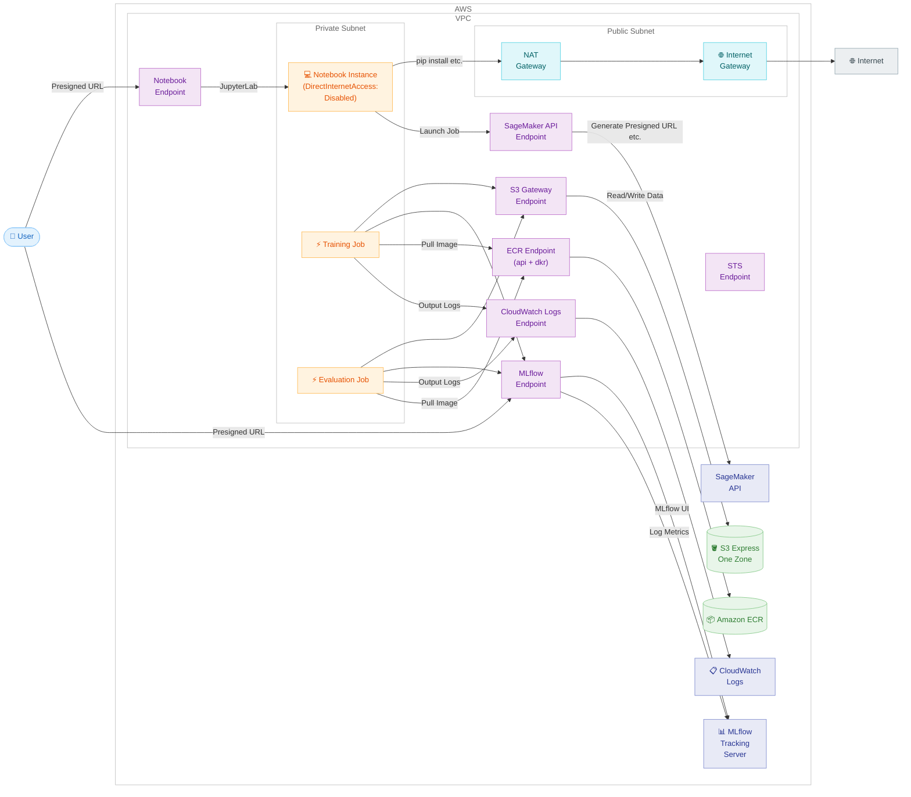

# SageMaker AI ML Pipeline の VPC 構成ガイド

🌐 **Language**: 🇺🇸 [English](vpc-configuration-guide.md) | 🇯🇵 [日本語](vpc-configuration-guide.ja.md)

## 目次

- [VPC 構成の動機](#vpc-構成の動機)
- [VPC 構成](#vpc-構成)
- [VPC Endpoint](#vpc-endpoint)
- [コンポーネント別の考慮点](#コンポーネント別の考慮点)
- [S3 Express One Zone と AZ 配置](#s3-express-one-zone-と-az-配置)
- [コスト影響](#コスト影響)
- [変更が必要なリソース](#変更が必要なリソース)
- [参考ドキュメント](#参考ドキュメント)

## VPC 構成の動機

VPC 構成を検討する動機として、以下の 2 つがあります。

- 企業のセキュリティポリシーとして、ML ワークロードを閉域ネットワーク内で運用する要件がある
- S3 Express One Zone ディレクトリバケットとトレーニングインスタンスを同一 AZ に配置し、データアクセスを高速化したい

本ガイドでは、Notebook Instance を含むすべてのコンポーネントを VPC 内に配置する閉域構成を扱います。

## VPC 構成

Notebook Instance を含むすべてのコンポーネントを VPC 内に配置する構成です。

`DirectInternetAccess: Disabled` により Notebook Instance からのアウトバウンドインターネットアクセスは遮断されますが、Presigned URL 経由のブラウザアクセス (JupyterLab、MLflow UI) はインターネットからも引き続き可能です。閉域要件がある場合は、IAM ポリシーで Presigned URL の生成を VPC 内に制限し、VPN / Direct Connect 経由でアクセスします。

以下の図は閉域アクセス (VPN / Direct Connect 経由) の構成を示しています。IAM ポリシーで制限しない場合は、ブラウザからインターネット経由で Presigned URL にアクセスすることも可能です。



### アクセス経路の詳細

MLflow App のように同じサービスでも、アクセス元によって経路が異なる点に注意してください。MLflow UI はブラウザ (VPC 外) からアクセスするため Presigned URL 経由ですが、メトリクス記録はトレーニングジョブ (VPC 内) から行うため VPC Endpoint 経由になります。

`DirectInternetAccess: Disabled` に設定しても、Presigned URL 経由のブラウザアクセスはインターネットから引き続き可能です (詳細は [Notebook Instance の DirectInternetAccess の動作](#directinternetaccess-の動作) を参照)。VPC Interface Endpoint の Private DNS を有効にすると、VPC 内からは Presigned URL の FQDN がプライベート IP に解決されるため、VPN / Direct Connect 経由のアクセスは VPC Endpoint 経由になります。

インターネットからの Presigned URL アクセスを制限したい場合は、IAM ポリシーで `aws:SourceVpc` / `aws:SourceVpce` 条件キーを使って Presigned URL 生成 API (`CreatePresignedNotebookInstanceUrl` 等) の呼び出しを VPC 内からのみに制限します。ただし、生成済みの URL 自体はインターネットからもアクセス可能です。

## VPC Endpoint

VPC 内のリソースがインターネットを経由せずに AWS サービスにアクセスするには、VPC Endpoint が必要です。以下の表は、必要な Endpoint を整理したものです。

| サービス | Endpoint タイプ | サービス名 | 用途 |
|---------|---------------|-----------|------|
| Amazon S3 | Gateway | `com.amazonaws.<region>.s3` | トレーニングデータ、モデルアーティファクトの読み書き |
| SageMaker API | Interface | `com.amazonaws.<region>.sagemaker.api` | Presigned URL 生成 (MLflow UI, JupyterLab)、Pipeline API 呼び出し |
| MLflow | Interface | `aws.sagemaker.<region>.experiments` | MLflow App への通信 (メトリクス記録 API、MLflow UI) |
| SageMaker AI Notebook | Interface | `aws.sagemaker.<region>.notebook` | VPN 経由での JupyterLab アクセス |
| Amazon ECR API | Interface | `com.amazonaws.<region>.ecr.api` | BYOC コンテナイメージの pull |
| Amazon ECR Docker | Interface | `com.amazonaws.<region>.ecr.dkr` | Docker レイヤーの pull |
| CloudWatch Logs | Interface | `com.amazonaws.<region>.logs` | トレーニングジョブのログ出力 |
| AWS STS | Interface | `com.amazonaws.<region>.sts` | IAM ロールの一時認証情報取得 |

Gateway Endpoint (S3) は無料です。Interface Endpoint は 1 つあたり時間単位の料金 + データ処理料金がかかります。詳細は [AWS PrivateLink の料金](https://aws.amazon.com/privatelink/pricing/) を参照してください。

参考: [SageMaker VPC Endpoint ドキュメント](https://docs.aws.amazon.com/sagemaker/latest/dg/interface-vpc-endpoint.html)、[MLflow VPC Endpoint ドキュメント](https://docs.aws.amazon.com/sagemaker/latest/dg/mlflow-interface-endpoint.html)

## コンポーネント別の考慮点

### トレーニングジョブ / 評価ジョブ

SageMaker の `CreateTrainingJob` API の `VpcConfig` パラメータでサブネットとセキュリティグループを指定することで、ジョブを VPC 内で実行できます。SageMaker Python SDK では Estimator の `subnets` / `security_group_ids` 引数に対応します。

考慮点は以下の通りです。

- サブネットに十分な IP アドレスが必要 (EFA なしで最低 2 個/インスタンス、EFA ありで最低 5 個/インスタンス)
- 分散学習を行う場合、セキュリティグループで同一グループ内のインバウンド通信を許可する必要がある
- S3 Gateway VPC Endpoint がないとトレーニングデータにアクセスできない
- train.py / evaluate.py で MLflow にメトリクスを記録している場合、MLflow Interface Endpoint が必要
- IAM ロールに ENI 関連の権限が必要 (`AmazonSageMakerFullAccess` マネージドポリシーに含まれている)

参考: [SageMaker Training VPC ドキュメント](https://docs.aws.amazon.com/sagemaker/latest/dg/train-vpc.html)

#### 実装例: SageMaker Python SDK

Estimator に `subnets` と `security_group_ids` を渡します。

```python
from sagemaker.pytorch.estimator import PyTorch

estimator = PyTorch(
    entry_point="train.py",
    source_dir="pipelines/container-pytorch-dlc",
    framework_version="2.5.1",
    py_version="py311",
    role=role_arn,
    instance_count=1,
    instance_type="ml.p4d.24xlarge",
    # VPC 設定
    subnets=["subnet-0123456789abcdef0"],
    security_group_ids=["sg-0123456789abcdef0"],
    output_path=model_output_uri,
    sagemaker_session=pipeline_session,
)
```

Processing Job (評価ジョブ) の場合は `NetworkConfig` を使用します。

```python
from sagemaker.network import NetworkConfig
from sagemaker.processing import FrameworkProcessor

network_config = NetworkConfig(
    subnets=["subnet-0123456789abcdef0"],
    security_group_ids=["sg-0123456789abcdef0"],
)

eval_processor = PyTorchProcessor(
    framework_version="2.5.1",
    py_version="py311",
    role=role_arn,
    instance_count=1,
    instance_type="ml.c7i.xlarge",
    network_config=network_config,
    sagemaker_session=pipeline_session,
)
```

#### 実装例: CloudFormation (VPC / サブネット / セキュリティグループ)

```yaml
TrainingVPC:
  Type: AWS::EC2::VPC
  Properties:
    CidrBlock: 10.0.0.0/16
    EnableDnsSupport: true
    EnableDnsHostnames: true

TrainingSubnet:
  Type: AWS::EC2::Subnet
  Properties:
    VpcId: !Ref TrainingVPC
    AvailabilityZoneId: !Ref TargetAvailabilityZoneId
    CidrBlock: 10.0.1.0/24

TrainingRouteTable:
  Type: AWS::EC2::RouteTable
  Properties:
    VpcId: !Ref TrainingVPC

TrainingSubnetRouteTableAssociation:
  Type: AWS::EC2::SubnetRouteTableAssociation
  Properties:
    SubnetId: !Ref TrainingSubnet
    RouteTableId: !Ref TrainingRouteTable

# 分散学習のために同一 SG 内の全トラフィックを許可
TrainingSecurityGroup:
  Type: AWS::EC2::SecurityGroup
  Properties:
    GroupDescription: Security group for SageMaker training jobs
    VpcId: !Ref TrainingVPC

TrainingSecurityGroupSelfIngress:
  Type: AWS::EC2::SecurityGroupIngress
  Properties:
    GroupId: !Ref TrainingSecurityGroup
    IpProtocol: -1
    SourceSecurityGroupId: !Ref TrainingSecurityGroup
```

#### 実装例: CloudFormation (VPC Endpoints)

```yaml
# S3 Gateway Endpoint (無料)
S3GatewayEndpoint:
  Type: AWS::EC2::VPCEndpoint
  Properties:
    VpcId: !Ref TrainingVPC
    ServiceName: !Sub 'com.amazonaws.${AWS::Region}.s3'
    VpcEndpointType: Gateway
    RouteTableIds:
      - !Ref TrainingRouteTable

# VPC Endpoint 用セキュリティグループ
VpcEndpointSecurityGroup:
  Type: AWS::EC2::SecurityGroup
  Properties:
    GroupDescription: Allow HTTPS for VPC Endpoints
    VpcId: !Ref TrainingVPC
    SecurityGroupIngress:
      - IpProtocol: tcp
        FromPort: 443
        ToPort: 443
        SourceSecurityGroupId: !Ref TrainingSecurityGroup

# SageMaker API Interface Endpoint
SageMakerApiEndpoint:
  Type: AWS::EC2::VPCEndpoint
  Properties:
    VpcId: !Ref TrainingVPC
    ServiceName: !Sub 'com.amazonaws.${AWS::Region}.sagemaker.api'
    VpcEndpointType: Interface
    SubnetIds:
      - !Ref TrainingSubnet
    SecurityGroupIds:
      - !Ref VpcEndpointSecurityGroup
    PrivateDnsEnabled: true

# MLflow Interface Endpoint
MlflowEndpoint:
  Type: AWS::EC2::VPCEndpoint
  Properties:
    VpcId: !Ref TrainingVPC
    ServiceName: !Sub 'aws.sagemaker.${AWS::Region}.experiments'
    VpcEndpointType: Interface
    SubnetIds:
      - !Ref TrainingSubnet
    SecurityGroupIds:
      - !Ref VpcEndpointSecurityGroup
    PrivateDnsEnabled: true
```

各 Endpoint の `ServiceName` を差し替えて追加します。各 Endpoint の CloudFormation 実装例は、対応するコンポーネントのセクション (Notebook Instance、MLflow App) を参照してください。

### Notebook Instance

Notebook Instance を VPC に配置する場合、`DirectInternetAccess: Disabled` に設定します。

#### DirectInternetAccess の動作

`DirectInternetAccess` はアウトバウンド通信 (Notebook Instance からインターネットへの通信) を制御する設定です。Presigned URL 経由のインバウンドアクセス (ブラウザから Notebook への通信) には影響しません。Presigned URL のアクセスは SageMaker のマネージドインフラが仲介するため、Notebook の VPC 設定とは独立しています。

| 通信方向 | DirectInternetAccess: Enabled | DirectInternetAccess: Disabled |
|---------|------|------|
| Notebook → インターネット (アウトバウンド) | ✅ SageMaker のマネージド NI 経由で可能 | ❌ 不可 (NAT GW か VPC Endpoint が必要) |
| ブラウザ → Notebook (Presigned URL) | ✅ 可能 | ✅ 可能 (IAM で制限しない限り) |

`DirectInternetAccess: Disabled` の実質的な影響は、pip install、GitHub clone、Lifecycle Config でのツールインストール (Kiro CLI、uv 等) ができなくなることです。これを解決するために NAT Gateway が必要になります。

AWS ドキュメントにも以下の記載があります。

> Even if you set up an interface endpoint in your VPC, individuals outside the VPC can connect to the notebook instance over the internet.
>
> — [Connect to a Notebook Instance Through a VPC Interface Endpoint](https://docs.aws.amazon.com/sagemaker/latest/dg/notebook-interface-endpoint.html)

インターネットからの Presigned URL アクセスを制限するには、IAM ポリシーで `aws:SourceVpc` / `aws:SourceVpce` 条件キーを明示的に設定する必要があります。

参考: [Notebook VPC ドキュメント](https://docs.aws.amazon.com/sagemaker/latest/dg/appendix-notebook-and-internet-access.html)、[Notebook VPC Interface Endpoint ドキュメント](https://docs.aws.amazon.com/sagemaker/latest/dg/notebook-interface-endpoint.html)

#### アクセス経路

JupyterLab へのブラウザアクセスには Presigned URL を使用します。

- Presigned URL はインターネットからアクセス可能。現在の `open-jupyterlab.sh` (Presigned URL を生成してブラウザで開く) がそのまま動作する
- 閉域アクセスする場合: Notebook Interface Endpoint (`aws.sagemaker.<region>.notebook`) の Private DNS を有効にすることで、Presigned URL の FQDN (`*.notebook.<region>.sagemaker.aws`) が VPC 内ではプライベート IP に解決される。VPN / Direct Connect で VPC に接続したブラウザからアクセスすると、インターネットを経由せず VPC Endpoint 経由で JupyterLab に接続できる

Presigned URL の生成 (`CreatePresignedNotebookInstanceUrl` API) は SageMaker API を呼び出します。閉域にする場合は SageMaker API Interface Endpoint 経由で VPC 内から呼び出します。

#### その他の考慮点

- pip install、GitHub clone など、インターネットアクセスが必要な操作は NAT Gateway がないと動作しない
- Lifecycle Config スクリプトでインターネットからツールをインストールしている場合 (例: Kiro CLI、uv)、NAT Gateway の設置またはスクリプトの修正が必要
- NAT Gateway を使わずに閉域を維持する場合、必要なパッケージを S3 経由で配布するなどの代替手段が必要

#### 実装例: CloudFormation (Notebook Instance の VPC 配置)

```yaml
NotebookInstance:
  Type: AWS::SageMaker::NotebookInstance
  Properties:
    NotebookInstanceName: !Sub '${ProjectName}-notebook'
    InstanceType: !Ref NotebookInstanceType
    RoleArn: !GetAtt SageMakerExecutionRole.Arn
    DirectInternetAccess: Disabled
    SubnetId: !Ref TrainingSubnet
    SecurityGroupIds:
      - !Ref NotebookSecurityGroup
    VolumeSizeInGB: 200
```

#### 実装例: CloudFormation (Notebook Interface Endpoint + Private DNS)

```yaml
# Notebook Interface Endpoint
# PrivateDnsEnabled: true により、*.notebook.<region>.sagemaker.aws が
# VPC 内ではこの Endpoint のプライベート IP に解決される
NotebookEndpoint:
  Type: AWS::EC2::VPCEndpoint
  Properties:
    VpcId: !Ref TrainingVPC
    ServiceName: !Sub 'aws.sagemaker.${AWS::Region}.notebook'
    VpcEndpointType: Interface
    SubnetIds:
      - !Ref TrainingSubnet
    SecurityGroupIds:
      - !Ref VpcEndpointSecurityGroup
    PrivateDnsEnabled: true
```

#### 実装例: IAM ポリシー (Presigned URL 生成を VPC 内に制限)

VPC Interface Endpoint を設定しても、VPC 外からの Presigned URL 生成はデフォルトで可能です。以下の IAM ポリシーで VPC 内からの生成のみに制限できます。

```json
{
  "Version": "2012-10-17",
  "Statement": [
    {
      "Sid": "RestrictNotebookAccessToVpc",
      "Effect": "Allow",
      "Action": [
        "sagemaker:CreatePresignedNotebookInstanceUrl",
        "sagemaker:DescribeNotebookInstance"
      ],
      "Resource": "*",
      "Condition": {
        "StringEquals": {
          "aws:SourceVpc": "vpc-0123456789abcdef0"
        }
      }
    }
  ]
}
```

### MLflow App

SageMaker マネージド MLflow App は SageMaker が管理するインフラ上で動作しています。VPC 内からのアクセスには MLflow Interface Endpoint (`aws.sagemaker.<region>.experiments`) を使用します。

#### アクセス経路

MLflow App には 2 つのアクセス経路があります。

- メトリクス記録 API: トレーニングジョブ内の `mlflow.set_tracking_uri()` から MLflow Interface Endpoint 経由でアクセス。train.py / evaluate.py のコード変更は不要で、Private DNS が有効な Interface Endpoint があれば DNS 解決が自動的に Endpoint 経由に切り替わる
- MLflow UI: ブラウザから Presigned URL でアクセス。Notebook Instance と同様に、MLflow Interface Endpoint の Private DNS を有効にすることで、VPC 内からは Presigned URL の FQDN がプライベート IP に解決される

Presigned URL の生成 (`CreatePresignedMlflowAppUrl` API) は SageMaker API を呼び出します。SageMaker API Interface Endpoint が必要です。

参考: [MLflow VPC Endpoint ドキュメント](https://docs.aws.amazon.com/sagemaker/latest/dg/mlflow-interface-endpoint-create.html)

#### 実装例: CloudFormation (MLflow Interface Endpoint + Private DNS)

```yaml
# MLflow Interface Endpoint
# PrivateDnsEnabled: true により、MLflow App の FQDN が
# VPC 内ではこの Endpoint のプライベート IP に解決される
MlflowEndpoint:
  Type: AWS::EC2::VPCEndpoint
  Properties:
    VpcId: !Ref TrainingVPC
    ServiceName: !Sub 'aws.sagemaker.${AWS::Region}.experiments'
    VpcEndpointType: Interface
    SubnetIds:
      - !Ref TrainingSubnet
    SecurityGroupIds:
      - !Ref VpcEndpointSecurityGroup
    PrivateDnsEnabled: true

# SageMaker API Interface Endpoint
# Presigned URL 生成 (CreatePresignedMlflowAppUrl) に必要
SageMakerApiEndpoint:
  Type: AWS::EC2::VPCEndpoint
  Properties:
    VpcId: !Ref TrainingVPC
    ServiceName: !Sub 'com.amazonaws.${AWS::Region}.sagemaker.api'
    VpcEndpointType: Interface
    SubnetIds:
      - !Ref TrainingSubnet
    SecurityGroupIds:
      - !Ref VpcEndpointSecurityGroup
    PrivateDnsEnabled: true
```

#### 実装例: IAM ポリシー (Presigned URL 生成を VPC 内に制限)

```json
{
  "Version": "2012-10-17",
  "Statement": [
    {
      "Sid": "RestrictMlflowAccessToVpc",
      "Effect": "Allow",
      "Action": [
        "sagemaker:CreatePresignedMlflowAppUrl"
      ],
      "Resource": "*",
      "Condition": {
        "StringEquals": {
          "aws:SourceVpc": "vpc-0123456789abcdef0"
        }
      }
    }
  ]
}
```

### セキュリティグループ

VPC 構成では、用途に応じたセキュリティグループの設計が必要です。

考慮点は以下の通りです。

- トレーニングジョブ用: 分散学習のために同一セキュリティグループ内の全トラフィックを許可
- VPC Endpoint 用: トレーニングジョブおよび Notebook からの HTTPS (443) インバウンドを許可
- Notebook 用: VPN / Direct Connect からのインバウンドアクセスを許可

## S3 Express One Zone と AZ 配置

S3 Express One Zone は単一の AZ にデータを保存するストレージクラスです。コンピュートリソースを同じ AZ に配置することで、最高のパフォーマンスを得られます。

### AZ の制御方法

SageMaker Training Job には AZ を直接指定するパラメータがありません。`VpcConfig` で特定の AZ に属するサブネットのみを指定することで、間接的にインスタンスの AZ を制御します。

### AZ ID と AZ Name

AWS アカウントごとに AZ Name (`ap-northeast-1a` など) と物理的な AZ のマッピングが異なります。アカウント間で一貫した識別子は AZ ID (`apne1-az1` など) です。S3 Express One Zone のディレクトリバケット名には AZ ID が含まれるため (例: `my-bucket--apne1-az1--x-s3`)、サブネットの AZ ID と照合してください。利用可能な AZ はリージョンによって異なります。

参考: [S3 Express One Zone の AZ とリージョン](https://docs.aws.amazon.com/AmazonS3/latest/userguide/s3-express-Endpoints.html)

### VPC なしで S3 Express One Zone を使う場合

VPC なしでも S3 Express One Zone のディレクトリバケット URI を指定するだけでトレーニングデータとして利用できます。ただし、トレーニングインスタンスの AZ は制御できないため、同一 AZ に配置される保証はありません。AZ が異なる場合、AZ 間通信のレイテンシ増加とデータ転送コストが発生します。

参考: [SageMaker Training Data ドキュメント](https://docs.aws.amazon.com/sagemaker/latest/dg/model-access-training-data.html)、[S3 Express One Zone ベストプラクティス](https://docs.aws.amazon.com/AmazonS3/latest/userguide/s3-express-optimizing-performance-design-patterns.html)

## コスト影響

VPC 構成の導入に伴う主なコスト要素です。東京リージョン (ap-northeast-1) の料金を基準にしています。

| コスト要素 | 単価 (概算) | 概算 |
|-----------|-----------|:---:|
| Interface VPC Endpoint | 約 $10/月/個 | 6 個以上: 約 $60/月 |
| Gateway VPC Endpoint (S3) | 無料 | $0 |
| NAT Gateway | 約 $45/月 + データ転送料 | 必要な場合あり |
| AZ 間データ転送 | $0.01/GB | - |
| VPC 自体 | 無料 | $0 |

NAT Gateway の有無により、月額 $60-120 程度の追加コストが見込まれます。

## 変更が必要なリソース

VPC 構成を導入する場合に変更が必要なリソースの一覧です。

### CloudFormation テンプレート

追加が必要なリソースは以下の通りです。

| リソース | 備考 |
|---------|------|
| VPC | |
| プライベートサブネット | ターゲット AZ に配置 |
| ルートテーブル | |
| S3 Gateway Endpoint | |
| SageMaker API Interface Endpoint | |
| MLflow Interface Endpoint | |
| Notebook Interface Endpoint | |
| ECR Interface Endpoints (api + dkr) | BYOC 使用時 |
| CloudWatch Logs Interface Endpoint | |
| STS Interface Endpoint | |
| セキュリティグループ (トレーニング用) | |
| セキュリティグループ (Endpoint 用) | |
| パブリックサブネット + IGW + NAT Gateway | pip install 等に必要な場合あり |

### パイプラインスクリプト

`pipelines/scripts/03-create-and-run-pipeline.py` の Estimator / Processor に `subnets` と `security_group_ids` を渡す変更が必要です。`--subnet-ids` / `--security-group-ids` を省略した場合、CloudFormation スタックの Output から自動取得します。

train.py / evaluate.py のコード変更は不要です。

### Notebook Instance

CloudFormation テンプレートの `NotebookInstance` リソースに `SubnetId`、`SecurityGroupIds` を追加し、`DirectInternetAccess` を `Disabled` に変更します。Lifecycle Config スクリプトでインターネットアクセスを前提としている処理がある場合は、NAT Gateway の設置またはスクリプトの修正が必要です。

### IAM ロール

`AmazonSageMakerFullAccess` マネージドポリシーに VPC 内での ENI 作成に必要な EC2 権限が含まれているため、追加の IAM 変更は不要です。

## 参考ドキュメント

以下のドキュメントは本ガイドの作成にあたって参照したものです。

- [SageMaker Training Job の VPC 設定](https://docs.aws.amazon.com/sagemaker/latest/dg/train-vpc.html)
- [SageMaker AI Notebook Instance の VPC 接続](https://docs.aws.amazon.com/sagemaker/latest/dg/appendix-notebook-and-internet-access.html)
- [Notebook VPC Interface Endpoint](https://docs.aws.amazon.com/sagemaker/latest/dg/notebook-interface-endpoint.html)
- [SageMaker VPC Interface Endpoint](https://docs.aws.amazon.com/sagemaker/latest/dg/interface-vpc-endpoint.html)
- [MLflow VPC Endpoint](https://docs.aws.amazon.com/sagemaker/latest/dg/mlflow-interface-endpoint.html)
- [MLflow VPC Endpoint の作成](https://docs.aws.amazon.com/sagemaker/latest/dg/mlflow-interface-endpoint-create.html)
- [S3 Express One Zone の AZ とリージョン](https://docs.aws.amazon.com/AmazonS3/latest/userguide/s3-express-Endpoints.html)
- [S3 Express One Zone ベストプラクティス](https://docs.aws.amazon.com/AmazonS3/latest/userguide/s3-express-optimizing-performance-design-patterns.html)
- [SageMaker Training Data ドキュメント](https://docs.aws.amazon.com/sagemaker/latest/dg/model-access-training-data.html)
- [CreateTrainingJob API リファレンス](https://docs.aws.amazon.com/boto3/latest/reference/services/sagemaker/client/create_training_job.html)
- [Security Hub SageMaker コントロール](https://docs.aws.amazon.com/securityhub/latest/userguide/sagemaker-controls.html)
- [AWS PrivateLink と MLflow のブログ記事](https://aws.amazon.com/blogs/machine-learning/accelerating-ml-experimentation-with-enhanced-security-aws-privatelink-support-for-amazon-sagemaker-with-mlflow/)
