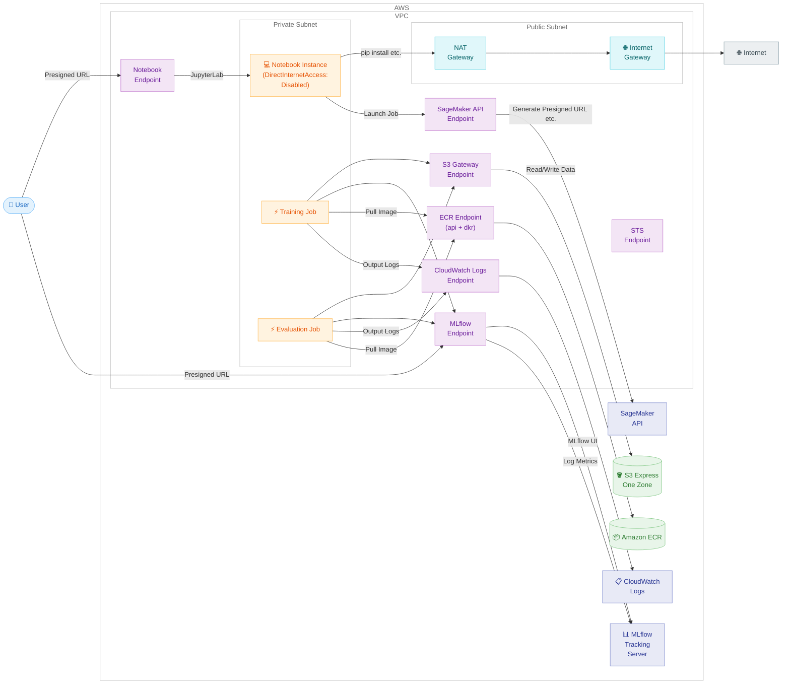

# VPC Configuration Guide for SageMaker AI ML Pipeline

🌐 **Language**: 🇺🇸 [English](vpc-configuration-guide.md) | 🇯🇵 [日本語](vpc-configuration-guide.ja.md)

## Table of Contents

- [Motivation for VPC Configuration](#motivation-for-vpc-configuration)
- [VPC Configuration](#vpc-configuration)
- [VPC Endpoint Overview](#vpc-endpoint-overview)
- [Considerations by Component](#considerations-by-component)
- [S3 Express One Zone and AZ Placement](#s3-express-one-zone-and-az-placement)
- [Cost Impact](#cost-impact)
- [Resources That Require Changes](#resources-that-require-changes)
- [Reference Documentation](#reference-documentation)

## Motivation for VPC Configuration

There are two main motivations for considering a VPC configuration.

- Corporate security policies require ML workloads to operate within a private network
- Placing S3 Express One Zone directory buckets and training instances in the same AZ to accelerate data access

This guide covers a private network configuration where all components, including the Notebook Instance, are placed inside a VPC.

## VPC Configuration

This is a configuration in which all components, including the Notebook Instance, are placed inside a VPC.

With `DirectInternetAccess: Disabled`, outbound internet access from the Notebook Instance is blocked, but browser access via Presigned URL (JupyterLab, MLflow UI) is still possible from the internet. If private network requirements exist, restrict Presigned URL generation to within the VPC via IAM policies and access via VPN / Direct Connect.

The following diagram shows a private access configuration (via VPN / Direct Connect). If not restricted by IAM policy, you can also access Presigned URLs from a browser via the internet.



### Access Path Details

Note that even for the same service, such as the MLflow App, the access path differs depending on the source. The MLflow UI is accessed via Presigned URL because it is accessed from a browser (outside the VPC), while metric logging is done from training jobs (inside the VPC) and therefore goes through the VPC Endpoint.

Even if you set `DirectInternetAccess: Disabled`, browser access via Presigned URL remains possible from the internet (see [DirectInternetAccess Behavior for Notebook Instance](#directinternetaccess-behavior) for details). When Private DNS is enabled on a VPC Interface Endpoint, the FQDN of the Presigned URL resolves to a private IP from within the VPC, so access via VPN / Direct Connect goes through the VPC Endpoint.

If you want to restrict Presigned URL access from the internet, use the `aws:SourceVpc` / `aws:SourceVpce` condition keys in IAM policies to restrict calls to Presigned URL generation APIs (such as `CreatePresignedNotebookInstanceUrl`) to only within the VPC. However, the generated URLs themselves are still accessible from the internet.

## VPC Endpoint Overview

VPC Endpoints are required for resources inside the VPC to access AWS services without going through the internet. The following table summarizes the required endpoints.

| Service | Endpoint Type | Service Name | Purpose |
|---------|---------------|-----------|------|
| Amazon S3 | Gateway | `com.amazonaws.<region>.s3` | Read/write training data and model artifacts |
| SageMaker API | Interface | `com.amazonaws.<region>.sagemaker.api` | Presigned URL generation (MLflow UI, JupyterLab), Pipeline API calls |
| MLflow | Interface | `aws.sagemaker.<region>.experiments` | Communication with MLflow App (metric logging API, MLflow UI) |
| SageMaker AI Notebook | Interface | `aws.sagemaker.<region>.notebook` | JupyterLab access via VPN |
| Amazon ECR API | Interface | `com.amazonaws.<region>.ecr.api` | Pull BYOC container images |
| Amazon ECR Docker | Interface | `com.amazonaws.<region>.ecr.dkr` | Pull Docker layers |
| CloudWatch Logs | Interface | `com.amazonaws.<region>.logs` | Log output from training jobs |
| AWS STS | Interface | `com.amazonaws.<region>.sts` | Obtain temporary credentials for IAM roles |

Gateway Endpoints (S3) are free. Interface Endpoints incur an hourly charge per endpoint plus data processing charges. See [AWS PrivateLink pricing](https://aws.amazon.com/privatelink/pricing/) for details.

Reference: [SageMaker VPC Endpoint documentation](https://docs.aws.amazon.com/sagemaker/latest/dg/interface-vpc-endpoint.html), [MLflow VPC Endpoint documentation](https://docs.aws.amazon.com/sagemaker/latest/dg/mlflow-interface-endpoint.html)

## Considerations by Component

### Training Jobs / Evaluation Jobs

By specifying subnets and security groups in the `VpcConfig` parameter of the SageMaker `CreateTrainingJob` API, you can run jobs within a VPC. In the SageMaker Python SDK, this corresponds to the `subnets` / `security_group_ids` arguments of the Estimator.

The considerations are as follows.

- The subnet must have enough IP addresses (at least 2 per instance without EFA, at least 5 per instance with EFA)
- For distributed training, the security group must allow inbound communication within the same group
- Without an S3 Gateway VPC Endpoint, training data cannot be accessed
- If train.py / evaluate.py logs metrics to MLflow, an MLflow Interface Endpoint is required
- The IAM role needs ENI-related permissions (included in the `AmazonSageMakerFullAccess` managed policy)

Reference: [SageMaker Training VPC documentation](https://docs.aws.amazon.com/sagemaker/latest/dg/train-vpc.html)

#### Implementation Example: SageMaker Python SDK

Pass `subnets` and `security_group_ids` to the Estimator.

```python
from sagemaker.pytorch.estimator import PyTorch

estimator = PyTorch(
    entry_point="train.py",
    source_dir="pipelines/container-pytorch-dlc",
    framework_version="2.5.1",
    py_version="py311",
    role=role_arn,
    instance_count=1,
    instance_type="ml.p4d.24xlarge",
    # VPC configuration
    subnets=["subnet-0123456789abcdef0"],
    security_group_ids=["sg-0123456789abcdef0"],
    output_path=model_output_uri,
    sagemaker_session=pipeline_session,
)
```

For Processing Jobs (evaluation jobs), use `NetworkConfig`.

```python
from sagemaker.network import NetworkConfig
from sagemaker.processing import FrameworkProcessor

network_config = NetworkConfig(
    subnets=["subnet-0123456789abcdef0"],
    security_group_ids=["sg-0123456789abcdef0"],
)

eval_processor = PyTorchProcessor(
    framework_version="2.5.1",
    py_version="py311",
    role=role_arn,
    instance_count=1,
    instance_type="ml.c7i.xlarge",
    network_config=network_config,
    sagemaker_session=pipeline_session,
)
```

#### Implementation Example: CloudFormation (VPC / Subnet / Security Group)

```yaml
TrainingVPC:
  Type: AWS::EC2::VPC
  Properties:
    CidrBlock: 10.0.0.0/16
    EnableDnsSupport: true
    EnableDnsHostnames: true

TrainingSubnet:
  Type: AWS::EC2::Subnet
  Properties:
    VpcId: !Ref TrainingVPC
    AvailabilityZoneId: !Ref TargetAvailabilityZoneId
    CidrBlock: 10.0.1.0/24

TrainingRouteTable:
  Type: AWS::EC2::RouteTable
  Properties:
    VpcId: !Ref TrainingVPC

TrainingSubnetRouteTableAssociation:
  Type: AWS::EC2::SubnetRouteTableAssociation
  Properties:
    SubnetId: !Ref TrainingSubnet
    RouteTableId: !Ref TrainingRouteTable

# Allow all traffic within the same SG for distributed training
TrainingSecurityGroup:
  Type: AWS::EC2::SecurityGroup
  Properties:
    GroupDescription: Security group for SageMaker training jobs
    VpcId: !Ref TrainingVPC

TrainingSecurityGroupSelfIngress:
  Type: AWS::EC2::SecurityGroupIngress
  Properties:
    GroupId: !Ref TrainingSecurityGroup
    IpProtocol: -1
    SourceSecurityGroupId: !Ref TrainingSecurityGroup
```

#### Implementation Example: CloudFormation (VPC Endpoints)

```yaml
# S3 Gateway Endpoint (free)
S3GatewayEndpoint:
  Type: AWS::EC2::VPCEndpoint
  Properties:
    VpcId: !Ref TrainingVPC
    ServiceName: !Sub 'com.amazonaws.${AWS::Region}.s3'
    VpcEndpointType: Gateway
    RouteTableIds:
      - !Ref TrainingRouteTable

# Security group for VPC Endpoints
VpcEndpointSecurityGroup:
  Type: AWS::EC2::SecurityGroup
  Properties:
    GroupDescription: Allow HTTPS for VPC Endpoints
    VpcId: !Ref TrainingVPC
    SecurityGroupIngress:
      - IpProtocol: tcp
        FromPort: 443
        ToPort: 443
        SourceSecurityGroupId: !Ref TrainingSecurityGroup

# SageMaker API Interface Endpoint
SageMakerApiEndpoint:
  Type: AWS::EC2::VPCEndpoint
  Properties:
    VpcId: !Ref TrainingVPC
    ServiceName: !Sub 'com.amazonaws.${AWS::Region}.sagemaker.api'
    VpcEndpointType: Interface
    SubnetIds:
      - !Ref TrainingSubnet
    SecurityGroupIds:
      - !Ref VpcEndpointSecurityGroup
    PrivateDnsEnabled: true

# MLflow Interface Endpoint
MlflowEndpoint:
  Type: AWS::EC2::VPCEndpoint
  Properties:
    VpcId: !Ref TrainingVPC
    ServiceName: !Sub 'aws.sagemaker.${AWS::Region}.experiments'
    VpcEndpointType: Interface
    SubnetIds:
      - !Ref TrainingSubnet
    SecurityGroupIds:
      - !Ref VpcEndpointSecurityGroup
    PrivateDnsEnabled: true
```

Add each endpoint by replacing the `ServiceName`. For CloudFormation implementation examples of each endpoint, see the corresponding component sections (Notebook Instance, MLflow App).

### Notebook Instance

When placing a Notebook Instance in a VPC, set `DirectInternetAccess: Disabled`.

#### DirectInternetAccess Behavior

`DirectInternetAccess` is a setting that controls outbound communication (communication from the Notebook Instance to the internet). It does not affect inbound access via Presigned URL (communication from a browser to the Notebook). Presigned URL access is mediated by SageMaker's managed infrastructure, so it is independent of the Notebook's VPC settings.

| Communication Direction | DirectInternetAccess: Enabled | DirectInternetAccess: Disabled |
|---------|------|------|
| Notebook → Internet (Outbound) | ✅ Possible via SageMaker's managed NI | ❌ Not possible (NAT GW or VPC Endpoint required) |
| Browser → Notebook (Presigned URL) | ✅ Possible | ✅ Possible (unless restricted by IAM) |

The practical impact of `DirectInternetAccess: Disabled` is that pip install, GitHub clone, and tool installation in Lifecycle Config (Kiro CLI, uv, etc.) become impossible. To resolve this, a NAT Gateway is required.

The AWS documentation also states the following.

> Even if you set up an interface endpoint in your VPC, individuals outside the VPC can connect to the notebook instance over the internet.
>
> — [Connect to a Notebook Instance Through a VPC Interface Endpoint](https://docs.aws.amazon.com/sagemaker/latest/dg/notebook-interface-endpoint.html)

To restrict Presigned URL access from the internet, you need to explicitly set the `aws:SourceVpc` / `aws:SourceVpce` condition keys in the IAM policy.

Reference: [Notebook VPC documentation](https://docs.aws.amazon.com/sagemaker/latest/dg/appendix-notebook-and-internet-access.html), [Notebook VPC Interface Endpoint documentation](https://docs.aws.amazon.com/sagemaker/latest/dg/notebook-interface-endpoint.html)

#### Access Paths

Browser access to JupyterLab uses a Presigned URL.

- Presigned URLs are accessible from the internet. The current `open-jupyterlab.sh` (which generates a Presigned URL and opens it in the browser) continues to work as is
- For private access: By enabling Private DNS on the Notebook Interface Endpoint (`aws.sagemaker.<region>.notebook`), the FQDN of the Presigned URL (`*.notebook.<region>.sagemaker.aws`) resolves to a private IP within the VPC. When accessed from a browser connected to the VPC via VPN / Direct Connect, JupyterLab can be accessed via the VPC Endpoint without going through the internet

Presigned URL generation (`CreatePresignedNotebookInstanceUrl` API) calls the SageMaker API. For a private network configuration, call it from within the VPC via the SageMaker API Interface Endpoint.

#### Other Considerations

- Operations requiring internet access, such as pip install and GitHub clone, will not work without a NAT Gateway
- If Lifecycle Config scripts install tools from the internet (e.g., Kiro CLI, uv), you need to set up a NAT Gateway or modify the scripts
- To maintain a private network without using a NAT Gateway, you need alternative methods such as distributing required packages via S3

#### Implementation Example: CloudFormation (Placing Notebook Instance in VPC)

```yaml
NotebookInstance:
  Type: AWS::SageMaker::NotebookInstance
  Properties:
    NotebookInstanceName: !Sub '${ProjectName}-notebook'
    InstanceType: !Ref NotebookInstanceType
    RoleArn: !GetAtt SageMakerExecutionRole.Arn
    DirectInternetAccess: Disabled
    SubnetId: !Ref TrainingSubnet
    SecurityGroupIds:
      - !Ref NotebookSecurityGroup
    VolumeSizeInGB: 200
```

#### Implementation Example: CloudFormation (Notebook Interface Endpoint + Private DNS)

```yaml
# Notebook Interface Endpoint
# With PrivateDnsEnabled: true, *.notebook.<region>.sagemaker.aws resolves
# to this Endpoint's private IP within the VPC
NotebookEndpoint:
  Type: AWS::EC2::VPCEndpoint
  Properties:
    VpcId: !Ref TrainingVPC
    ServiceName: !Sub 'aws.sagemaker.${AWS::Region}.notebook'
    VpcEndpointType: Interface
    SubnetIds:
      - !Ref TrainingSubnet
    SecurityGroupIds:
      - !Ref VpcEndpointSecurityGroup
    PrivateDnsEnabled: true
```

#### Implementation Example: IAM Policy (Restrict Presigned URL Generation to Within the VPC)

Even with a VPC Interface Endpoint configured, Presigned URL generation from outside the VPC is possible by default. The following IAM policy restricts generation to within the VPC only.

```json
{
  "Version": "2012-10-17",
  "Statement": [
    {
      "Sid": "RestrictNotebookAccessToVpc",
      "Effect": "Allow",
      "Action": [
        "sagemaker:CreatePresignedNotebookInstanceUrl",
        "sagemaker:DescribeNotebookInstance"
      ],
      "Resource": "*",
      "Condition": {
        "StringEquals": {
          "aws:SourceVpc": "vpc-0123456789abcdef0"
        }
      }
    }
  ]
}
```

### MLflow App

The SageMaker managed MLflow App runs on infrastructure managed by SageMaker. For access from within the VPC, use the MLflow Interface Endpoint (`aws.sagemaker.<region>.experiments`).

#### Access Paths

There are two access paths to the MLflow App.

- Metric logging API: Accessed via the MLflow Interface Endpoint from `mlflow.set_tracking_uri()` inside training jobs. No code changes are required for train.py / evaluate.py; if an Interface Endpoint with Private DNS enabled exists, DNS resolution automatically switches to go through the endpoint
- MLflow UI: Accessed from a browser via Presigned URL. As with the Notebook Instance, enabling Private DNS on the MLflow Interface Endpoint causes the FQDN of the Presigned URL to resolve to a private IP within the VPC

Presigned URL generation (`CreatePresignedMlflowAppUrl` API) calls the SageMaker API. A SageMaker API Interface Endpoint is required.

Reference: [MLflow VPC Endpoint documentation](https://docs.aws.amazon.com/sagemaker/latest/dg/mlflow-interface-endpoint-create.html)

#### Implementation Example: CloudFormation (MLflow Interface Endpoint + Private DNS)

```yaml
# MLflow Interface Endpoint
# With PrivateDnsEnabled: true, the MLflow App FQDN resolves
# to this Endpoint's private IP within the VPC
MlflowEndpoint:
  Type: AWS::EC2::VPCEndpoint
  Properties:
    VpcId: !Ref TrainingVPC
    ServiceName: !Sub 'aws.sagemaker.${AWS::Region}.experiments'
    VpcEndpointType: Interface
    SubnetIds:
      - !Ref TrainingSubnet
    SecurityGroupIds:
      - !Ref VpcEndpointSecurityGroup
    PrivateDnsEnabled: true

# SageMaker API Interface Endpoint
# Required for Presigned URL generation (CreatePresignedMlflowAppUrl)
SageMakerApiEndpoint:
  Type: AWS::EC2::VPCEndpoint
  Properties:
    VpcId: !Ref TrainingVPC
    ServiceName: !Sub 'com.amazonaws.${AWS::Region}.sagemaker.api'
    VpcEndpointType: Interface
    SubnetIds:
      - !Ref TrainingSubnet
    SecurityGroupIds:
      - !Ref VpcEndpointSecurityGroup
    PrivateDnsEnabled: true
```

#### Implementation Example: IAM Policy (Restrict Presigned URL Generation to Within the VPC)

```json
{
  "Version": "2012-10-17",
  "Statement": [
    {
      "Sid": "RestrictMlflowAccessToVpc",
      "Effect": "Allow",
      "Action": [
        "sagemaker:CreatePresignedMlflowAppUrl"
      ],
      "Resource": "*",
      "Condition": {
        "StringEquals": {
          "aws:SourceVpc": "vpc-0123456789abcdef0"
        }
      }
    }
  ]
}
```

### Security Groups

In a VPC configuration, security group design tailored to each use case is required.

The considerations are as follows.

- For training jobs: Allow all traffic within the same security group for distributed training
- For VPC Endpoints: Allow HTTPS (443) inbound from training jobs and Notebook
- For Notebook: Allow inbound access from VPN / Direct Connect

## S3 Express One Zone and AZ Placement

S3 Express One Zone is a storage class that stores data in a single AZ. By placing compute resources in the same AZ, you can achieve the highest performance.

### How to Control the AZ

SageMaker Training Jobs do not have a parameter to directly specify an AZ. By specifying only subnets that belong to a specific AZ in `VpcConfig`, you indirectly control the AZ of the instances.

### AZ ID and AZ Name

The mapping between AZ Name (such as `ap-northeast-1a`) and physical AZ differs per AWS account. The consistent identifier across accounts is the AZ ID (such as `apne1-az1`). Since the directory bucket name of S3 Express One Zone contains the AZ ID (e.g., `my-bucket--apne1-az1--x-s3`), match it with the AZ ID of the subnet. Available AZs vary by region.

Reference: [S3 Express One Zone AZs and Regions](https://docs.aws.amazon.com/AmazonS3/latest/userguide/s3-express-Endpoints.html)

### Using S3 Express One Zone Without a VPC

Even without a VPC, you can use S3 Express One Zone as training data simply by specifying the directory bucket URI. However, since you cannot control the AZ of the training instance, there is no guarantee that it will be placed in the same AZ. If the AZs differ, inter-AZ communication latency and data transfer costs will be incurred.

Reference: [SageMaker Training Data documentation](https://docs.aws.amazon.com/sagemaker/latest/dg/model-access-training-data.html), [S3 Express One Zone Best Practices](https://docs.aws.amazon.com/AmazonS3/latest/userguide/s3-express-optimizing-performance-design-patterns.html)

## Cost Impact

The main cost factors when introducing a VPC configuration. Pricing is based on the Tokyo region (ap-northeast-1).

| Cost Factor | Unit Price (Approx.) | Estimate |
|-----------|-----------|:---:|
| Interface VPC Endpoint | Approx. $10/month/endpoint | 6 or more: approx. $60/month |
| Gateway VPC Endpoint (S3) | Free | $0 |
| NAT Gateway | Approx. $45/month + data transfer | May be required |
| Inter-AZ Data Transfer | $0.01/GB | - |
| VPC Itself | Free | $0 |

Depending on whether a NAT Gateway is used, an additional cost of approximately $60-120 per month is expected.

## Resources That Require Changes

A list of resources that require changes when introducing a VPC configuration.

### CloudFormation Templates

Resources that need to be added are as follows.

| Resource | Notes |
|---------|------|
| VPC | |
| Private Subnet | Placed in the target AZ |
| Route Table | |
| S3 Gateway Endpoint | |
| SageMaker API Interface Endpoint | |
| MLflow Interface Endpoint | |
| Notebook Interface Endpoint | |
| ECR Interface Endpoints (api + dkr) | When using BYOC |
| CloudWatch Logs Interface Endpoint | |
| STS Interface Endpoint | |
| Security Group (for training) | |
| Security Group (for Endpoints) | |
| Public Subnet + IGW + NAT Gateway | May be required for pip install, etc. |

### Pipeline Scripts

The Estimator / Processor in `pipelines/scripts/03-create-and-run-pipeline.py` needs to be modified to pass `subnets` and `security_group_ids`. If `--subnet-ids` / `--security-group-ids` are omitted, they are automatically obtained from the CloudFormation stack Output.

No code changes are required for train.py / evaluate.py.

### Notebook Instance

Add `SubnetId` and `SecurityGroupIds` to the `NotebookInstance` resource in the CloudFormation template, and change `DirectInternetAccess` to `Disabled`. If there is processing in the Lifecycle Config script that assumes internet access, you need to set up a NAT Gateway or modify the script.

### IAM Role

Since the `AmazonSageMakerFullAccess` managed policy includes the EC2 permissions required to create ENIs within a VPC, no additional IAM changes are required.

## Reference Documentation

The following documents were referenced in creating this guide.

- [SageMaker Training Job VPC configuration](https://docs.aws.amazon.com/sagemaker/latest/dg/train-vpc.html)
- [SageMaker AI Notebook Instance VPC connection](https://docs.aws.amazon.com/sagemaker/latest/dg/appendix-notebook-and-internet-access.html)
- [Notebook VPC Interface Endpoint](https://docs.aws.amazon.com/sagemaker/latest/dg/notebook-interface-endpoint.html)
- [SageMaker VPC Interface Endpoint](https://docs.aws.amazon.com/sagemaker/latest/dg/interface-vpc-endpoint.html)
- [MLflow VPC Endpoint](https://docs.aws.amazon.com/sagemaker/latest/dg/mlflow-interface-endpoint.html)
- [Creating an MLflow VPC Endpoint](https://docs.aws.amazon.com/sagemaker/latest/dg/mlflow-interface-endpoint-create.html)
- [S3 Express One Zone AZs and Regions](https://docs.aws.amazon.com/AmazonS3/latest/userguide/s3-express-Endpoints.html)
- [S3 Express One Zone Best Practices](https://docs.aws.amazon.com/AmazonS3/latest/userguide/s3-express-optimizing-performance-design-patterns.html)
- [SageMaker Training Data documentation](https://docs.aws.amazon.com/sagemaker/latest/dg/model-access-training-data.html)
- [CreateTrainingJob API Reference](https://docs.aws.amazon.com/boto3/latest/reference/services/sagemaker/client/create_training_job.html)
- [Security Hub SageMaker Controls](https://docs.aws.amazon.com/securityhub/latest/userguide/sagemaker-controls.html)
- [AWS PrivateLink and MLflow Blog Post](https://aws.amazon.com/blogs/machine-learning/accelerating-ml-experimentation-with-enhanced-security-aws-privatelink-support-for-amazon-sagemaker-with-mlflow/)
