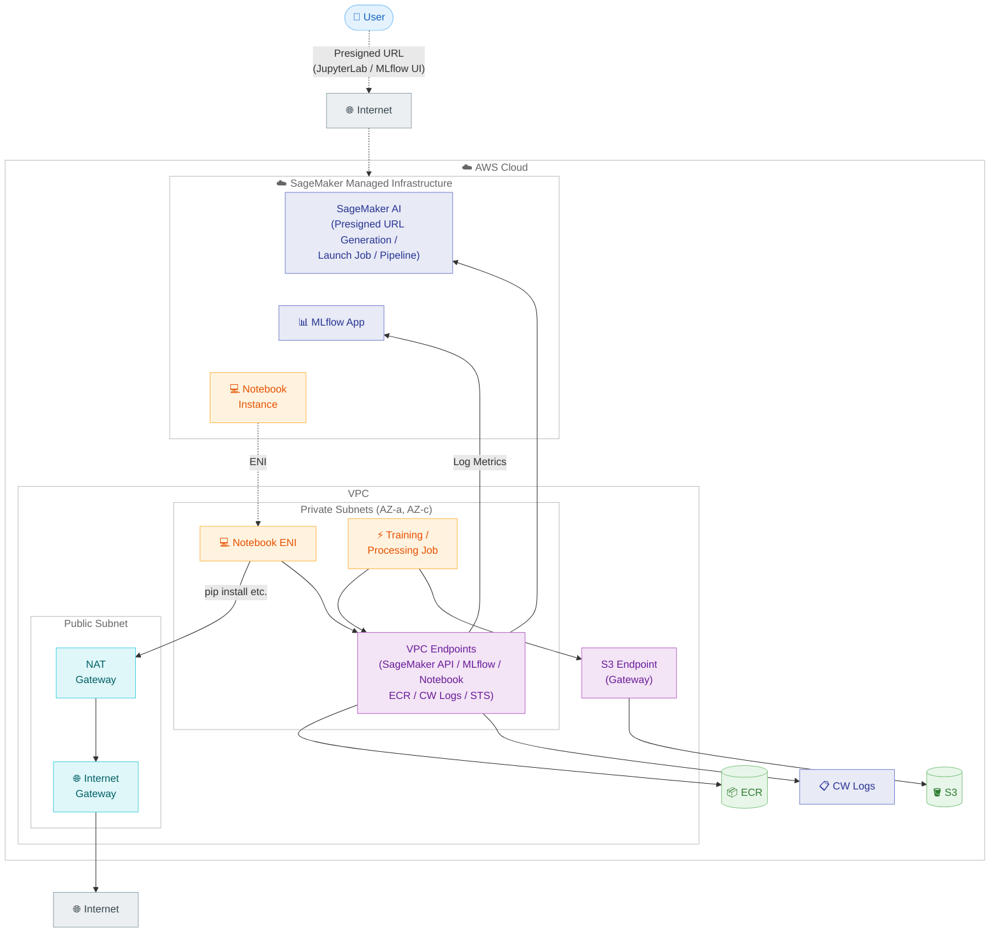

# VPC 構成の実装 <!-- omit in toc -->

🌐 **Language**: 🇺🇸 [English](vpc-implementation.md) | 🇯🇵 [日本語](vpc-implementation.ja.md)

本ドキュメントでは、SageMaker AI ML Pipeline 環境を VPC 内に配置する構成の設計と実装について説明します。デフォルトは VPC なしの構成ですが、`.env` で `ENABLE_VPC=true` を設定することで、すべてのコンポーネントを VPC 内に配置する閉域構成でデプロイできます。

- [アーキテクチャ](#アーキテクチャ)
- [VPC モード](#vpc-モード)
- [サブネット構成](#サブネット構成)
- [Notebook Instance の VPC 配置](#notebook-instance-の-vpc-配置)
- [VPC Endpoint](#vpc-endpoint)
- [既存 VPC 利用時の前提条件](#既存-vpc-利用時の前提条件)
- [CloudFormation 実装詳細](#cloudformation-実装詳細)
- [VPC 関連の実装箇所](#vpc-関連の実装箇所)

## アーキテクチャ

Notebook Instance、Training Job、Processing Job のすべてを VPC 内のプライベートサブネットに配置する閉域構成です。

通信経路は以下のように設計されています。

- **AWS サービスへの通信**: VPC Endpoints (Interface / Gateway) を経由。インターネットを通らずに S3、ECR、CloudWatch Logs、SageMaker API 等にアクセス
- **インターネットアクセス**: NAT Gateway 経由。pip install、GitHub clone、Lifecycle Config のツールインストールに使用
- **JupyterLab / MLflow UI**: Presigned URL によるブラウザアクセス。SageMaker マネージドインフラが仲介するため、VPC 内に配置しても引き続きインターネットからアクセス可能

### 実装アーキテクチャ図



## VPC モード

CloudFormation パラメータの組み合わせで、以下の 3 つのモードを切り替えます。

| モード | EnableVPC | VpcId | 動作 |
|--------|-----------|-------|------|
| VPC なし | `false` (デフォルト) | - | VPC を使用しない構成。後方互換 |
| 新規 VPC | `true` | 空 | CloudFormation が VPC / サブネット / NAT Gateway / セキュリティグループ / VPC Endpoint をすべて作成 |
| 既存 VPC | `true` | 指定 | ユーザーが `VpcId` / `SubnetIds` / `SecurityGroupId` を指定。既存のネットワークリソースを利用 |

## サブネット構成

新規 VPC 作成時は以下のサブネットを作成します。

| サブネット | CIDR | AZ | 用途 |
|-----------|------|-----|------|
| PrivateSubnet1 | 10.0.1.0/24 | AZ-0 (ap-northeast-1a) | Notebook、Training Job、Processing Job |
| PrivateSubnet2 | 10.0.2.0/24 | AZ-1 (ap-northeast-1c) | Training Job、Processing Job |
| PublicSubnet1 | 10.0.100.0/24 | AZ-0 (ap-northeast-1a) | NAT Gateway |
| PublicSubnet2 | 10.0.101.0/24 | AZ-1 (ap-northeast-1c) | (将来の拡張用) |

プライベート・パブリックともに 2 つ (異なる AZ) 作成する理由は以下の通りです。

- SageMaker Unified Studio の Blueprint 設定が、異なる AZ の最低 2 サブネットを要求する
- SageMaker Training / Processing Job 自体は 1 サブネットでも動作する
- S3 Express One Zone で AZ を固定したい場合は、Pipeline 実行時に `--subnet-ids` で 1 つだけ指定すれば制御可能 (通常は CloudFormation Output から自動取得)

## Notebook Instance の VPC 配置

VPC 有効時は、Notebook Instance に以下の設定が適用されます。

| 設定 | 値 | 説明 |
|------|-----|------|
| `DirectInternetAccess` | `Disabled` | Notebook ENI からのアウトバウンドインターネットを遮断 |
| `SubnetId` | プライベートサブネット | Notebook ENI をプライベートサブネットに配置 |
| `SecurityGroupIds` | TrainingSecurityGroup | Training Job と共通のセキュリティグループ |

`DirectInternetAccess: Disabled` でも、以下の通信は引き続き動作します。

- **pip install、GitHub clone**: NAT Gateway 経由でインターネットにアクセス
- **JupyterLab / MLflow UI**: Presigned URL は SageMaker マネージドインフラが仲介するため、インターネットからのブラウザアクセスが可能
- **Lifecycle Config のツールインストール** (Kiro CLI): NAT Gateway 経由

## VPC Endpoint

VPC Endpoint の作成は `CreateVpcEndpoints` パラメータ (デフォルト `true`) で制御します。

| VPC モード | CreateVpcEndpoints=true | CreateVpcEndpoints=false |
|-----------|------------------------|-------------------------|
| 新規 VPC | S3 Gateway Endpoint + 下表の Interface Endpoint をすべて作成 | Endpoint 作成なし |
| 既存 VPC | 下表の Interface Endpoint のみ作成 (S3 Gateway Endpoint はユーザーが事前に用意) | Endpoint 作成なし |

本環境で必要な VPC Endpoint は以下の通りです。

| サービス | タイプ | 用途 |
|---------|--------|------|
| S3 | Gateway | トレーニングデータ、モデルアーティファクトの読み書き |
| SageMaker API | Interface | Presigned URL 生成、Pipeline API、Training Job / Processing Job の起動 |
| MLflow | Interface | メトリクス記録、MLflow UI アクセス |
| SageMaker AI Notebook | Interface | JupyterLab アクセス |
| ECR API | Interface | BYOC コンテナイメージのメタデータ取得 |
| ECR Docker | Interface | コンテナイメージレイヤーの pull |
| CloudWatch Logs | Interface | Training Job / Processing Job のログ送信 |
| STS | Interface | IAM ロールの一時認証情報取得 |

> 💡 Gateway Endpoint (S3) は無料です。Interface Endpoint は 1 つあたり時間単位の料金 + データ処理料金がかかります。本環境では Interface Endpoint を 7 つ作成します。詳細は [AWS PrivateLink の料金](https://aws.amazon.com/privatelink/pricing/) を参照してください。

## 既存 VPC 利用時の前提条件

既存 VPC を使用する場合は、以下の条件を満たす必要があります。

**VPC 設定**:

- `EnableDnsSupport: true` および `EnableDnsHostnames: true` が有効であること

**サブネット**:

- プライベートサブネットが 2 つ以上 (異なる AZ) あること
- 各サブネットのルートテーブルに NAT Gateway へのルート (0.0.0.0/0) があること
- S3 Gateway Endpoint がルートテーブルに紐付いていること

**セキュリティグループ**:

- 分散学習を使用する場合は、同一セキュリティグループ内の全トラフィックを許可する自己参照 Ingress ルールが必要

**IP アドレス**:

- 各サブネットに十分な空き IP があること (インスタンスあたり最低 2 個)

## CloudFormation 実装詳細

以下は `infra/sagemaker-ai-ml-pipeline/cfn/sagemaker-ai-ml-pipeline.yaml` の VPC 関連部分の抜粋です。

### VPC 関連パラメータ

`.env` の設定が `deploy.sh` 経由で以下のパラメータに渡されます。

```yaml
EnableVPC:          {Default: 'false', AllowedValues: ['true', 'false']}
VpcId:              {Default: ''}
SubnetIds:          {Default: ''}
SecurityGroupId:    {Default: ''}
CreateVpcEndpoints: {Default: 'true', AllowedValues: ['true', 'false']}
```

| パラメータ | 説明 |
|-----------|------|
| `EnableVPC` | VPC 構成の有効化。`true` で全コンポーネントを VPC 内に配置 |
| `VpcId` | 既存 VPC の ID。空の場合は新規 VPC を作成 |
| `SubnetIds` | 既存サブネット ID (カンマ区切り)。`VpcId` 指定時に必須 |
| `SecurityGroupId` | 既存セキュリティグループ ID。`VpcId` 指定時に必須 |
| `CreateVpcEndpoints` | VPC Endpoint の作成。既存 VPC に Endpoint がある場合は `false` |

### Conditions

パラメータの組み合わせに応じて、作成するリソースを制御します。

```yaml
IsVPCEnabled: !Equals [!Ref EnableVPC, 'true']
CreateNewVPC: !And
  - !Condition IsVPCEnabled
  - !Equals [!Ref VpcId, '']
ShouldCreateVpcEndpoints: !And
  - !Condition IsVPCEnabled
  - !Equals [!Ref CreateVpcEndpoints, 'true']
ShouldCreateS3GwEndpoint: !And
  - !Condition CreateNewVPC
  - !Equals [!Ref CreateVpcEndpoints, 'true']
```

| Condition | 用途 |
|-----------|------|
| `IsVPCEnabled` | VPC 関連リソース全体の制御 |
| `CreateNewVPC` | VPC / サブネット / NAT Gateway 等の新規作成 |
| `ShouldCreateVpcEndpoints` | Interface Endpoint の作成 |
| `ShouldCreateS3GwEndpoint` | S3 Gateway Endpoint の作成 (新規 VPC のみ。既存 VPC ではユーザーが事前に用意) |

### VPC リソース

ネットワーク基盤 (Condition: `CreateNewVPC`) として、以下のリソースが作成されます。

| リソース | 説明 |
|---------|------|
| TrainingVPC | VPC 本体 (CIDR: 10.0.0.0/16) |
| PrivateSubnet1 | プライベートサブネット (CIDR: 10.0.1.0/24, AZ-0) |
| PrivateSubnet2 | プライベートサブネット (CIDR: 10.0.2.0/24, AZ-1) |
| PublicSubnet1 | パブリックサブネット (CIDR: 10.0.100.0/24, AZ-0)。NAT Gateway を配置 |
| PublicSubnet2 | パブリックサブネット (CIDR: 10.0.101.0/24, AZ-1) |
| InternetGateway + Attachment | パブリックサブネットからインターネットへの経路 |
| NatGatewayEIP + NatGateway | プライベートサブネットからのインターネットアクセス用 |
| PublicRouteTable + PublicRoute | 0.0.0.0/0 → Internet Gateway |
| PrivateRouteTable + PrivateRoute | 0.0.0.0/0 → NAT Gateway |
| TrainingSecurityGroup | Notebook / Training Job / Processing Job 共用。自己参照 Ingress ルール (分散学習用) |

### VPC Endpoint リソース

Interface Endpoint には共通のセキュリティグループ (`VpcEndpointSecurityGroup`: HTTPS 443 許可) が適用されます。

| リソース | タイプ | 用途 |
|---------|--------|------|
| S3GatewayEndpoint | Gateway | トレーニングデータ、モデルアーティファクトの読み書き |
| SageMakerApiEndpoint | Interface | Pipeline API、Training Job / Processing Job の起動 |
| MlflowEndpoint | Interface | メトリクス記録、MLflow UI アクセス |
| NotebookEndpoint | Interface | Presigned URL による JupyterLab アクセス |
| EcrApiEndpoint | Interface | ECR API (イメージメタデータの取得) |
| EcrDkrEndpoint | Interface | ECR Docker (コンテナイメージの pull) |
| CloudWatchLogsEndpoint | Interface | Training Job / Processing Job のログ送信 |
| StsEndpoint | Interface | IAM ロールの一時認証情報の取得 |

### NotebookInstance の VPC 設定

VPC 有効時に `!If [IsVPCEnabled, ...]` で以下のプロパティが条件付きで設定されます。

| プロパティ | VPC あり | VPC なし |
|-----------|---------|---------|
| `DirectInternetAccess` | `Disabled` | `Enabled` |
| `SubnetId` | プライベートサブネット (新規 VPC: PrivateSubnet1、既存 VPC: SubnetIds の 1 番目) | (なし) |
| `SecurityGroupIds` | TrainingSecurityGroup (新規 VPC) または指定の SecurityGroupId (既存 VPC) | (なし) |

### VPC 関連 Outputs

Pipeline 実行スクリプト (`03-create-and-run-pipeline.py`) が VPC 設定を自動取得するために使用します。VPC が無効の場合は出力されません。

```yaml
VpcSubnetIds:        Condition: IsVPCEnabled  # カンマ区切りのサブネット ID
VpcSecurityGroupId:  Condition: IsVPCEnabled  # セキュリティグループ ID
```

## VPC 関連の実装箇所

VPC 構成に関連するファイルは以下の通りです。

| ファイル | 内容 |
|---------|------|
| `infra/sagemaker-ai-ml-pipeline/cfn/sagemaker-ai-ml-pipeline.yaml` | VPC パラメータ、Condition、VPC リソース、Endpoint、Outputs、Notebook の VPC 設定 |
| `pipelines/scripts/03-create-and-run-pipeline.py` | `--subnet-ids` / `--security-group-ids` 引数。未指定時は CloudFormation スタックの Output から自動取得 |
| `infra/sagemaker-ai-ml-pipeline/scripts/deploy.sh` | `.env` から VPC 設定を読み取り、CloudFormation パラメータとして渡す |
| `.env.example` / `.env.example.ja` | VPC 設定項目 (`ENABLE_VPC`, `VPC_ID`, `SUBNET_IDS`, `SECURITY_GROUP_ID`, `CREATE_VPC_ENDPOINTS`) |
