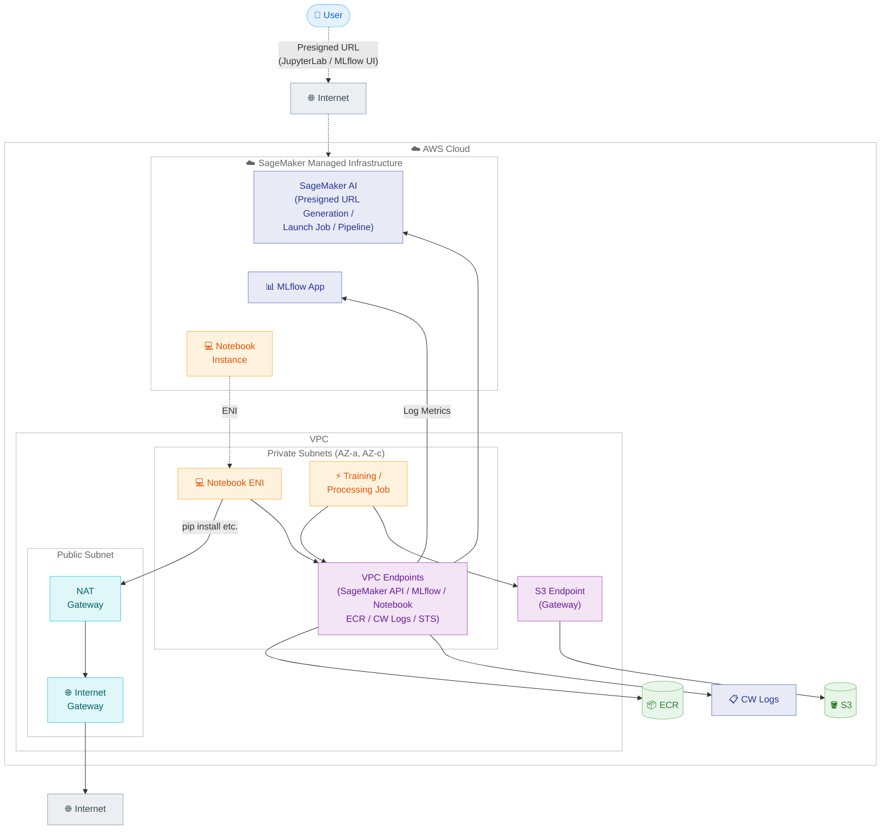

# VPC Configuration Implementation <!-- omit in toc -->

🌐 **Language**: 🇺🇸 [English](vpc-implementation.md) | 🇯🇵 [日本語](vpc-implementation.ja.md)

This document describes the design and implementation for deploying the SageMaker AI ML Pipeline environment inside a VPC. The default configuration does not use a VPC, but by setting `ENABLE_VPC=true` in `.env`, you can deploy all components inside a VPC as a private, closed network configuration.

- [Architecture](#architecture)
- [VPC Modes](#vpc-modes)
- [Subnet Configuration](#subnet-configuration)
- [Notebook Instance VPC Placement](#notebook-instance-vpc-placement)
- [VPC Endpoints](#vpc-endpoints)
- [Prerequisites for Using an Existing VPC](#prerequisites-for-using-an-existing-vpc)
- [CloudFormation Implementation Details](#cloudformation-implementation-details)
- [VPC-Related Implementation Files](#vpc-related-implementation-files)

## Architecture

This is a closed network configuration where Notebook Instance, Training Job, and Processing Job are all placed in private subnets inside a VPC.

The communication paths are designed as follows.

- **Communication with AWS services**: Routed through VPC Endpoints (Interface / Gateway). Access to S3, ECR, CloudWatch Logs, SageMaker API, etc., without going through the internet
- **Internet access**: Via NAT Gateway. Used for pip install, GitHub clone, and tool installation by Lifecycle Config
- **JupyterLab / MLflow UI**: Browser access via Presigned URL. Since the SageMaker managed infrastructure acts as an intermediary, the UIs remain accessible from the internet even when placed inside a VPC

### Implementation Architecture Diagram



## VPC Modes

By combining CloudFormation parameters, you can switch between the following three modes.

| Mode | EnableVPC | VpcId | Behavior |
|------|-----------|-------|----------|
| No VPC | `false` (default) | - | Configuration without VPC. Backward compatible |
| New VPC | `true` | empty | CloudFormation creates everything: VPC / subnets / NAT Gateway / security groups / VPC Endpoints |
| Existing VPC | `true` | specified | User specifies `VpcId` / `SubnetIds` / `SecurityGroupId`. Uses existing network resources |

## Subnet Configuration

When creating a new VPC, the following subnets are created.

| Subnet | CIDR | AZ | Purpose |
|--------|------|-----|---------|
| PrivateSubnet1 | 10.0.1.0/24 | AZ-0 (ap-northeast-1a) | Notebook, Training Job, Processing Job |
| PrivateSubnet2 | 10.0.2.0/24 | AZ-1 (ap-northeast-1c) | Training Job, Processing Job |
| PublicSubnet1 | 10.0.100.0/24 | AZ-0 (ap-northeast-1a) | NAT Gateway |
| PublicSubnet2 | 10.0.101.0/24 | AZ-1 (ap-northeast-1c) | (For future expansion) |

The reasons for creating two subnets each (in different AZs) for both private and public are as follows.

- The SageMaker Unified Studio Blueprint configuration requires at least 2 subnets across different AZs
- SageMaker Training / Processing Jobs themselves can operate with a single subnet
- If you want to pin the AZ for S3 Express One Zone, you can control it by specifying only one with `--subnet-ids` at Pipeline execution time (normally auto-retrieved from CloudFormation Output)

## Notebook Instance VPC Placement

When VPC is enabled, the following settings are applied to the Notebook Instance.

| Setting | Value | Description |
|---------|-------|-------------|
| `DirectInternetAccess` | `Disabled` | Blocks outbound internet access from the Notebook ENI |
| `SubnetId` | Private subnet | Places the Notebook ENI in a private subnet |
| `SecurityGroupIds` | TrainingSecurityGroup | Shared security group with Training Jobs |

Even with `DirectInternetAccess: Disabled`, the following communications continue to work.

- **pip install, GitHub clone**: Access the internet via NAT Gateway
- **JupyterLab / MLflow UI**: Since Presigned URLs are brokered by SageMaker managed infrastructure, browser access from the internet is possible
- **Tool installation by Lifecycle Config** (Kiro CLI): Via NAT Gateway

## VPC Endpoints

VPC Endpoint creation is controlled by the `CreateVpcEndpoints` parameter (default `true`).

| VPC Mode | CreateVpcEndpoints=true | CreateVpcEndpoints=false |
|----------|------------------------|-------------------------|
| New VPC | Creates S3 Gateway Endpoint + all Interface Endpoints listed below | No Endpoints created |
| Existing VPC | Creates only the Interface Endpoints listed below (S3 Gateway Endpoint must be prepared by the user in advance) | No Endpoints created |

The VPC Endpoints required for this environment are as follows.

| Service | Type | Purpose |
|---------|------|---------|
| S3 | Gateway | Read/write training data and model artifacts |
| SageMaker API | Interface | Presigned URL generation, Pipeline API, launching Training Jobs / Processing Jobs |
| MLflow | Interface | Metrics recording, MLflow UI access |
| SageMaker AI Notebook | Interface | JupyterLab access |
| ECR API | Interface | Retrieving BYOC container image metadata |
| ECR Docker | Interface | Pulling container image layers |
| CloudWatch Logs | Interface | Sending logs from Training Jobs / Processing Jobs |
| STS | Interface | Retrieving temporary credentials for IAM roles |

> 💡 Gateway Endpoints (S3) are free. Interface Endpoints incur an hourly charge per endpoint plus data processing charges. This environment creates 7 Interface Endpoints. See [AWS PrivateLink pricing](https://aws.amazon.com/privatelink/pricing/) for details.

## Prerequisites for Using an Existing VPC

When using an existing VPC, the following conditions must be met.

**VPC Settings**:

- `EnableDnsSupport: true` and `EnableDnsHostnames: true` must be enabled

**Subnets**:

- At least 2 private subnets (in different AZs)
- Each subnet's route table must have a route (0.0.0.0/0) to the NAT Gateway
- The S3 Gateway Endpoint must be associated with the route table

**Security Groups**:

- When using distributed training, a self-referencing Ingress rule that allows all traffic within the same security group is required

**IP Addresses**:

- Each subnet must have sufficient available IPs (minimum 2 per instance)

## CloudFormation Implementation Details

Below are excerpts of the VPC-related portions of `infra/sagemaker-ai-ml-pipeline/cfn/sagemaker-ai-ml-pipeline.yaml`.

### VPC-Related Parameters

Settings in `.env` are passed to the following parameters via `deploy.sh`.

```yaml
EnableVPC:          {Default: 'false', AllowedValues: ['true', 'false']}
VpcId:              {Default: ''}
SubnetIds:          {Default: ''}
SecurityGroupId:    {Default: ''}
CreateVpcEndpoints: {Default: 'true', AllowedValues: ['true', 'false']}
```

| Parameter | Description |
|-----------|-------------|
| `EnableVPC` | Enables VPC configuration. `true` places all components inside the VPC |
| `VpcId` | ID of an existing VPC. If empty, a new VPC is created |
| `SubnetIds` | Existing subnet IDs (comma-separated). Required when `VpcId` is specified |
| `SecurityGroupId` | Existing security group ID. Required when `VpcId` is specified |
| `CreateVpcEndpoints` | Whether to create VPC Endpoints. Set to `false` if the existing VPC already has Endpoints |

### Conditions

The resources to be created are controlled based on parameter combinations.

```yaml
IsVPCEnabled: !Equals [!Ref EnableVPC, 'true']
CreateNewVPC: !And
  - !Condition IsVPCEnabled
  - !Equals [!Ref VpcId, '']
ShouldCreateVpcEndpoints: !And
  - !Condition IsVPCEnabled
  - !Equals [!Ref CreateVpcEndpoints, 'true']
ShouldCreateS3GwEndpoint: !And
  - !Condition CreateNewVPC
  - !Equals [!Ref CreateVpcEndpoints, 'true']
```

| Condition | Purpose |
|-----------|---------|
| `IsVPCEnabled` | Controls all VPC-related resources |
| `CreateNewVPC` | Creates new VPC / subnets / NAT Gateway, etc. |
| `ShouldCreateVpcEndpoints` | Creates Interface Endpoints |
| `ShouldCreateS3GwEndpoint` | Creates S3 Gateway Endpoint (new VPC only; existing VPCs require user preparation in advance) |

### VPC Resources

As the network foundation (Condition: `CreateNewVPC`), the following resources are created.

| Resource | Description |
|----------|-------------|
| TrainingVPC | The VPC itself (CIDR: 10.0.0.0/16) |
| PrivateSubnet1 | Private subnet (CIDR: 10.0.1.0/24, AZ-0) |
| PrivateSubnet2 | Private subnet (CIDR: 10.0.2.0/24, AZ-1) |
| PublicSubnet1 | Public subnet (CIDR: 10.0.100.0/24, AZ-0). Hosts NAT Gateway |
| PublicSubnet2 | Public subnet (CIDR: 10.0.101.0/24, AZ-1) |
| InternetGateway + Attachment | Path from public subnets to the internet |
| NatGatewayEIP + NatGateway | For internet access from private subnets |
| PublicRouteTable + PublicRoute | 0.0.0.0/0 → Internet Gateway |
| PrivateRouteTable + PrivateRoute | 0.0.0.0/0 → NAT Gateway |
| TrainingSecurityGroup | Shared by Notebook / Training Job / Processing Job. Self-referencing Ingress rule (for distributed training) |

### VPC Endpoint Resources

A common security group (`VpcEndpointSecurityGroup`: allows HTTPS 443) is applied to all Interface Endpoints.

| Resource | Type | Purpose |
|----------|------|---------|
| S3GatewayEndpoint | Gateway | Read/write training data and model artifacts |
| SageMakerApiEndpoint | Interface | Pipeline API, launching Training Jobs / Processing Jobs |
| MlflowEndpoint | Interface | Metrics recording, MLflow UI access |
| NotebookEndpoint | Interface | JupyterLab access via Presigned URL |
| EcrApiEndpoint | Interface | ECR API (retrieving image metadata) |
| EcrDkrEndpoint | Interface | ECR Docker (pulling container images) |
| CloudWatchLogsEndpoint | Interface | Sending logs from Training Jobs / Processing Jobs |
| StsEndpoint | Interface | Retrieving temporary credentials for IAM roles |

### NotebookInstance VPC Settings

When VPC is enabled, the following properties are conditionally set using `!If [IsVPCEnabled, ...]`.

| Property | With VPC | Without VPC |
|----------|----------|-------------|
| `DirectInternetAccess` | `Disabled` | `Enabled` |
| `SubnetId` | Private subnet (new VPC: PrivateSubnet1, existing VPC: first of SubnetIds) | (none) |
| `SecurityGroupIds` | TrainingSecurityGroup (new VPC) or the specified SecurityGroupId (existing VPC) | (none) |

### VPC-Related Outputs

Used by the Pipeline execution script (`03-create-and-run-pipeline.py`) to automatically retrieve VPC settings. Not output when VPC is disabled.

```yaml
VpcSubnetIds:        Condition: IsVPCEnabled  # Comma-separated subnet IDs
VpcSecurityGroupId:  Condition: IsVPCEnabled  # Security group ID
```

## VPC-Related Implementation Files

The files related to VPC configuration are as follows.

| File | Contents |
|------|----------|
| `infra/sagemaker-ai-ml-pipeline/cfn/sagemaker-ai-ml-pipeline.yaml` | VPC parameters, Conditions, VPC resources, Endpoints, Outputs, Notebook VPC settings |
| `pipelines/scripts/03-create-and-run-pipeline.py` | `--subnet-ids` / `--security-group-ids` arguments. If not specified, automatically retrieved from CloudFormation stack Outputs |
| `infra/sagemaker-ai-ml-pipeline/scripts/deploy.sh` | Reads VPC settings from `.env` and passes them as CloudFormation parameters |
| `.env.example` / `.env.example.ja` | VPC configuration items (`ENABLE_VPC`, `VPC_ID`, `SUBNET_IDS`, `SECURITY_GROUP_ID`, `CREATE_VPC_ENDPOINTS`) |
