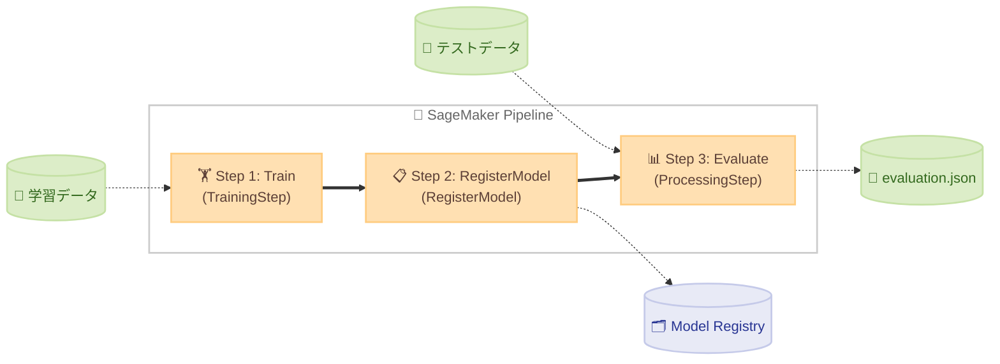

# Pipeline <!-- omit in toc -->

🌐 **Language**: 🇺🇸 [English](README.md) | 🇯🇵 [日本語](README.ja.md)

SageMaker Pipeline の実行に必要なスクリプト、コンテナ定義、サンプルデータを格納しています。JupyterLab のターミナルからこのディレクトリ内のスクリプトを実行して、データアップロード → コンテナビルド → Pipeline 実行の一連のワークフローを行います。

- [ディレクトリ構成](#ディレクトリ構成)
- [実行手順](#実行手順)
  - [Step 1: データセットのアップロード](#step-1-データセットのアップロード)
  - [Step 2: コンテナビルド \& ECR プッシュ](#step-2-コンテナビルド--ecr-プッシュ)
  - [Step 3: Pipeline 作成 \& 実行](#step-3-pipeline-作成--実行)
  - [Step 4: 実行状況の確認](#step-4-実行状況の確認)
  - [一括実行 (run-pipeline.sh)](#一括実行-run-pipelinesh)
- [コンテナ一覧](#コンテナ一覧)
- [カスタマイズ](#カスタマイズ)

## ディレクトリ構成

```
pipelines/
├── scripts/                              # 実行スクリプト (番号順に実行)
│   ├── 01-upload-dataset.sh              # サンプルデータを S3 にアップロード
│   ├── 02-build-and-push-container.sh    # コンテナビルド & ECR プッシュ
│   ├── 03-create-and-run-pipeline.py     # Pipeline 作成 & 実行
│   ├── 04-check-pipeline-status.sh       # Pipeline 実行状況の確認
│   └── run-pipeline.sh                   # Step 1〜4 の一括実行
├── container-pytorch-dlc/                # PyTorch DLC ベース (マネージドコンテナ)
│   ├── requirements.txt                  # 追加パッケージ (Train / Evaluate 共通)
│   ├── train.py                          # SimpleClassifier
│   ├── evaluate.py
│   └── data/
├── container-pytorch-dlc-byoc/           # PyTorch DLC ベース BYOC (Train も BYOC)
│   ├── Dockerfile
│   ├── train.py                          # SimpleClassifier
│   ├── evaluate.py
│   └── data/
├── container-navsim-ego-mlp/             # NAVSIM EgoStatusMLP ベースライン
│   ├── Dockerfile
│   ├── requirements.txt
│   ├── train.py
│   ├── evaluate.py
│   └── scripts/
│       ├── prepare_dataset.sh            # データセット準備 (ダウンロード → 特徴量抽出 → バランシング → S3)
│       ├── extract_features.py           # EgoStatus 特徴量を npz に変換
│       └── balance_dataset.py            # コマンド分布 (LEFT / FORWARD / RIGHT) を均等化
└── container-navsim-transfuser/          # NAVSIM Transfuser (GPU)
    ├── Dockerfile
    ├── requirements.txt
    ├── train.py
    ├── evaluate.py
    ├── transfuser_backbone.py
    ├── transfuser_model.py
    ├── transfuser_config.py
    ├── transfuser_loss.py
    └── scripts/
        ├── prepare_dataset.sh            # データセット準備 (ダウンロード → 特徴量抽出 → バランシング → S3)
        ├── extract_features.py           # カメラ・LiDAR・EgoStatus 特徴量を pt に変換
        └── balance_dataset.py            # コマンド分布 (LEFT / FORWARD / RIGHT) を均等化
```

## 実行手順

以下のコマンドはすべて JupyterLab のターミナルで実行してください。Step 1〜4 を一括で実行するには `run-pipeline.sh` が便利です。

PyTorch コンテナ (`container-pytorch-dlc` 等) はサンプルデータが同梱されているため、`run-pipeline.sh` だけで実行できます。NAVSIM コンテナ (`container-navsim-ego-mlp` 等) は事前に `prepare_dataset.sh` でデータを準備してから、`--skip-upload` 付きで実行してください。

```bash
# PyTorch マネージドコンテナで実行 (デフォルト、ビルド不要)
./pipelines/scripts/run-pipeline.sh

# PyTorch マネージドコンテナで実行 (ビルド不要)
./pipelines/scripts/run-pipeline.sh -c container-pytorch-dlc

# PyTorch DLC BYOC で実行 (Dockerfile ビルドあり)
./pipelines/scripts/run-pipeline.sh -c container-pytorch-dlc-byoc

# NAVSIM EgoStatusMLP で実行 (データ準備 → Pipeline 実行)
./pipelines/container-navsim-ego-mlp/scripts/prepare_dataset.sh
./pipelines/scripts/run-pipeline.sh -c container-navsim-ego-mlp --skip-upload

# NAVSIM Transfuser で実行 (データ準備 → Pipeline 実行)
./pipelines/container-navsim-transfuser/scripts/prepare_dataset.sh
./pipelines/scripts/run-pipeline.sh -c container-navsim-transfuser --skip-upload

# train.py / evaluate.py のみ変更した再実行 (ビルドをスキップ)
./pipelines/scripts/run-pipeline.sh --skip-upload --skip-build
```

NAVSIM コンテナの所要時間の目安は以下の通りです。`prepare_dataset.sh` は OpenScene データセットのダウンロードと特徴量抽出を行うため、ネットワーク速度によって大きく変動します。

| ステップ | EgoStatusMLP | Transfuser |
|---------|-------------|-----------|
| データ準備 (初回のみ) | 約 60 分 | 約 140 分 |
| Pipeline 実行 (ビルド + 学習 + 評価) | 約 15 分 | 約 10 分 |

各ステップを個別に実行する場合は以下の手順に従ってください。

> Step 1 と Step 2 は順不同ですが、Step 3 の前にどちらも完了している必要があります。

### Step 1: データセットのアップロード

コンテナの種類によってデータの準備方法が異なります。

**PyTorch コンテナの場合**:

`container-pytorch-dlc` / `container-pytorch-dlc-byoc` は、コンテナディレクトリ内のサンプルデータを S3 にアップロードします。

```bash
./pipelines/scripts/01-upload-dataset.sh [PROJECT_NAME]

# コンテナを指定する場合
./pipelines/scripts/01-upload-dataset.sh -c container-pytorch-dlc [PROJECT_NAME]
```

**NAVSIM コンテナの場合**:

`container-navsim-ego-mlp` / `container-navsim-transfuser` は、専用の `prepare_dataset.sh` でデータを準備して S3 にアップロードします。Pipeline 実行時は `--skip-upload` を指定してください。

```bash
# 1. データセットを準備して S3 にアップロード
./pipelines/container-navsim-ego-mlp/scripts/prepare_dataset.sh

# 2. Pipeline 実行時は --skip-upload を指定 (データは準備済みのため)
./pipelines/scripts/run-pipeline.sh -c container-navsim-ego-mlp --skip-upload
```

データはコンテナ名をプレフィックスとして S3 に配置されます。Pipeline 実行時に同じコンテナ名から S3 パスが自動生成されるため、データとコンテナが自動的に紐づきます。

```
s3://{project}-dataset-{account}-{region}/
  ├── container-navsim-ego-mlp/train/        ← container-navsim-ego-mlp の学習データ
  └── container-navsim-transfuser/train/     ← container-navsim-transfuser の学習データ
```

### Step 2: コンテナビルド & ECR プッシュ

BYOC コンテナの Docker イメージをビルドし、ECR にプッシュします。`container-pytorch-dlc` は AWS マネージドコンテナを使用するため、ビルドは不要です (スキップされます)。

```bash
# PyTorch DLC BYOC の場合
./pipelines/scripts/02-build-and-push-container.sh -c container-pytorch-dlc-byoc [PROJECT_NAME]
```

### Step 3: Pipeline 作成 & 実行

SageMaker Pipeline を作成して実行します。Pipeline は Train → RegisterModel → Evaluate の 3 ステップで構成されており、モデルの学習・登録・評価を自動的に順番に実行します。Evaluate ステップは推論 Endpoint を使わず、Processing Job でモデルファイルを直接ロードして評価します (詳細は [Processing Job での評価の仕組み](../docs/sagemaker-python-sdk-guide.ja.md#73-processing-job-での評価の仕組み) を参照)。



ターミナルから実行する場合は以下のコマンドを使用します。

`container-pytorch-dlc` の場合:

```bash
ROLE_ARN=$(aws cloudformation describe-stacks \
  --stack-name sagemaker-ai-ml-pipeline-stack \
  --query 'Stacks[0].Outputs[?OutputKey==`SageMakerRoleArn`].OutputValue' \
  --output text)

python pipelines/scripts/03-create-and-run-pipeline.py \
  --project-name sagemaker-ai-ml-pipeline \
  --role-arn "$ROLE_ARN" \
  --create --start
```

`container-pytorch-dlc` の場合:

```bash
python pipelines/scripts/03-create-and-run-pipeline.py \
  --project-name sagemaker-ai-ml-pipeline \
  --role-arn "$ROLE_ARN" \
  --container-dir pipelines/container-pytorch-dlc \
  --create --start
```

主要なオプションです。

| オプション | 説明 |
|-----------|------|
| `--project-name` | プロジェクト名 (必須) |
| `--role-arn` | SageMaker 実行ロール ARN (必須) |
| `--region` | AWS リージョン (デフォルト: `us-east-1`) |
| `--container-dir` | コンテナディレクトリのパス (デフォルト: `pipelines/container-pytorch-dlc`) |
| `--create` | Pipeline を作成/更新 |
| `--start` | Pipeline を実行 |

### Step 4: 実行状況の確認

Pipeline 実行後、以下のスクリプトで各ステップの状況をターミナルから確認できます。

```bash
./pipelines/scripts/04-check-pipeline-status.sh [PROJECT_NAME]
```

実行例:

```
=== Pipeline 実行状況 ===
Pipeline:  sagemaker-ai-ml-pipeline-container-pytorch-dlc-pipeline
Execution: ooj49xv2k8fc
Status:    🔄 Executing
Started:   1771677200.017

Steps:
🔄 Evaluate: Executing
└─ [Console]  [CW Instance Metrics]
✅ RegisterModel-RegisterModel: Succeeded
✅ Train: Succeeded
└─ [Console]  [CW Instance Metrics]  [CW Algorithm Metrics]
```

`[Console]` / `[CW Instance Metrics]` / `[CW Algorithm Metrics]` はターミナル上でクリックして直接開けるリンクです。

### 一括実行 (run-pipeline.sh)

Step 1〜4 をまとめて実行するスクリプトです。Pipeline 実行後は自動でポーリングに入り、完了または失敗で終了します。

```bash
./pipelines/scripts/run-pipeline.sh [オプション] [プロジェクト名]
```

主要なオプションです。

| オプション | 説明 |
|-----------|------|
| `-c, --container DIR` | コンテナディレクトリ名 (デフォルト: `container-pytorch-dlc`) |
| `-w, --watch SEC` | ポーリング間隔 (秒、デフォルト: `30`) |
| `--skip-upload` | データセットアップロードをスキップ |
| `--skip-build` | コンテナビルド & ECR プッシュをスキップ |

`--skip-upload` / `--skip-build` は train.py や evaluate.py のロジックのみ変更した再実行時に使うと時間を短縮できます。SDK が `entry_point` / `source_dir` 経由でスクリプトを S3 経由でコンテナに注入するため、コンテナの再ビルドは不要です (詳細は `docs/sagemaker-python-sdk-guide.ja.md` Section 3.3 参照)。依存ライブラリ (`pip install`) やベースイメージを変更した場合はコンテナの再ビルドが必要です。

## コンテナ一覧

各コンテナは単一の ECR リポジトリ (`{project}-container`) にディレクトリ名をタグとして push されます。インスタンスタイプはコンテナごとに自動選択されます (`03-create-and-run-pipeline.py` の `instance_type_map`)。

| コンテナ | 説明 | ビルド | インスタンスタイプ | スペック |
|---------|------|-------|------------------|---------|
| `container-pytorch-dlc` | PyTorch DLC マネージドコンテナ | 不要 | `ml.c7i.xlarge` | 4 vCPU, 8GB RAM |
| `container-pytorch-dlc-byoc` | PyTorch DLC ベース BYOC | 必要 | `ml.c7i.xlarge` | 同上 |
| `container-navsim-ego-mlp` | NAVSIM EgoStatusMLP | 必要 | `ml.c7i.xlarge` | 4 vCPU, 8GB RAM (CPU) |
| `container-navsim-transfuser` | NAVSIM Transfuser (GPU) | 必要 | `ml.g6.4xlarge` | 1x L4 GPU, 16 vCPU, 64GB RAM |

> **Note**: Transfuser を CPU インスタンス (例: `ml.m7i.4xlarge`) で実行するとメモリ不足エラー (`Please use an instance type with more memory`) が発生します。カメラ + LiDAR の特徴量データが大きいため、GPU インスタンスの大容量メモリが必要です。

## カスタマイズ

同じフレームワーク内であれば `train.py` と `evaluate.py` を差し替えるだけで任意のモデルに対応できます。TensorFlow や Hugging Face など別のフレームワークに切り替える場合は、コンテナ設定 (Estimator / Processor の選択、Dockerfile や `requirements.txt`) の変更も必要です。

データ形式は CSV で、カラムは `f1,f2,f3,f4,target` です。`data/` 内のファイルを自分のデータセットに差し替えて使用してください。
