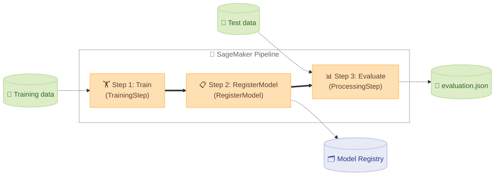

# Pipeline <!-- omit in toc -->

🌐 **Language**: 🇺🇸 [English](README.md) | 🇯🇵 [日本語](README.ja.md)

This directory contains the scripts, container definitions, and sample data required to run SageMaker Pipelines. Run the scripts from a JupyterLab terminal to perform the end-to-end workflow: dataset upload → container build → pipeline execution.

- [Directory structure](#directory-structure)
- [Execution steps](#execution-steps)
  - [Step 1: Upload the dataset](#step-1-upload-the-dataset)
  - [Step 2: Build and push the container](#step-2-build-and-push-the-container)
  - [Step 3: Create and run the pipeline](#step-3-create-and-run-the-pipeline)
  - [Step 4: Check execution status](#step-4-check-execution-status)
  - [End-to-end run (run-pipeline.sh)](#end-to-end-run-run-pipelinesh)
- [Container list](#container-list)
- [Customization](#customization)

## Directory structure

```
pipelines/
├── scripts/                              # Execution scripts (run in numerical order)
│   ├── 01-upload-dataset.sh              # Upload sample data to S3
│   ├── 02-build-and-push-container.sh    # Build the container and push to ECR
│   ├── 03-create-and-run-pipeline.py     # Create and run the pipeline
│   ├── 04-check-pipeline-status.sh       # Check pipeline execution status
│   └── run-pipeline.sh                   # Run steps 1-4 in one shot
├── container-pytorch-dlc/                # Based on PyTorch DLC (managed container)
│   ├── requirements.txt                  # Additional packages (shared by Train / Evaluate)
│   ├── train.py                          # SimpleClassifier
│   ├── evaluate.py
│   └── data/
├── container-pytorch-dlc-byoc/           # PyTorch DLC-based BYOC (Train is also BYOC)
│   ├── Dockerfile
│   ├── train.py                          # SimpleClassifier
│   ├── evaluate.py
│   └── data/
├── container-navsim-ego-mlp/             # NAVSIM EgoStatusMLP baseline
│   ├── Dockerfile
│   ├── requirements.txt
│   ├── train.py
│   ├── evaluate.py
│   └── scripts/
│       ├── prepare_dataset.sh            # Prepare dataset (download → extract features → balance → S3)
│       ├── extract_features.py           # Convert EgoStatus features to npz
│       └── balance_dataset.py            # Equalize command distribution (LEFT / FORWARD / RIGHT)
└── container-navsim-transfuser/          # NAVSIM Transfuser (GPU)
    ├── Dockerfile
    ├── requirements.txt
    ├── train.py
    ├── evaluate.py
    ├── transfuser_backbone.py
    ├── transfuser_model.py
    ├── transfuser_config.py
    ├── transfuser_loss.py
    └── scripts/
        ├── prepare_dataset.sh            # Prepare dataset (download → extract features → balance → S3)
        ├── extract_features.py           # Convert camera / LiDAR / EgoStatus features to pt
        └── balance_dataset.py            # Equalize command distribution (LEFT / FORWARD / RIGHT)
```

## Execution steps

Run all commands below from a JupyterLab terminal. To run steps 1-4 in one shot, use `run-pipeline.sh`.

PyTorch containers (e.g., `container-pytorch-dlc`) include sample data, so `run-pipeline.sh` alone works. NAVSIM containers (e.g., `container-navsim-ego-mlp`) require you to prepare data with `prepare_dataset.sh` first, then run with `--skip-upload`.

```bash
# Run with PyTorch managed container (default, no build needed)
./pipelines/scripts/run-pipeline.sh

# Run with PyTorch managed container (no build needed)
./pipelines/scripts/run-pipeline.sh -c container-pytorch-dlc

# Run with PyTorch DLC BYOC (builds the Dockerfile)
./pipelines/scripts/run-pipeline.sh -c container-pytorch-dlc-byoc

# Run with NAVSIM EgoStatusMLP (prepare data → run pipeline)
./pipelines/container-navsim-ego-mlp/scripts/prepare_dataset.sh
./pipelines/scripts/run-pipeline.sh -c container-navsim-ego-mlp --skip-upload

# Run with NAVSIM Transfuser (prepare data → run pipeline)
./pipelines/container-navsim-transfuser/scripts/prepare_dataset.sh
./pipelines/scripts/run-pipeline.sh -c container-navsim-transfuser --skip-upload

# Re-run when only train.py / evaluate.py changed (skip build)
./pipelines/scripts/run-pipeline.sh --skip-upload --skip-build
```

Estimated execution times for NAVSIM containers. `prepare_dataset.sh` downloads the OpenScene dataset and extracts features, so times vary significantly depending on network speed.

| Step | EgoStatusMLP | Transfuser |
|------|-------------|-----------|
| Data preparation (first time only) | ~60 min | ~140 min |
| Pipeline execution (build + train + evaluate) | ~15 min | ~10 min |

To run each step individually, follow the steps below.

> Steps 1 and 2 can run in any order, but both must complete before Step 3.

### Step 1: Upload the dataset

The data preparation method depends on the container type.

**For PyTorch containers**:

`container-pytorch-dlc` / `container-pytorch-dlc-byoc` upload the sample data inside the container directory to S3.

```bash
./pipelines/scripts/01-upload-dataset.sh [PROJECT_NAME]

# To specify a container
./pipelines/scripts/01-upload-dataset.sh -c container-pytorch-dlc [PROJECT_NAME]
```

**For NAVSIM containers**:

`container-navsim-ego-mlp` / `container-navsim-transfuser` prepare data and upload to S3 with a dedicated `prepare_dataset.sh`. Pass `--skip-upload` when running the pipeline.

```bash
# 1. Prepare the dataset and upload to S3
./pipelines/container-navsim-ego-mlp/scripts/prepare_dataset.sh

# 2. Pass --skip-upload when running the pipeline (data is already prepared)
./pipelines/scripts/run-pipeline.sh -c container-navsim-ego-mlp --skip-upload
```

Data is placed under an S3 prefix named after the container. The same container name is used to generate the S3 path when running the pipeline, so data and containers are linked automatically.

```
s3://{project}-dataset-{account}-{region}/
  ├── container-navsim-ego-mlp/train/        ← Training data for container-navsim-ego-mlp
  └── container-navsim-transfuser/train/     ← Training data for container-navsim-transfuser
```

### Step 2: Build and push the container

Build the BYOC container's Docker image and push it to ECR. `container-pytorch-dlc` uses an AWS managed container, so building is not required (this step is skipped).

```bash
# For PyTorch DLC BYOC
./pipelines/scripts/02-build-and-push-container.sh -c container-pytorch-dlc-byoc [PROJECT_NAME]
```

### Step 3: Create and run the pipeline

Create and run a SageMaker Pipeline. The pipeline consists of three steps (Train → RegisterModel → Evaluate), which automatically handle model training, registration, and evaluation in order. The Evaluate step does not use an inference endpoint; instead, a Processing Job loads the model file directly for evaluation (see [How Evaluation Works in Processing Jobs](../docs/sagemaker-python-sdk-guide.md#73-how-evaluation-works-in-processing-jobs) in `docs/sagemaker-python-sdk-guide.md`).



To run from a terminal, use the following commands.

For `container-pytorch-dlc`:

```bash
ROLE_ARN=$(aws cloudformation describe-stacks \
  --stack-name sagemaker-ai-ml-pipeline-stack \
  --query 'Stacks[0].Outputs[?OutputKey==`SageMakerRoleArn`].OutputValue' \
  --output text)

python pipelines/scripts/03-create-and-run-pipeline.py \
  --project-name sagemaker-ai-ml-pipeline \
  --role-arn "$ROLE_ARN" \
  --create --start
```

For `container-pytorch-dlc-byoc`:

```bash
python pipelines/scripts/03-create-and-run-pipeline.py \
  --project-name sagemaker-ai-ml-pipeline \
  --role-arn "$ROLE_ARN" \
  --container-dir pipelines/container-pytorch-dlc \
  --create --start
```

Key options:

| Option | Description |
|--------|-------------|
| `--project-name` | Project name (required) |
| `--role-arn` | SageMaker execution role ARN (required) |
| `--region` | AWS region (default: `us-east-1`) |
| `--container-dir` | Path to the container directory (default: `pipelines/container-pytorch-dlc`) |
| `--create` | Create / update the pipeline |
| `--start` | Start the pipeline |

### Step 4: Check execution status

After starting the pipeline, use the following script to check the status of each step from the terminal.

```bash
./pipelines/scripts/04-check-pipeline-status.sh [PROJECT_NAME]
```

Sample output:

```
=== Pipeline execution status ===
Pipeline:  sagemaker-ai-ml-pipeline-container-pytorch-dlc-pipeline
Execution: ooj49xv2k8fc
Status:    🔄 Executing
Started:   1771677200.017

Steps:
🔄 Evaluate: Executing
└─ [Console]  [CW Instance Metrics]
✅ RegisterModel-RegisterModel: Succeeded
✅ Train: Succeeded
└─ [Console]  [CW Instance Metrics]  [CW Algorithm Metrics]
```

`[Console]` / `[CW Instance Metrics]` / `[CW Algorithm Metrics]` are clickable links you can open directly from the terminal.

### End-to-end run (run-pipeline.sh)

A script that runs steps 1-4 together. After starting the pipeline, it automatically enters a polling loop and exits on completion or failure.

```bash
./pipelines/scripts/run-pipeline.sh [OPTIONS] [PROJECT_NAME]
```

Key options:

| Option | Description |
|--------|-------------|
| `-c, --container DIR` | Container directory name (default: `container-pytorch-dlc`) |
| `-w, --watch SEC` | Polling interval in seconds (default: `30`) |
| `--skip-upload` | Skip dataset upload |
| `--skip-build` | Skip container build and ECR push |

Use `--skip-upload` / `--skip-build` to speed up re-runs when you only changed the logic in `train.py` or `evaluate.py`. Because the SDK injects scripts into the container from S3 via `entry_point` / `source_dir`, you do not need to rebuild the container (see Section 3.3 of `docs/sagemaker-python-sdk-guide.md`). When you change dependencies (`pip install`) or the base image, container rebuild is required.

## Container list

Each container is pushed to a single ECR repository (`{project}-container`) with the directory name as the tag. The instance type is automatically selected per container (see `instance_type_map` in `03-create-and-run-pipeline.py`).

| Container | Description | Build | Instance type | Spec |
|-----------|-------------|-------|---------------|------|
| `container-pytorch-dlc` | PyTorch DLC managed container | Not required | `ml.c7i.xlarge` | 4 vCPU, 8GB RAM |
| `container-pytorch-dlc-byoc` | PyTorch DLC-based BYOC | Required | `ml.c7i.xlarge` | Same as above |
| `container-navsim-ego-mlp` | NAVSIM EgoStatusMLP | Required | `ml.c7i.xlarge` | 4 vCPU, 8GB RAM (CPU) |
| `container-navsim-transfuser` | NAVSIM Transfuser (GPU) | Required | `ml.g6.4xlarge` | 1x L4 GPU, 16 vCPU, 64GB RAM |

> **Note**: Running Transfuser on a CPU instance (e.g., `ml.m7i.4xlarge`) triggers an out-of-memory error (`Please use an instance type with more memory`). The camera + LiDAR feature data is large, so the large memory of a GPU instance is required.

## Customization

As long as you stay within the same framework, you can adapt this to any model by replacing `train.py` and `evaluate.py`. To switch to a different framework like TensorFlow or Hugging Face, you also need to change the container configuration (Estimator / Processor selection, Dockerfile, `requirements.txt`).

The data format is CSV with columns `f1,f2,f3,f4,target`. Replace the files under `data/` with your own dataset.
